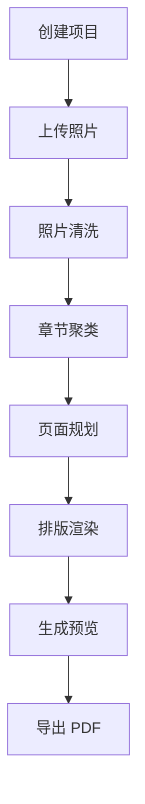

## 1. 产品概述
AI 相册书自动排版系统面向需要将照片快速生成相册书的用户，提供从上传照片到导出 PDF 的一站式流程。
- 解决用户手动选图、分组、排版效率低的问题
- 通过自动化流程降低成书门槛，并为后续印刷交付提供标准文件

## 2. 核心功能

### 2.1 用户角色
| 角色 | 接入方式 | 核心权限 |
|------|----------|----------|
| 普通用户 | H5 登录 | 创建项目、上传照片、查看清洗结果、调整章节、预览排版、导出 PDF |
| 运营人员 | 管理后台登录 | 查看任务状态、人工重试、调整异常流程 |
| 工厂人员 | 管理后台登录 | 查看导出文件、获取可生产订单 |

### 2.2 功能模块
1. **项目与上传**：创建项目、选择规格与风格、批量上传照片
2. **照片清洗**：展示重复图、低质量图与推荐保留结果
3. **章节聚类**：自动生成章节，并支持重命名、合并与拆分
4. **页面规划与预览**：生成页面结构、查看版式与预览效果
5. **导出与订单**：导出 PDF、查看导出记录、预留后续工厂对接

### 2.3 页面明细
| 页面名称 | 模块名称 | 功能描述 |
|----------|----------|----------|
| 项目首页 | 项目列表 | 查看、创建、进入相册项目 |
| 上传页 | 上传区域 | 批量上传照片、展示上传进度、失败重试 |
| 清洗页 | 清洗结果面板 | 查看质量评分、重复分组、人工保留或移除 |
| 章节页 | 章节管理 | 查看章节结果、重命名、调整照片归属 |
| 规划预览页 | 页面规划与预览 | 查看页码结构、预览页面、局部微调 |
| 导出页 | 导出中心 | 发起 PDF 导出、查看导出历史、下载文件 |
| 管理后台 | 任务监控 | 查看项目状态、任务失败、人工重试 |

## 3. 核心流程
用户创建相册项目后，先上传照片；系统完成照片清洗，产出可入书候选照片；再基于时间和规则进行章节聚类；随后生成页面规划与模板化排版；最后生成预览并导出 PDF。异常情况下允许运营侧重试或人工修正后继续流程。

## 4. 用户界面设计
### 4.1 设计风格
- 主色：深蓝灰 + 亮青色点缀
- 按钮风格：圆角中等、强调主操作、弱化次操作
- 字体：中文优先无衬线，标题较粗，正文中等字重
- 布局风格：卡片化内容区 + 左侧或顶部步骤导航
- 图标风格：线性图标，状态颜色清晰

### 4.2 页面设计概览
| 页面名称 | 模块名称 | UI 元素 |
|----------|----------|---------|
| 项目首页 | 项目卡片 | 卡片列表、状态标签、主操作按钮 |
| 上传页 | 上传面板 | 拖拽上传区、进度条、失败提示、缩略图列表 |
| 清洗页 | 结果对比 | 原图缩略图、评分标签、保留/移除操作 |
| 章节页 | 章节列表 | 章节卡片、照片网格、编辑按钮 |
| 规划预览页 | 预览区 | 页面缩略图、页码结构、预览大图、操作工具栏 |
| 导出页 | 导出记录 | 状态列表、下载按钮、文件信息 |

### 4.3 响应式
- 桌面优先设计
- 用户端兼容移动端 H5
- 关键操作按钮适配触控尺寸
- 预览区域在小屏设备采用上下结构
