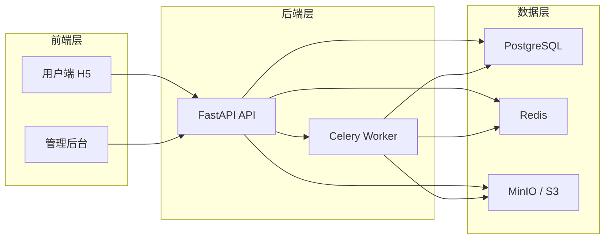
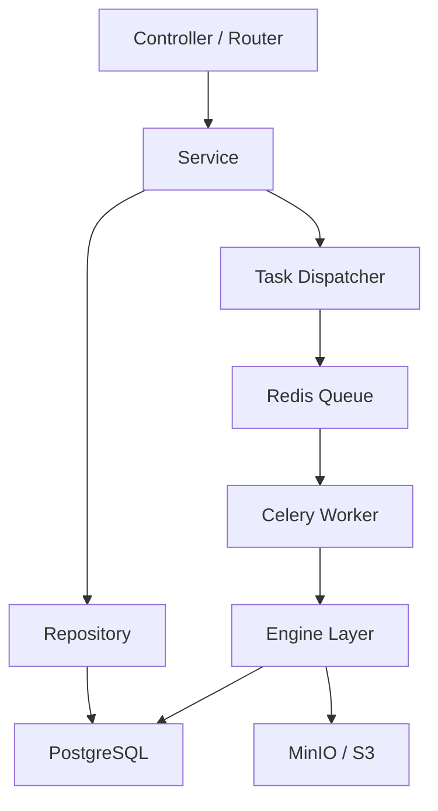
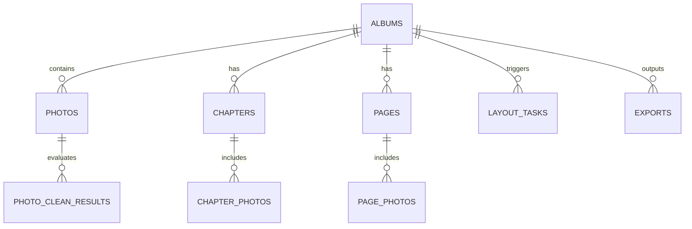

## 1. 架构设计



## 2. 技术说明
- 前端：Vue 3 + TypeScript + Vite + Vue Router + Pinia
- 用户端组件库：Vant
- 管理端组件库：Ant Design Vue
- 后端：Python 3.11 + FastAPI
- 异步任务：Celery + Redis
- 数据库：PostgreSQL
- 对象存储：MinIO / S3
- 初始化工具：Vite

## 3. 路由定义
| 路由 | 用途 |
|------|------|
| `/` | 项目列表页 |
| `/albums/create` | 创建项目页 |
| `/albums/:id/upload` | 照片上传页 |
| `/albums/:id/cleaning` | 清洗结果页 |
| `/albums/:id/chapters` | 章节管理页 |
| `/albums/:id/planning` | 页面规划与预览页 |
| `/albums/:id/export` | 导出页 |
| `/admin/tasks` | 管理后台任务页 |

## 4. API 定义

```ts
type AlbumStatus =
  | 'draft'
  | 'uploaded'
  | 'cleaned'
  | 'clustered'
  | 'planned'
  | 'rendered'
  | 'exported'
  | 'failed'

type TaskStatus =
  | 'pending'
  | 'queued'
  | 'running'
  | 'succeeded'
  | 'failed'
  | 'cancelled'
  | 'skipped'

interface ApiResponse<T> {
  code: number
  message: string
  request_id: string
  data: T
}

interface Album {
  id: string
  name: string
  album_type: string
  book_size: string
  theme_style: string
  status: AlbumStatus
  cover_title?: string
}
```

关键接口：

- `POST /api/v1/albums`
- `GET /api/v1/albums`
- `GET /api/v1/albums/{id}`
- `POST /api/v1/albums/{id}/photos/upload`
- `POST /api/v1/albums/{id}/clean`
- `POST /api/v1/albums/{id}/cluster`
- `POST /api/v1/albums/{id}/plan`
- `POST /api/v1/albums/{id}/render`
- `POST /api/v1/albums/{id}/export`
- `GET /api/v1/tasks/{id}`

## 5. 服务端架构图



## 6. 数据模型
### 6.1 数据模型定义



### 6.2 数据定义语言

```sql
CREATE TABLE albums (
  id UUID PRIMARY KEY,
  user_id UUID NOT NULL,
  name VARCHAR(128) NOT NULL,
  album_type VARCHAR(32) NOT NULL,
  book_size VARCHAR(32) NOT NULL,
  theme_style VARCHAR(32) NOT NULL,
  status VARCHAR(32) NOT NULL,
  cover_title VARCHAR(128),
  created_at TIMESTAMP NOT NULL DEFAULT NOW(),
  updated_at TIMESTAMP NOT NULL DEFAULT NOW()
);

CREATE TABLE photos (
  id UUID PRIMARY KEY,
  album_id UUID NOT NULL,
  storage_key VARCHAR(255) NOT NULL,
  origin_filename VARCHAR(255) NOT NULL,
  width INT,
  height INT,
  taken_at TIMESTAMP,
  exif_json JSONB,
  created_at TIMESTAMP NOT NULL DEFAULT NOW()
);

CREATE INDEX idx_albums_user_created_at ON albums(user_id, created_at DESC);
CREATE INDEX idx_photos_album_created_at ON photos(album_id, created_at);
```
