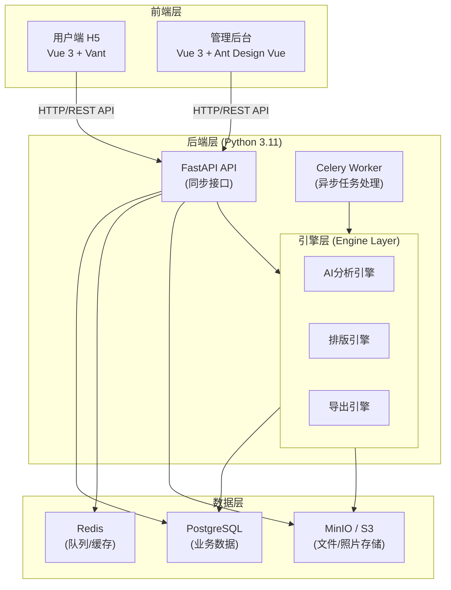
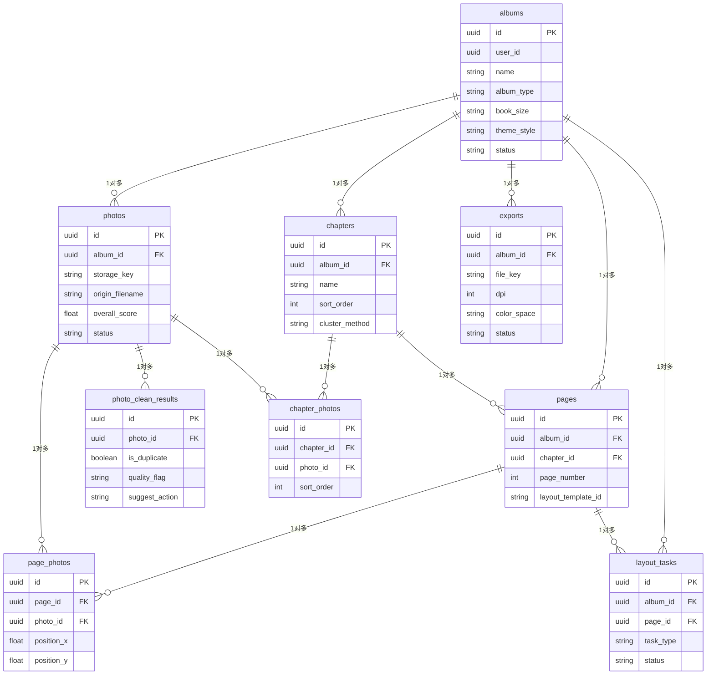
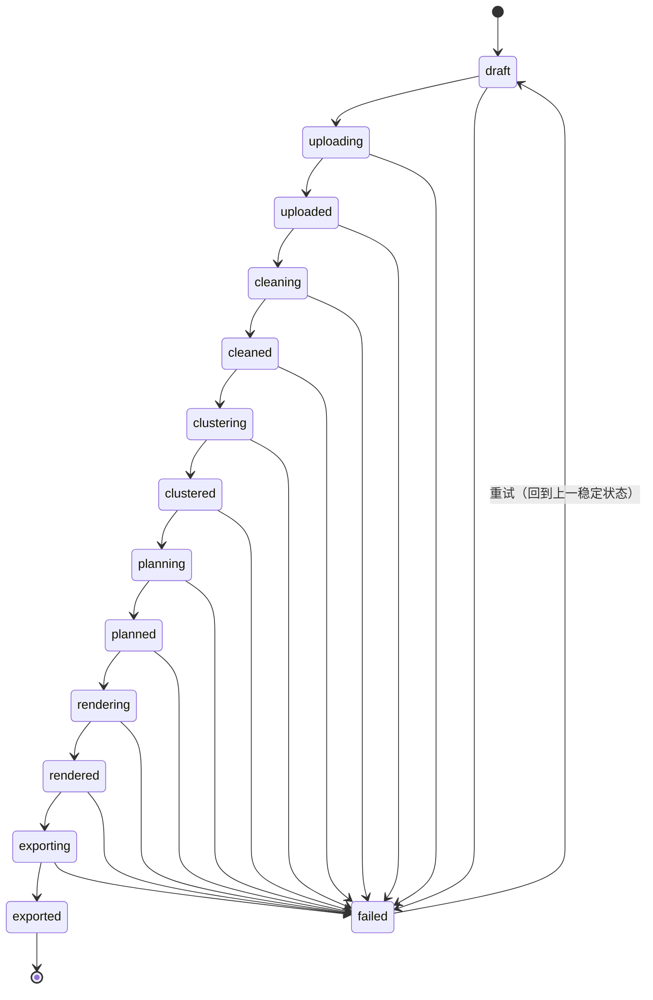
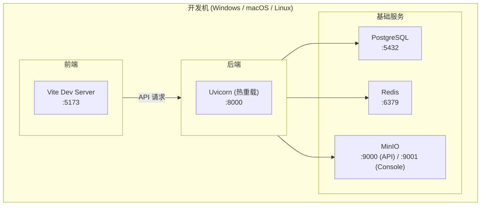

# AI 智能相册排版系统 - 系统设计文档

**版本**：v0.1
**日期**：2026-06-15
**状态**：迭代中

---

## 一、技术路线

### 1.1 总体架构



### 1.2 技术选型明细

| 层次 | 技术 | 版本 | 说明 |
|------|------|------|------|
| **前端框架** | Vue 3 | 3.x | 渐进式框架，Composition API |
| **前端语言** | TypeScript | 5.x | 类型安全，提升代码可维护性 |
| **构建工具** | Vite | 5.x | 快速 HMR，ESBuild 打包 |
| **路由** | Vue Router | 4.x | 单页应用路由管理 |
| **状态管理** | Pinia | 2.x | Vue 官方推荐状态管理库 |
| **CSS 方案** | Tailwind CSS | 3.x | 原子化 CSS，快速构建 UI |
| **用户端组件库** | Vant | 4.x | 移动端 H5 UI 组件库 |
| **管理端组件库** | Ant Design Vue | 4.x | 企业级后台 UI 组件库 |
| **HTTP 客户端** | Axios | 1.x | 请求拦截、错误处理 |
| **后端框架** | FastAPI | 0.115+ | 异步高性能，自动生成 OpenAPI 文档 |
| **后端语言** | Python | 3.11 | 稳定版本，广泛 AI/ML 库支持 |
| **异步任务** | Celery | 5.x | 分布式任务队列 |
| **消息队列** | Redis | 7.x | 任务队列 + 缓存 |
| **ORM** | SQLAlchemy | 2.x | 异步 ORM，支持 PostgreSQL |
| **数据库** | PostgreSQL | 15+ | 关系型数据库，JSONB 支持 |
| **对象存储** | MinIO / S3 | - | 照片文件与导出 PDF 存储 |
| **AI 服务** | DeepSeek V4 Pro | - | 图片理解、内容识别、排版建议 |
| **PDF 导出** | Puppeteer / Playwright | - | HTML → PDF 高保真渲染 |
| **图片处理** | Pillow + ImageMagick | - | 格式转换、缩略图生成、EXIF 提取 |

### 1.3 关键依赖版本锁定

```
# 后端 (backend/requirements.txt)
fastapi==0.115.*
uvicorn[standard]==0.30.*
sqlalchemy[asyncio]==2.0.*
asyncpg==0.29.*
psycopg[binary]==3.2.*
celery[redis]==5.4.*
redis==5.0.*
pydantic==2.*
python-multipart==0.0.*
Pillow==10.*
minio==7.2.*
python-dotenv==1.*

# 前端 (frontend/package.json)
vue: ^3.5
vue-router: ^4.4
pinia: ^2.2
vite: ^5.4
typescript: ~5.6
vant: ^4.9
ant-design-vue: ^4.2
tailwindcss: ^3.4
axios: ^1.7
```

---

## 二、系统模块划分

### 2.1 前端模块结构

```
src/
├── app/                          # 应用级配置
│   ├── providers/                # 全局 Provider（主题、API 等）
│   └── router/                   # 根路由配置
├── assets/                       # 静态资源
├── components/                   # 通用组件
├── composables/                  # 通用组合式函数
├── features/                     # 功能模块（按业务流程划分）
│   ├── project-upload/           # 项目创建 & 照片上传
│   │   ├── pages/
│   │   │   └── ProjectUploadPage.vue
│   │   ├── components/
│   │   └── composables/
│   ├── photo-cleaning/           # 照片清洗
│   │   ├── pages/
│   │   │   └── PhotoCleaningPage.vue
│   │   ├── components/
│   │   └── composables/
│   ├── chapter-clustering/       # 章节聚类
│   │   ├── pages/
│   │   │   └── ChapterClusteringPage.vue
│   │   ├── components/
│   │   └── composables/
│   ├── page-planning/            # 页面规划 & 预览
│   │   ├── pages/
│   │   │   └── PagePlanningPage.vue
│   │   ├── components/
│   │   └── composables/
│   └── export-order/             # 导出 & 订单
│       ├── pages/
│       │   └── ExportOrderPage.vue
│       ├── components/
│       └── composables/
├── modules/                      # 独立模块
│   └── admin/                    # 管理后台
│       ├── pages/
│       │   └── AdminTasksPage.vue
│       ├── components/
│       └── composables/
├── pages/                        # 顶层页面
│   └── HomePage.vue              # 项目列表首页
├── shared/                       # 共享模块
│   ├── api/                      # HTTP 客户端封装
│   │   └── http.ts
│   ├── components/               # 共享 UI 组件
│   │   └── SectionCard.vue
│   └── types/                    # 共享类型定义
│       └── album.ts
├── router/                       # 路由定义
│   └── index.ts
├── lib/                          # 工具函数
│   └── utils.ts
├── App.vue
├── main.ts
└── style.css
```

### 2.2 后端模块结构

```
backend/
├── app/
│   ├── main.py                   # FastAPI 应用入口
│   ├── config.py                 # 配置管理
│   ├── api/                      # API 路由层
│   │   ├── __init__.py
│   │   ├── deps.py               # 依赖注入
│   │   └── v1/
│   │       ├── __init__.py
│   │       ├── albums.py         # 相册 CRUD API
│   │       ├── photos.py         # 照片上传/管理 API
│   │       ├── cleaning.py       # 清洗流程 API
│   │       ├── chapters.py       # 章节管理 API
│   │       ├── planning.py       # 页面规划 API
│   │       ├── rendering.py      # 排版渲染 API
│   │       ├── export.py         # 导出 PDF API
│   │       └── tasks.py          # 任务状态查询 API
│   ├── services/                 # 业务逻辑层
│   │   ├── __init__.py
│   │   ├── album_service.py      # 相册业务
│   │   ├── photo_service.py      # 照片业务
│   │   ├── cleaning_service.py   # 清洗业务
│   │   ├── cluster_service.py    # 聚类业务
│   │   ├── planning_service.py   # 规划业务
│   │   ├── layout_service.py     # 排版业务
│   │   └── export_service.py     # 导出业务
│   ├── engine/                   # 核心引擎层（算法）
│   │   ├── __init__.py
│   │   ├── analyzer.py           # AI 照片分析引擎
│   │   ├── cleaner.py            # 照片清洗引擎
│   │   ├── clusterer.py          # 章节聚类引擎
│   │   ├── planner.py            # 页面规划引擎
│   │   ├── layout_engine.py      # 排版引擎
│   │   └── pdf_exporter.py       # PDF 导出引擎
│   ├── models/                   # 数据模型 (SQLAlchemy)
│   │   ├── __init__.py
│   │   ├── album.py              # 相册模型
│   │   ├── photo.py              # 照片模型
│   │   ├── chapter.py            # 章节模型
│   │   ├── page.py               # 页面模型
│   │   ├── layout.py             # 排版模型
│   │   └── export.py             # 导出模型
│   ├── repositories/             # 数据仓库层
│   │   ├── __init__.py
│   │   ├── album_repo.py
│   │   ├── photo_repo.py
│   │   ├── chapter_repo.py
│   │   ├── page_repo.py
│   │   └── export_repo.py
│   ├── schemas/                  # Pydantic 序列化模型
│   │   ├── __init__.py
│   │   ├── album.py
│   │   ├── photo.py
│   │   ├── chapter.py
│   │   ├── page.py
│   │   └── common.py
│   ├── tasks/                    # Celery 异步任务
│   │   ├── __init__.py
│   │   ├── celery_app.py         # Celery 配置
│   │   ├── cleaning_tasks.py     # 清洗任务
│   │   ├── cluster_tasks.py      # 聚类任务
│   │   ├── planning_tasks.py     # 规划任务
│   │   ├── layout_tasks.py       # 排版任务
│   │   └── export_tasks.py       # 导出任务
│   └── utils/                    # 工具函数
│       ├── __init__.py
│       ├── image_utils.py        # 图片处理工具
│       ├── file_utils.py         # 文件工具
│       └── exif_utils.py         # EXIF 提取工具
├── alembic/                      # 数据库迁移
├── tests/                        # 测试
├── requirements.txt
└── .env
```

---

## 三、数据模型设计

### 3.1 ER 图



### 3.2 核心表结构

```sql
-- 相册表
CREATE TABLE albums (
  id UUID PRIMARY KEY DEFAULT gen_random_uuid(),
  user_id UUID NOT NULL,
  name VARCHAR(128) NOT NULL,
  album_type VARCHAR(32) NOT NULL,        -- 'photo_book', 'travel', etc.
  book_size VARCHAR(32) NOT NULL,          -- 'A4', 'A5', 'square'
  theme_style VARCHAR(32) NOT NULL,        -- 'minimal', 'vintage', 'fresh', 'business'
  status VARCHAR(32) NOT NULL DEFAULT 'draft',
  cover_title VARCHAR(128),
  created_at TIMESTAMP NOT NULL DEFAULT NOW(),
  updated_at TIMESTAMP NOT NULL DEFAULT NOW()
);

-- 照片表
CREATE TABLE photos (
  id UUID PRIMARY KEY DEFAULT gen_random_uuid(),
  album_id UUID NOT NULL REFERENCES albums(id) ON DELETE CASCADE,
  storage_key VARCHAR(255) NOT NULL,       -- MinIO 中的存储路径
  origin_filename VARCHAR(255) NOT NULL,   -- 原始文件名
  width INT,
  height INT,
  file_size BIGINT,
  taken_at TIMESTAMP,                      -- 拍摄时间（EXIF）
  exif_json JSONB,                         -- 原始 EXIF 数据
  -- AI 分析结果
  scene_tags TEXT[],                       -- 场景标签：['户外','人像','风景']
  person_count INT,                        -- 人物数量
  subject_desc TEXT,                       -- 主体描述
  sharpness_score FLOAT,                   -- 清晰度评分 0-10
  exposure_score FLOAT,                    -- 曝光评分 0-10
  composition_score FLOAT,                 -- 构图评分 0-10
  overall_score FLOAT,                     -- 综合质量评分 0-10
  layout_ratio VARCHAR(16),               -- 推荐占版比例：'full','half','small'
  user_tags TEXT[],                        -- 用户自定义标签
  user_memo TEXT,                          -- 用户备注
  status VARCHAR(32) NOT NULL DEFAULT 'pending',  -- pending/analyzed/removed
  created_at TIMESTAMP NOT NULL DEFAULT NOW()
);

-- 照片清洗结果
CREATE TABLE photo_clean_results (
  id UUID PRIMARY KEY DEFAULT gen_random_uuid(),
  album_id UUID NOT NULL REFERENCES albums(id) ON DELETE CASCADE,
  photo_id UUID NOT NULL REFERENCES photos(id) ON DELETE CASCADE,
  is_duplicate BOOLEAN DEFAULT FALSE,      -- 是否重复
  duplicate_group_id UUID,                 -- 重复组 ID
  quality_flag VARCHAR(16),                -- 'good','medium','poor'
  suggest_action VARCHAR(16),              -- 'keep','remove','review'
  reason TEXT,                             -- 清洗原因
  user_action VARCHAR(16),                 -- 用户决定：'keep','remove','skip'
  created_at TIMESTAMP NOT NULL DEFAULT NOW()
);

-- 章节表
CREATE TABLE chapters (
  id UUID PRIMARY KEY DEFAULT gen_random_uuid(),
  album_id UUID NOT NULL REFERENCES albums(id) ON DELETE CASCADE,
  name VARCHAR(128) NOT NULL,              -- 章节名称
  description TEXT,                        -- 章节描述
  sort_order INT NOT NULL DEFAULT 0,       -- 排序序号
  cluster_method VARCHAR(32),              -- 聚类方式：'time','location','event','manual'
  start_date TIMESTAMP,                    -- 时间范围开始
  end_date TIMESTAMP,                      -- 时间范围结束
  created_at TIMESTAMP NOT NULL DEFAULT NOW()
);

-- 章节-照片关联表
CREATE TABLE chapter_photos (
  id UUID PRIMARY KEY DEFAULT gen_random_uuid(),
  chapter_id UUID NOT NULL REFERENCES chapters(id) ON DELETE CASCADE,
  photo_id UUID NOT NULL REFERENCES photos(id) ON DELETE CASCADE,
  sort_order INT NOT NULL DEFAULT 0,
  UNIQUE(chapter_id, photo_id)
);

-- 页面表
CREATE TABLE pages (
  id UUID PRIMARY KEY DEFAULT gen_random_uuid(),
  album_id UUID NOT NULL REFERENCES albums(id) ON DELETE CASCADE,
  chapter_id UUID REFERENCES chapters(id) ON DELETE SET NULL,
  page_number INT NOT NULL,                -- 页码
  page_type VARCHAR(32),                   -- 'cover','content','divider'
  layout_template_id VARCHAR(64),          -- 版式模板标识
  layout_json JSONB,                       -- 排版配置 JSON
  preview_key VARCHAR(255),                -- 预览图存储路径
  status VARCHAR(32) NOT NULL DEFAULT 'pending',
  created_at TIMESTAMP NOT NULL DEFAULT NOW()
);

-- 页面-照片关联表
CREATE TABLE page_photos (
  id UUID PRIMARY KEY DEFAULT gen_random_uuid(),
  page_id UUID NOT NULL REFERENCES pages(id) ON DELETE CASCADE,
  photo_id UUID NOT NULL REFERENCES photos(id) ON DELETE CASCADE,
  position_x FLOAT,                        -- 照片在页面中 X 位置（百分比）
  position_y FLOAT,                        -- 照片在页面中 Y 位置（百分比）
  width_ratio FLOAT,                       -- 照片宽度占页面比例
  height_ratio FLOAT,                      -- 照片高度占页面比例
  z_index INT DEFAULT 0,
  UNIQUE(page_id, photo_id)
);

-- 排版任务表
CREATE TABLE layout_tasks (
  id UUID PRIMARY KEY DEFAULT gen_random_uuid(),
  album_id UUID NOT NULL REFERENCES albums(id) ON DELETE CASCADE,
  page_id UUID REFERENCES pages(id) ON DELETE CASCADE,
  task_type VARCHAR(32) NOT NULL,           -- 'single_page','full_album'
  status VARCHAR(32) NOT NULL DEFAULT 'pending',
  error_message TEXT,
  started_at TIMESTAMP,
  completed_at TIMESTAMP,
  created_at TIMESTAMP NOT NULL DEFAULT NOW()
);

-- 导出记录表
CREATE TABLE exports (
  id UUID PRIMARY KEY DEFAULT gen_random_uuid(),
  album_id UUID NOT NULL REFERENCES albums(id) ON DELETE CASCADE,
  file_key VARCHAR(255),                   -- PDF 文件存储路径
  file_size BIGINT,
  page_count INT,
  dpi INT DEFAULT 300,
  color_space VARCHAR(16) DEFAULT 'CMYK',
  status VARCHAR(32) NOT NULL DEFAULT 'pending',
  error_message TEXT,
  created_at TIMESTAMP NOT NULL DEFAULT NOW(),
  completed_at TIMESTAMP
);

-- 索引
CREATE INDEX idx_albums_user_created_at ON albums(user_id, created_at DESC);
CREATE INDEX idx_photos_album_created_at ON photos(album_id, created_at);
CREATE INDEX idx_photos_taken_at ON photos(taken_at);
CREATE INDEX idx_chapters_album_sort ON chapters(album_id, sort_order);
CREATE INDEX idx_pages_album_page ON pages(album_id, page_number);
CREATE INDEX idx_page_photos_page ON page_photos(page_id);
CREATE INDEX idx_chapter_photos_chapter ON chapter_photos(chapter_id);
CREATE INDEX idx_photo_clean_album ON photo_clean_results(album_id);
CREATE INDEX idx_exports_album ON exports(album_id);
```

---

## 四、接口设计

### 4.1 通用响应格式

```json
{
  "code": 0,
  "message": "success",
  "request_id": "uuid-string",
  "data": {}
}
```

### 4.2 API 清单

#### 4.2.1 相册管理

| 方法 | 路径 | 说明 |
|------|------|------|
| POST | `/api/v1/albums` | 创建相册 |
| GET | `/api/v1/albums` | 获取相册列表 |
| GET | `/api/v1/albums/{id}` | 获取相册详情 |
| PATCH | `/api/v1/albums/{id}` | 更新相册信息 |
| DELETE | `/api/v1/albums/{id}` | 删除相册 |

#### 4.2.2 照片管理

| 方法 | 路径 | 说明 |
|------|------|------|
| POST | `/api/v1/albums/{id}/photos/upload` | 批量上传照片 |
| GET | `/api/v1/albums/{id}/photos` | 获取照片列表 |
| GET | `/api/v1/albums/{id}/photos/{photo_id}` | 获取照片详情 |
| PATCH | `/api/v1/albums/{id}/photos/{photo_id}` | 更新照片标签/备注 |
| DELETE | `/api/v1/albums/{id}/photos/{photo_id}` | 删除照片 |

#### 4.2.3 照片清洗

| 方法 | 路径 | 说明 |
|------|------|------|
| POST | `/api/v1/albums/{id}/clean` | 触发照片清洗 |
| GET | `/api/v1/albums/{id}/clean/results` | 获取清洗结果 |
| PATCH | `/api/v1/albums/{id}/clean/results/{result_id}` | 人工标记保留/移除 |

#### 4.2.4 章节管理

| 方法 | 路径 | 说明 |
|------|------|------|
| POST | `/api/v1/albums/{id}/cluster` | 触发 AI 章节聚类 |
| GET | `/api/v1/albums/{id}/chapters` | 获取章节列表 |
| PATCH | `/api/v1/albums/{id}/chapters/{chapter_id}` | 更新章节（名称、描述等） |
| POST | `/api/v1/albums/{id}/chapters/{chapter_id}/photos` | 向章节添加照片 |
| DELETE | `/api/v1/albums/{id}/chapters/{chapter_id}/photos/{photo_id}` | 从章节移除照片 |
| POST | `/api/v1/albums/{id}/chapters/merge` | 合并章节 |
| POST | `/api/v1/albums/{id}/chapters/{chapter_id}/split` | 拆分章节 |

#### 4.2.5 页面规划

| 方法 | 路径 | 说明 |
|------|------|------|
| POST | `/api/v1/albums/{id}/plan` | 触发页面规划 |
| GET | `/api/v1/albums/{id}/pages` | 获取页面列表 |
| PATCH | `/api/v1/albums/{id}/pages/{page_id}` | 调整页面内容 |
| POST | `/api/v1/albums/{id}/pages/{page_id}/photos` | 向页面添加照片 |
| DELETE | `/api/v1/albums/{id}/pages/{page_id}/photos/{photo_id}` | 从页面移除照片 |

#### 4.2.6 排版渲染

| 方法 | 路径 | 说明 |
|------|------|------|
| POST | `/api/v1/albums/{id}/render` | 触发排版渲染 |
| GET | `/api/v1/albums/{id}/pages/{page_id}/preview` | 获取单页预览 |
| GET | `/api/v1/albums/{id}/preview` | 获取全册预览 |
| PATCH | `/api/v1/albums/{id}/pages/{page_id}/layout` | 调整排版参数 |

#### 4.2.7 导出

| 方法 | 路径 | 说明 |
|------|------|------|
| POST | `/api/v1/albums/{id}/export` | 发起 PDF 导出 |
| GET | `/api/v1/albums/{id}/exports` | 获取导出记录列表 |
| GET | `/api/v1/exports/{export_id}/download` | 下载 PDF 文件 |

#### 4.2.8 任务查询

| 方法 | 路径 | 说明 |
|------|------|------|
| GET | `/api/v1/tasks/{task_id}` | 查询任务状态 |
| GET | `/api/v1/tasks?album_id={id}` | 查询相册关联任务 |

### 4.3 状态机



---

## 五、核心引擎算法（迭代预留）

> **说明**：以下算法模块当前为设计占位，具体实现将在后续开发迭代中逐步填充和优化。

### 5.1 照片分析引擎 (`engine/analyzer.py`)

**功能**：对上传照片进行 AI 分析与参数提取。

**输入**：照片文件 + EXIF 数据
**输出**：照片参数（场景标签、质量评分、排版建议）

**子模块**：

| 子模块 | 功能 | 算法状态 |
|--------|------|----------|
| EXIF 提取 | 从照片文件提取拍摄时间、GPS、相机参数等 | 待实现 |
| 内容识别 | 调用 DeepSeek V4 Pro 识别场景、人物、主体 | 待实现 |
| 质量评估 | 评估清晰度、曝光、构图得分 | 待实现 |
| 排版建议 | 根据内容类型推荐占版比例 | 待实现 |

### 5.2 照片清洗引擎 (`engine/cleaner.py`)

**功能**：识别并标记重复图、低质量图，产出推荐保留清单。

**输入**：照片列表 + AI 分析结果
**输出**：清洗报告（重复组、质量标记、建议操作）

**子模块**：

| 子模块 | 功能 | 算法状态 |
|--------|------|----------|
| 重复检测 | 基于感知哈希（pHash）的图片相似度比对 | 待实现 |
| 质量筛选 | 基于综合评分的自动过滤（阈值规则） | 待实现 |
| 清洗建议 | 综合重复+质量结果，生成保留/移除建议 | 待实现 |

### 5.3 章节聚类引擎 (`engine/clusterer.py`)

**功能**：根据照片的时空信息与内容特征，自动将照片分入不同章节。

**输入**：清洗后的照片列表（含时间、地点、标签）
**输出**：章节分组结果

**子模块**：

| 子模块 | 功能 | 算法状态 |
|--------|------|----------|
| 时间聚类 | 基于拍摄时间间隔的 DBSCAN / 层次聚类 | 待实现 |
| 地点聚类 | 基于 GPS 坐标的地理位置分组 | 待实现 |
| 事件识别 | 结合时间+地点+场景标签的事件划分 | 待实现 |
| 手动调整 | 用户拖拽照片到章节的增量更新 | 待实现 |

### 5.4 页面规划引擎 (`engine/planner.py`)

**功能**：在章节内，将照片分配到各个页面，确定每页照片数量和候选版式。

**输入**：章节照片列表 + 每张照片的占版比例建议
**输出**：分页结构（每页包含的照片列表）

**子模块**：

| 子模块 | 功能 | 算法状态 |
|--------|------|----------|
| 照片排序 | 按时间/重要性对章节内照片排序 | 待实现 |
| 页面分配 | 贪心/动态规划分配照片到页面 | 待实现 |
| 版式匹配 | 根据每页照片数量与比例推荐版式模板 | 待实现 |

### 5.5 排版引擎 (`engine/layout_engine.py`)

**功能**：根据页面照片和选定版式模板，生成具体的排版布局（位置、大小、间距）。

**输入**：页面照片列表 + 版式模板 + 照片参数
**输出**：排版方案 JSON + 预览图

**子模块**：

| 子模块 | 功能 | 算法状态 |
|--------|------|----------|
| 模板选择 | 版式模板库匹配与优选 | 待实现 |
| 布局计算 | 计算每张照片的坐标、尺寸、裁切区域 | 待实现 |
| HTML 渲染 | 生成排版预览 HTML | 待实现 |
| 用户调整 | 接收用户微调指令并重新计算 | 待实现 |

### 5.6 PDF 导出引擎 (`engine/pdf_exporter.py`)

**功能**：将已确认的排版页面渲染为印刷规格的 PDF 文件。

**输入**：排版方案 JSON + 页面 HTML
**输出**：CMYK 300DPI PDF 文件

**子模块**：

| 子模块 | 功能 | 算法状态 |
|--------|------|----------|
| HTML 生成 | 根据排版方案生成完整 PDF 页面 HTML | 待实现 |
| Puppeteer 渲染 | 无头浏览器渲染 HTML → PDF | 待实现 |
| 印刷适配 | CMYK 色彩转换、出血线处理 | 待实现 |

---

## 六、前端路由与页面设计

### 6.1 路由表

| 路径 | 页面 | 组件 | 说明 |
|------|------|------|------|
| `/` | 项目列表 | HomePage.vue | 查看所有相册，创建新项目 |
| `/albums/create` | 创建项目 | ProjectUploadPage.vue | 填写基本信息，选择模板 |
| `/albums/:id/upload` | 上传照片 | ProjectUploadPage.vue | 拖拽/批量上传 |
| `/albums/:id/cleaning` | 照片清洗 | PhotoCleaningPage.vue | 查看清洗结果，人工确认 |
| `/albums/:id/chapters` | 章节管理 | ChapterClusteringPage.vue | AI 聚类 + 手动调整 |
| `/albums/:id/planning` | 页面规划 | PagePlanningPage.vue | 页码结构 + 预览 |
| `/albums/:id/export` | 导出中心 | ExportOrderPage.vue | 发起导出 + 下载 |
| `/admin/tasks` | 任务监控 | AdminTasksPage.vue | 管理后台任务监控 |

### 6.2 步骤导航

用户端按流程步骤导航，顶部或左侧显示进度指示器：

```
[创建项目] → [上传照片] → [照片清洗] → [章节聚类] → [页面规划] → [预览排版] → [导出PDF]
```

---

## 七、部署架构

### 7.1 开发环境



### 7.2 生产环境（后续迭代）

- 前端：Nginx 静态托管 + CDN
- 后端：Gunicorn + Uvicorn Worker + Docker
- 任务队列：Celery Worker 独立容器
- 数据库：PostgreSQL RDS / 托管实例
- 缓存：Redis 托管实例
- 存储：MinIO 集群 / S3 兼容存储

---

## 八、安全设计

| 层面 | 措施 | 状态 |
|------|------|------|
| 认证 | JWT Token 认证 | 待实现 |
| 授权 | 基于角色的访问控制（RBAC） | 待实现 |
| 传输 | HTTPS 加密 | 待实现 |
| 文件上传 | 格式白名单、大小限制、病毒扫描 | 待实现 |
| 数据库 | 参数化查询防注入、敏感字段加密 | 待实现 |
| API | 请求频率限制（Rate Limiting） | 待实现 |

---

## 九、非功能性需求实现方案

| 需求 | 实现方案 | 状态 |
|------|----------|------|
| 单张照片分析 ≤5s | DeepSeek V4 Pro 调用 + 结果缓存 | 待实现 |
| 单页排版 ≤10s | 模板预渲染 + 参数化布局 | 待实现 |
| 支持 200 张以内上传 | 分片上传 + 断点续传 | 待实现 |
| 输入格式 JPG/PNG/HEIC/RAW | Pillow + ImageMagick 转换 | 待实现 |
| 输出 PDF 300DPI CMYK | Puppeteer + 色彩配置 | 待实现 |
| 桌面优先 + 移动端适配 | Tailwind 响应式断点 | 进行中 |
| 出血线 3mm | 排版引擎内嵌出血参数 | 待实现 |

---

## 十、后续迭代规划

| 版本 | 内容 | 优先级 |
|------|------|--------|
| v0.2 | 算法模块逐个实现（AI 分析 → 清洗 → 聚类 → 规划 → 排版） | P0 |
| v0.3 | 用户认证、项目管理完整体验 | P0 |
| v0.4 | 管理后台任务监控 | P1 |
| v0.5 | 导出印刷规格 PDF | P1 |
| v0.6 | 历史版本管理 | P2 |
| v1.0 | 视频封面提取、模板市场 | P2 |

---

*本文档随开发迭代持续更新。*
