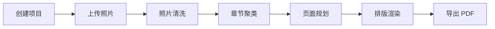
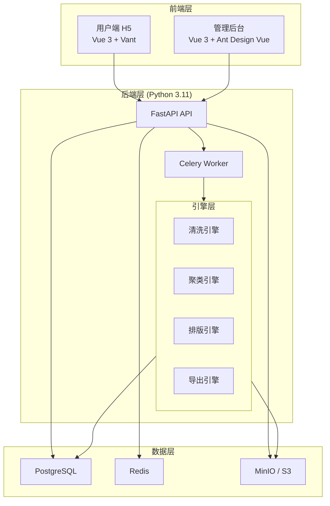
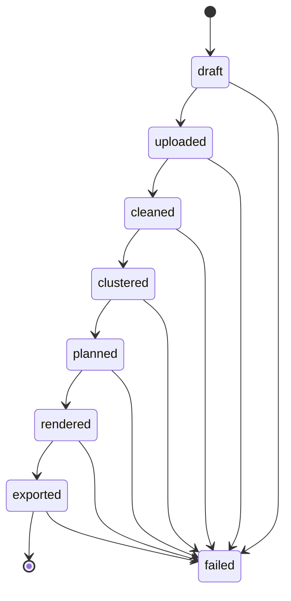

# Pixpress1 - AI 智能相册排版系统

基于 AI 的相册书自动排版系统，帮助用户将照片快速生成精美相册书，支持从上传到导出 PDF 的一站式流程。

## 核心流程



### 功能模块

| 模块 | 说明 |
|------|------|
| 项目与上传 | 创建相册、选择规格与风格、批量上传照片 |
| 照片清洗 | AI 分析照片质量，识别重复图与低质量图，推荐保留结果 |
| 章节聚类 | 按时间/地点/事件自动分组章节，支持重命名、合并与拆分 |
| 页面规划 | 自动分页、智能匹配版式模板，支持手动调整 |
| 排版渲染 | HTML 渲染排版预览，支持全册预览与单页微调 |
| 导出 | 生成印刷规格 PDF（300 DPI，CMYK），支持下载 |

## 技术栈

| 层次 | 技术 |
|------|------|
| 前端 | Vue 3 + TypeScript + Vite + Vue Router + Pinia |
| UI 框架 | Tailwind CSS + Vant（用户端）+ Ant Design Vue（管理端） |
| 后端 | Python 3.11 + FastAPI |
| 异步任务 | Celery + Redis |
| 数据库 | PostgreSQL |
| ORM | SQLAlchemy 2.0 |
| 对象存储 | MinIO / S3 |
| AI 服务 | Claude API（照片分析、内容识别） |
| PDF 导出 | Playwright（HTML → PDF 高保真渲染） |

## 系统架构



## 项目结构

```
pixpress1/
├── backend/                    # 后端服务
│   ├── app/
│   │   ├── main.py             # FastAPI 应用入口
│   │   ├── api/                # API 路由层
│   │   ├── core/               # 配置管理
│   │   ├── common/             # 通用模块（响应格式、枚举）
│   │   ├── engines/            # 核心引擎层
│   │   │   ├── cleaning_engine/    # 照片清洗引擎
│   │   │   ├── chapter_engine/     # 章节聚类引擎
│   │   │   ├── layout_engine/      # 排版引擎
│   │   │   └── export_engine/      # PDF 导出引擎
│   │   ├── modules/            # 业务模块
│   │   │   ├── album/          # 相册管理
│   │   │   ├── photo/          # 照片管理
│   │   │   ├── cleaning/       # 照片清洗
│   │   │   ├── chapter/        # 章节管理
│   │   │   ├── layout/         # 排版管理
│   │   │   ├── export/         # 导出管理
│   │   │   └── user/           # 用户模块
│   │   └── storage/            # 存储层（文件、内存）
│   ├── requirements.txt
│   └── .env.example
├── frontend/                   # 前端应用
│   └── src/
│       ├── app/                # 应用级配置（路由、Provider）
│       ├── features/           # 功能页面
│       │   ├── project-upload/     # 项目创建 & 上传
│       │   ├── photo-cleaning/     # 照片清洗
│       │   ├── chapter-clustering/ # 章节聚类
│       │   ├── page-planning/      # 页面规划
│       │   └── export-order/       # 导出中心
│       ├── modules/admin/      # 管理后台
│       └── shared/             # 共享组件、API 封装、类型定义
├── start.bat                  # Windows 一键启动脚本
└── .env                       # 环境变量
```

## 快速开始

### 前置依赖

- **Node.js** 18+
- **Python** 3.11+
- **PostgreSQL** 15+
- **Redis** 7+
- **MinIO**（可选，默认使用本地文件系统）

### Windows 一键启动

```bash
start.bat
```

脚本将自动完成依赖安装和服务启动：
- 后端 API：http://127.0.0.1:8000
- API 文档：http://127.0.0.1:8000/docs
- 前端应用：http://127.0.0.1:5173

### 手动启动

#### 1. 配置环境变量

```bash
cp backend/.env.example backend/.env
cp frontend/.env.example frontend/.env
```

按需修改 `backend/.env` 中的数据库、Redis、MinIO 连接信息。

#### 2. 启动后端

```bash
cd backend
python -m venv .venv
.venv\Scripts\activate   # Windows
pip install -r requirements.txt
uvicorn app.main:app --reload --host 127.0.0.1 --port 8000
```

#### 3. 启动前端

```bash
cd frontend
npm install
npm run dev
```

## API 概览

所有 API 均以 `/api/v1` 为前缀，统一响应格式：

```json
{
  "code": 0,
  "message": "success",
  "request_id": "uuid",
  "data": {}
}
```

### 主要接口

| 方法 | 路径 | 说明 |
|------|------|------|
| POST | `/api/v1/albums` | 创建相册 |
| POST | `/api/v1/albums/{id}/photos/upload` | 上传照片 |
| POST | `/api/v1/albums/{id}/clean` | 触发清洗 |
| POST | `/api/v1/albums/{id}/cluster` | 触发章节聚类 |
| POST | `/api/v1/albums/{id}/plan` | 触发页面规划 |
| POST | `/api/v1/albums/{id}/render` | 触发排版渲染 |
| POST | `/api/v1/albums/{id}/export` | 导出 PDF |
| GET  | `/api/v1/tasks/{id}` | 查询任务状态 |

完整接口文档见 Swagger UI：http://127.0.0.1:8000/docs

## 相册状态流转



每个阶段由对应的异步任务驱动，前端通过任务状态接口（`GET /api/v1/tasks/{id}`）轮询进度。

## 环境变量说明

| 变量 | 说明 | 默认值 |
|------|------|--------|
| `APP_NAME` | 应用名称 | `Pixpress1 API` |
| `APP_ENV` | 运行环境 | `development` |
| `APP_HOST` | 绑定地址 | `127.0.0.1` |
| `APP_PORT` | 服务端口 | `8000` |
| `DATABASE_URL` | 数据库连接 | `postgresql+psycopg://...` |
| `REDIS_URL` | Redis 连接 | `redis://127.0.0.1:6379/0` |
| `MINIO_ENDPOINT` | MinIO 地址 | `127.0.0.1:9000` |
| `UPLOADS_DIR` | 本地上传目录 | `uploads` |
