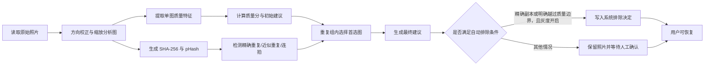

# 阶段 B：照片清洗环节说明

**文档版本**：v1.0
**对应实现版本**：`b1-local-v1`
**更新时间**：2026-07-15
**状态**：已实现，待使用真实标注集完成发布指标验收

---

## 1. 环节定位

照片清洗位于照片上传之后、章节划分之前，目标不是代替用户删除照片，而是先完成技术质量分析和重复关系整理，降低后续人工筛选成本。

当前处理流程为：



本阶段使用本地确定性图像算法，不调用外部视觉模型。它评估的是照片的技术质量和图像相似度，不评价人物表情、纪念意义、故事价值或审美偏好。

---

## 2. 三类状态及其区别

系统将“算法怎么看”和“照片是否真的被排除”拆成两个独立状态。

| 概念 | 字段 | 可选值 | 含义 |
|---|---|---|---|
| 系统建议 | `cleaning_suggestion` | `keep / review / remove` | 算法给出的处理建议，不一定影响后续流程 |
| 实际决定 | `cleaning_decision` | `keep / remove / null` | 照片是否实际进入分章、分页和排版 |
| 决定来源 | `cleaning_decision_source` | `user / system_exact_duplicate / null` | 决定来自用户还是精确重复自动规则 |

实际生效规则：

- 只有 `cleaning_decision=remove` 的照片会被后续分章、分页和排版排除。
- `cleaning_suggestion=remove` 但 `cleaning_decision=null` 的照片仍然保留。
- 用户点击“恢复”后写入 `cleaning_decision=keep`、`cleaning_decision_source=user`。
- 用户作出的决定优先级最高，重新运行清洗不会覆盖用户决定。
- 清洗中的“移出”不是物理删除，原文件和章节/页面关联仍然保留，因此可以恢复。
- 永久删除照片是独立功能，不由清洗建议自动触发。

这套设计的核心目的是：允许算法积极提示，但限制算法直接改变用户内容的权限。

---

## 3. 图像预处理

每张照片在分析前执行以下处理：

1. 通过 `file_store.open_file()` 从本地存储或 MinIO 读取原始文件。
2. 使用 Pillow 完整解码图片。
3. 根据 EXIF Orientation 校正照片方向。
4. 转换为 RGB 色彩模式。
5. 保留原始宽高用于分辨率评分。
6. 复制一份最长边不超过 1024 像素的分析图，用于 pHash、清晰度、曝光和颜色直方图计算。

分析图缩放不会修改用户原始文件。

---

## 4. 单图质量特征

### 4.1 清晰度

清晰度使用灰度图的拉普拉斯响应方差衡量。通常边缘越丰富、越清晰，方差越高；严重失焦或运动模糊会使方差降低。

原始值记为 `V`，清晰度分项分数 `S_sharpness` 范围为 `0-1`：

```text
V <= 30:
    S_sharpness = max(0, V / 30 * 0.25)

30 < V <= 80:
    S_sharpness = 0.25 + (V - 30) / 50 * 0.25

V > 80:
    S_sharpness = min(1, 0.5 + ln(V / 80) / ln(10) * 0.5)
```

严重程度：

| 拉普拉斯方差 | 等级 | 问题码 |
|---:|---|---|
| `< 30` | 严重 | `sharpness_severe` |
| `30-79.999` | 警告 | `sharpness_warning` |
| `>= 80` | 正常 | 无 |

注意：纹理很少的纯色照片即使没有失焦，也可能得到较低清晰度分。因此系统不会仅凭清晰度一项自动排除照片。

### 4.2 曝光

曝光分析包含以下指标：

- `mean`：归一化平均亮度，范围 `0-1`。
- `p05 / p95`：亮度的第 5、95 百分位。
- `shadow_clip`：亮度不高于 `0.02` 的像素占比。
- `highlight_clip`：亮度不低于 `0.98` 的像素占比。
- `dynamic_range`：`p95 - p05`，用于估计有效动态范围。

曝光分项首先计算平均亮度分：

```text
mean < 0.5:
    mean_score = min(1, mean / 0.35)
mean >= 0.5:
    mean_score = min(1, (1 - mean) / 0.35)
```

然后计算裁切惩罚和动态范围系数：

```text
clipping_penalty = min(0.75, max(shadow_clip, highlight_clip) * 1.5)
range_factor = min(1, max(0, dynamic_range / 0.55))

S_exposure = mean_score
             * (1 - clipping_penalty)
             * (0.65 + 0.35 * range_factor)
```

最终将 `S_exposure` 限制在 `0-1`。

严重程度：

| 条件 | 等级 | 问题码 |
|---|---|---|
| `mean < 0.08` 或 `mean > 0.92` | 严重 | `exposure_severe` |
| 暗部或高光裁切比例 `> 50%` | 严重 | `exposure_severe` |
| `mean < 0.15` 或 `mean > 0.85` | 警告 | `exposure_warning` |
| 暗部或高光裁切比例 `> 25%` | 警告 | `exposure_warning` |
| 其他情况 | 正常 | 无 |

动态范围会影响曝光分，但当前不会单独生成严重问题码。

### 4.3 分辨率

分辨率以原始照片短边为主要依据。短边记为 `M`：

```text
S_resolution = min(1, M / 1600)
```

严重程度：

| 原图短边 | 等级 | 问题码 |
|---:|---|---|
| `< 320 px` | 严重 | `resolution_severe` |
| `320-799 px` | 警告 | `resolution_warning` |
| `>= 800 px` | 正常 | 无 |

短边达到 1600 像素时，分辨率分项达到满分。分辨率是否满足最终印刷要求仍取决于照片在版面中的实际尺寸，本分数只是清洗阶段的通用技术指标。

### 4.4 横竖方向与长宽比

方向不参与质量扣分，只作为筛选和重复检测条件。

| 宽高比 | 分类 |
|---:|---|
| `width / height > 1.1` | `landscape`，横图 |
| `width / height < 1 / 1.1` | `portrait`，竖图 |
| 其他 | `square`，近方形 |

当前不认为横图或竖图天然优于另一种方向。

### 4.5 颜色直方图

系统分别对 RGB 三个通道建立 16 档归一化直方图，共 48 个值。颜色直方图不直接参与质量分，只用于辅助 pHash 排除“结构相似但颜色内容不同”的误判。

---

## 5. 总质量分

质量总分范围为 `0-10`，保留两位小数：

```text
quality_score = (
    S_sharpness * 0.50
    + S_exposure * 0.30
    + S_resolution * 0.20
) * 10
```

权重含义：

| 分项 | 权重 | 原因 |
|---|---:|---|
| 清晰度 | 50% | 模糊通常最直接影响照片可用性和印刷效果 |
| 曝光 | 30% | 严重欠曝、过曝和大面积裁切会损失有效细节 |
| 分辨率 | 20% | 低分辨率影响放大使用，但小尺寸排版仍可能可用 |

质量分不是审美分，也不表示照片内容的重要程度。例如一张技术质量一般但具有唯一纪念价值的照片，仍应由用户保留。

---

## 6. 基于质量的初始建议标准

先统计清晰度、曝光、分辨率中被标记为 `severe` 的独立问题数量，再结合总质量分生成初始建议。

| 条件 | 初始建议 | 置信度 | 是否自动排除 |
|---|---|---:|---|
| 严重问题数 `>= 2` 且总分 `< 3` | `remove` | `0.90` | `exact_and_clear_quality` 模式下是 |
| 严重问题数 `>= 1`，或总分 `< 5` | `review` | `0.75` | 否 |
| 其他情况 | `keep` | `0.90` | 否 |

因此，以下情况不会仅凭质量规则自动排除：

- 只有模糊问题，但曝光和分辨率尚可。
- 只有严重欠曝，但照片可能具有特殊创作意图。
- 只有分辨率过低，但照片可能只需要以小图使用。
- 总分偏低但没有同时满足两个严重问题。

典型“建议删除”示例：

- 严重模糊 + 严重欠曝，并且总分低于 3。
- 严重模糊 + 分辨率短边低于 320，并且总分低于 3。
- 严重过曝 + 分辨率严重不足，并且总分低于 3。

这类结果在默认的 `exact_and_clear_quality` 模式下会写入可恢复的系统排除决定；边界值 `3.0` 不自动排除。

---

## 7. 重复与连拍检测

### 7.1 SHA-256 精确重复

两张照片原始文件字节的 SHA-256 完全一致时，关系类型为 `exact`。

该判定表示两个文件内容完全相同，不再依赖文件大小或文件名。相同文件大小但内容不同的照片不会因此成为重复照片。

### 7.2 感知哈希 pHash

系统将分析图转换为 `32 x 32` 灰度图，执行二维 DCT，取左上角 `8 x 8` 低频系数，并基于中位数生成 64 位 pHash。

两张照片的 pHash 距离使用汉明距离：

```text
distance = bit_count(phash_a XOR phash_b)
```

距离越小，表示图像整体结构越相似。距离为 0 不等于原文件完全一致，精确重复仍以 SHA-256 为准。

### 7.3 近似重复

一对照片必须同时满足以下条件，才判定为 `near`：

| 指标 | 阈值 |
|---|---:|
| pHash 汉明距离 | `<= 6` |
| 相对长宽比差 | `<= 2%` |
| RGB 直方图距离 | `<= 0.20` |

相对长宽比差计算方式：

```text
abs(aspect_a - aspect_b) / max(aspect_a, aspect_b)
```

这一类通常覆盖重新编码、轻微压缩、轻度色彩变化等情况。

### 7.4 连拍相似

若一对照片没有先被判定为近似重复，还可以在同时满足以下条件时判定为 `burst`：

| 指标 | 阈值 |
|---|---:|
| 拍摄时间差 | `<= 3000 ms` |
| pHash 汉明距离 | `<= 12` |
| 相对长宽比差 | `<= 5%` |
| RGB 直方图距离 | `<= 0.30` |
| 设备信息 | 双方都有设备信息时必须一致 |

如果任意一方没有设备信息，设备条件不会阻断连拍判断；如果缺少拍摄时间，则不能判定为连拍。

### 7.5 完整链接聚类

系统使用完整链接约束建立重复组。两个组只有在所有跨组照片对都满足重复或连拍关系时才会合并。

例如：

```text
A 与 B 相似
B 与 C 相似
A 与 C 不相似
```

系统不会仅因为 A-B、B-C 相似，就把 A、B、C 全部合成一个组。这一策略牺牲部分召回率，优先降低错误合组。

重复组类型包括：

- `exact`：组内关系全部为精确重复。
- `near`：组内关系全部为近似重复。
- `burst`：组内关系全部为连拍相似。
- `mixed`：组内同时存在精确、近似或连拍关系。

---

## 8. 重复组首选图评分

重复组成员首先按以下顺序排序：

1. `quality_score` 更高者优先。
2. 总像素数 `width * height` 更高者优先。
3. 上传时间更早者优先。
4. 照片 ID 字典序更小者优先，保证结果稳定可复现。

排序第一的照片成为组内 `preferred_photo_id`。

首选图本质上是“技术质量最优图”，当前不会考虑：

- 人物是否闭眼。
- 表情是否自然。
- 主体是否被遮挡。
- 哪张照片更有纪念意义。
- 用户对构图和内容的个人偏好。

因此连拍组的首选图仍应由用户确认。

---

## 9. 重复关系对建议的覆盖规则

完成分组后，重复关系会调整单图的初始质量建议。当前优先级如下：

| 组内身份或关系 | 最终建议 | 置信度 | 自动排除 |
|---|---|---:|---|
| 全组首选图 | `keep` | 至少 `0.95` | 否 |
| 同一 SHA-256 子组中的非首个副本 | `remove` | `1.00` | 可能，取决于灰度配置 |
| 近似重复且 pHash 距离 `<= 4`、直方图距离 `<= 0.10` | `remove` | `0.90` | 否 |
| 其他近似重复或连拍成员 | `review` | 至少 `0.75` | 否 |

在 `mixed` 混合组中，每个 SHA-256 子组独立选择一个规范副本。即使全组首选图属于另一个近似图片，完全相同的副本中仍只保留一个系统规范副本。

当前重复组规则优先于初始质量建议。也就是说，组内首选图会被标记为 `keep`，即使它在单图质量分析阶段曾被标记为 `review` 或 `remove`。这样做是为了确保每个重复组至少保留一个候选，但用户仍应检查其质量问题。

---

## 10. 什么情况下会自动排除

系统只自动排除两类置信边界明确的照片：

> SHA-256 完全相同的非规范副本；或者同时存在至少两个严重质量问题且总分严格低于 `3.0` 的照片。重复组首选图始终保留。

自动排除还受以下配置控制：

| 环境变量 | 默认值 | 作用 |
|---|---|---|
| `CLEANING_PIPELINE_VERSION` | `b1-local-v1` | 清洗算法版本和缓存键 |
| `CLEANING_ANALYSIS_MAX_PARALLEL` | `3` | 单册并行分析数量 |
| `CLEANING_ROLLOUT_PERCENT` | `100` | 自动排除灰度比例，范围 `0-100` |
| `CLEANING_AUTO_EXCLUDE_MODE` | `exact_and_clear_quality` | `off` 关闭；`exact_only` 仅排除精确副本；默认模式同时排除明确低质量照片 |

灰度桶根据相册 ID 的 SHA-256 稳定计算，同一相册不会在多次请求中随机切换是否命中灰度。

以下情况不会自动排除：

- 只有一个严重质量问题。
- 总分等于或高于 `3.0`。
- pHash 近似重复。
- 连拍相似。
- 用户已明确作出 `keep` 或 `remove` 决定。

---

## 11. 人工确认、恢复和重跑

### 11.1 单张或批量决定

用户可以对一张或多张照片执行：

- 确认保留：写入 `decision=keep`。
- 移出后续流程：写入 `decision=remove`。
- 清除决定：写入 `decision=null`。

所有操作都会记录决定事件，包括前一状态、当前状态、来源、任务 ID、重复组 ID 和操作时间。

### 11.2 接受重复组首选图

用户点击“采用首选图”后，在一个事务中：

- 首选图写入人工 `keep`。
- 组内其他照片写入人工 `remove`。

这是明确的人工批量操作，因此可以排除近似重复和连拍照片；它与系统自动排除精确副本不同。

### 11.3 恢复规则

恢复照片会写入人工 `keep`，不是简单清空状态。这样重新运行清洗时，系统能识别这是用户主动恢复的照片，不会再次自动排除。

### 11.4 重置清洗

`POST /albums/{album_id}/clean/reset` 默认清除算法特征、建议和重复组，但保留人工决定。

只有显式传入：

```json
{
  "clear_user_decisions": true
}
```

才会同时清除人工决定。

---

## 12. 分析失败时的回退

如果单张照片读取或解码失败，整册任务不会因此失败。系统改用元数据回退：

- 不生成 SHA-256 和 pHash。
- 添加 `analysis_failed` 问题码。
- 标记 `fallback_used=true`。
- 建议固定为 `review`。
- 置信度为 `0.20`。
- 只根据已有宽高计算分辨率信息。
- 绝不自动排除。

回退质量分当前按以下方式计算：

```text
fallback_quality_score = (0.5 + 0.3 + 0.2 * resolution_score) * 10
```

该分数是兼容展示值，不能与完整图像分析得到的质量分直接比较；实际处理应以 `analysis_failed` 和 `review` 为准。

存储服务不可用、数据库异常或任务状态异常仍会使整册任务失败，并进入 ARQ 的任务失败/重试流程。

---

## 13. 缓存、任务和下游影响

- 当照片已有相同 `cleaning_analysis_version`、特征、SHA-256 和 pHash 时，重跑会复用单图分析结果。
- 算法版本进入任务幂等键；修改算法或阈值时应提升版本号，避免误用旧缓存。
- 单册图像分析使用有限并发，默认最多 3 张同时处理。
- 清洗成功后相册状态设为 `cleaned`，`content_revision` 增加一次。
- 清洗重跑或人工决定变化都会使旧渲染产物失效。
- 已有章节和页面照片关联不会被物理删除。
- 分章、分页和渲染统一只过滤 `cleaning_decision=remove` 的照片。

---

## 14. 前端展示与操作

照片清洗页包含四个主要视图：

| 视图 | 内容 |
|---|---|
| 重复组 | 组类型、组置信度、首选图、pHash 距离、阈值、自动排除状态 |
| 待复核 | 尚无系统或用户决定的 `review` 和 `remove` 建议照片 |
| 全部 | 所有照片及质量分项 |
| 已移出 | 当前 `decision=remove` 的照片 |

单图展示内容包括：

- 总质量分。
- 清晰度、曝光、分辨率分项分数。
- 文件尺寸与图片宽高。
- 质量问题标签。
- 系统建议。
- 实际是否已移出。

页面支持单张确认、批量保留、批量移出、采用组内首选图、恢复和撤销最近一次前端操作。

---

## 15. 接口摘要

所有接口继续使用统一响应包：

```json
{
  "code": 0,
  "message": "ok",
  "request_id": "req_xxx",
  "data": {}
}
```

| 方法 | 路径 | 用途 |
|---|---|---|
| `POST` | `/albums/{album_id}/clean` | 创建异步清洗任务 |
| `GET` | `/albums/{album_id}/clean/results` | 获取清洗摘要、重复组和照片结果 |
| `PATCH` | `/albums/{album_id}/clean/decisions` | 单张或批量更新人工决定 |
| `POST` | `/albums/{album_id}/clean/groups/{group_id}/accept-preferred` | 接受重复组首选图并移出其他成员 |
| `POST` | `/albums/{album_id}/clean/reset` | 重置算法结果，可选清除人工决定 |

批量决定请求示例：

```json
{
  "photo_ids": ["photo-id-1", "photo-id-2"],
  "decision": "remove"
}
```

`decision` 可以是 `keep`、`remove` 或 `null`，单次最多处理 200 张照片。

---

## 16. 离线评测指标

离线评测脚本位于 `backend/scripts/evaluate_cleaning.py`，标注格式示例位于 `backend/scripts/cleaning_evaluation_manifest.example.jsonl`。

### 16.1 指标定义

| 指标 | 定义 |
|---|---|
| 重复检测 precision | 正确预测的重复照片对 / 全部预测重复照片对 |
| 重复检测 recall | 正确预测的重复照片对 / 全部真实重复照片对 |
| 删除建议 precision | 真实应该移除且被建议移除的照片 / 全部建议移除照片 |
| 误删率 | 自动排除且标注为必须保留的照片 / 全部必须保留照片 |
| 首选准确率 | 首选图落入人工可接受首选集合的重复组 / 可评估重复组 |
| 高质量保留率 | 未被自动排除的必须保留照片 / 全部必须保留照片 |

重复 precision/recall 按照片对计算，不是按重复组数量计算。

### 16.2 发布门槛

| 指标 | 门槛 |
|---|---:|
| 重复检测 precision | `>= 98%` |
| 重复检测 recall | `>= 90%` |
| 删除建议 precision | `>= 98%` |
| 误删率 | `<= 0.5%` |
| 误删率 95% Wilson 置信区间上界 | `<= 0.5%` |
| 首选准确率 | `>= 85%` |
| 高质量保留率 | 不低于基线版本 |

任一门槛不通过时，评测脚本返回非零退出码，候选版本不得进入灰度。

### 16.3 标注字段

每行 JSONL 至少应包含：

| 字段 | 含义 |
|---|---|
| `id` | 照片唯一标识 |
| `album_id` | 相册或事件分组标识 |
| `path` | 相对于标注文件的图片路径 |
| `duplicate_cluster_id` | 真实重复组；非重复照片可为空 |
| `quality_label` | 质量标签；必须保留照片使用 `must_keep` |
| `should_remove` | 人工判断是否应该移除 |
| `acceptable_preferred` | 是否属于该组可接受首选图 |
| `baseline_excluded` | 基线版本是否自动排除该照片 |
| `taken_at` | 可选，ISO 拍摄时间 |
| `device_model` | 可选，拍摄设备 |

执行示例：

```powershell
cd backend
python scripts/evaluate_cleaning.py path\to\manifest.jsonl --output cleaning-report.json
```

建议正式发布集至少包含 5000 张照片、500 个重复或连拍组、2000 张高质量必须保留照片，并按相册或事件维度切分数据，避免相同连拍跨越训练/验证/测试集合。

---

## 17. 当前边界与风险

当前版本明确不包含：

- 人脸检测、闭眼检测、笑容或表情评分。
- 主体识别、遮挡判断和语义内容理解。
- 审美构图评分和情感价值判断。
- RAW 图片支持。
- 物理删除回收站。
- 基于真实大规模标注集完成的阈值校准结果。

已知算法风险：

- pHash 对大幅裁剪、旋转、加边框或局部水印的召回有限。
- 低纹理照片可能被清晰度算法低估。
- 夜景、剪影、高调摄影可能被曝光规则标记为异常。
- 高质量首选目前只代表技术质量，不代表人物状态或内容价值。
- 连拍设备信息缺失时仍允许匹配，需要依靠时间、pHash、长宽比和颜色共同约束。
- 当前阈值是初始工程阈值，扩大自动排除范围前必须重新标注和评测。

因此首版坚持以下原则：

1. 只有至少两个严重质量问题且总分严格低于 `3.0` 时，质量规则才自动排除。
2. 近似重复和连拍只提供建议，不自动排除。
3. 文件内容完全相同的副本和明确越过质量抛弃边界的照片可以自动排除。
4. 所有自动排除都可恢复。
5. 用户决定永远优先于算法重跑。

---

## 18. 验收建议

功能验收应至少覆盖以下场景：

1. 同一文件改名后重复上传，应识别为精确重复并只自动排除一个副本。
2. 文件大小相同但内容不同，不应识别为精确重复。
3. 同图重新编码，应进入近似重复组，但不自动排除。
4. 三张照片满足 A-B 相似、B-C 相似、A-C 不相似时，不应全部合并。
5. 3 秒内同设备连拍且图像相似，应进入连拍组。
6. 缺少拍摄时间时，不应仅凭上传顺序判定连拍。
7. 单一严重模糊照片应进入复核，不应自动排除。
8. 两个严重质量问题且总分低于 3，应自动移出且允许用户恢复；总分等于 3 时仍进入人工复核。
9. 恢复系统自动排除的精确副本后，重新运行清洗不应再次排除。
10. 接受组内首选图后，首选图保留，其余组成员实际移出。
11. 图片读取失败时整册任务应继续，失败照片进入 `analysis_failed + review`。
12. 清洗决定变化后，旧渲染产物应失效，但原章节/页面关联应保留。

实现改动后的基本验证命令：

```powershell
start.bat test
start.bat test-render
cd frontend
npm run build
```

发布前还必须运行真实标注集离线评测，常规集成测试不能替代准确率和误删率验收。
