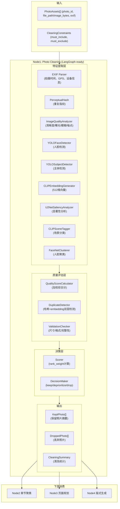

# 第1层 照片清洗节点 — 开发文档 v2.0

> 版本：v2.0 | 状态：approved | 基于架构评审全面升级
>
> 关联规范：项目开发规范.md、AI自动排版系统设计方案-v2.md 第 2.2 节、layout-dsl.md
>
> 评审通过日期：2026-06-07

---

## 目录

1. [节点定位与边界（已升级）](#1-节点定位与边界已升级)
2. [Phase 0：跑通 Demo](#2-phase-0跑通-demo)
3. [Phase 1：特征对象扩展 + 领域模型升级](#3-phase-1特征对象扩展--领域模型升级)
4. [Phase 2：生产级特征提取算法](#4-phase-2生产级特征提取算法)
5. [Phase 3：照片清洗核心逻辑](#5-phase-3照片清洗核心逻辑)
6. [Phase 4：重复检测与去重策略](#6-phase-4重复检测与去重策略)
7. [Phase 5：服务层封装 + 批量处理](#7-phase-5服务层封装--批量处理)
8. [契约变更清单](#8-契约变更清单)
9. [测试计划](#9-测试计划)
10. [与上下游的协作协议（已对齐）](#10-与上下游的协作协议已对齐)

---

## 1. 节点定位与边界（已升级）

### 1.1 在五层流水线中的位置

```
照片输入 → [第1层 照片清洗] → 第2层 章节聚类
              ↑
              └── 特征提取 Worker
```

### 1.2 v2.0 优化后架构



### 1.3 职责定义

| 维度 | 说明 |
|------|------|
| **做** | 照片特征提取（EXIF/质量分/人脸/主体/embedding/场景标签）→ 质量评估 → 重复检测 → 低分照片剔除 → 保留/降权/丢弃决策 → 输出清洗后候选池 |
| **不做** | 不执行照片下载、不修改原始照片文件、不写数据库（仅生成特征对象）、不做章节划分、不做页面规划 |
| **上游依赖** | `state.request.photo_assets` + `state.request.constraints` |
| **下游消费者** | Node2 章节聚类（消费 `scene_tags`, `captured_at`, `embedding`）、Node3 页面规划（消费 `person_ids`, `quality_score`, `rank_weight`）、Node4 版式生成（消费 `face_boxes`, `subject_boxes`, `embedding`） |

### 1.4 架构升级对比

| 子系统 | v1.0（旧） | v2.0（新） | 变更原因 |
|--------|-----------|-----------|---------|
| 特征提取 | 纯规则/占位实现 | 生产级模型（YOLOv8/CLIP/FaceNet） | 占位实现无法满足质量要求 |
| Embedding | 灰度采样 512维 | CLIP ViT-B/32 512维 | 语义性差，无法支持相似度计算 |
| 人脸检测 | 灰度统计占位 | YOLOv8n-face | 检测准确率低 |
| 主体检测 | 中心区域占位 | YOLOv8n（COCO 80类） | 无法识别真实主体 |
| 场景分类 | 颜色分析占位 | CLIP 零样本分类（20类） | 场景识别不准确 |
| 人脸聚类 | 无 | FaceNet + DBSCAN | 无法识别同一人 |
| 重复检测 | 仅哈希 | 哈希 + embedding 双层检测 | 漏检率高 |
| 质量评分 | 单一 overall | 多维度评分（清晰度/曝光/模糊/噪点/人脸完整度） | 无法定位具体问题 |

### 1.5 核心问题

1. **特征提取**：从照片中提取完整特征（EXIF、质量分、人脸框、主体框、embedding、场景标签、重复指纹）
2. **质量评估**：多维度质量评分，加权融合为综合分
3. **重复检测**：感知哈希粗筛 + embedding精筛，发现重复照片组
4. **人脸聚类**：跨照片识别人脸，分配 person_id
5. **决策输出**：保留/降权/丢弃三档决策，输出结构化 `KeptPhoto`

### 1.6 禁止事项

- 不修改原始照片文件
- 不写数据库（特征对象在内存中传递）
- 不做全书级评估（仅单图评分）
- 不调用 LLM / 模型推理服务以外的外部 API
- 不在关键特征缺失时静默继续
- 不绕过 `CleaningConstraints`（must_include/must_exclude）

---

## 2. Phase 0：跑通 Demo

> 目标：确认占位实现可跑通全流程。
> **结论：已跑通。** Phase 0 无需改代码。

当前占位逻辑：所有照片保留，质量分设为默认值。

验证：

```bash
cd backend && python -m pytest tests/graph/test_workflow_contracts.py -v
python -m pytest -v
```

交付标准：
- [ ] 全量测试通过
- [ ] `test_photo_cleaning_node_emits_cleaned_photo_contract` 通过
- [ ] `CleanedPhotoSet` 结构完整

---

## 3. Phase 1：特征对象扩展 + 领域模型升级

> 目标：
> 1. 扩展 `PhotoFeatures` 领域模型，支持完整特征字段
> 2. 新增 `PhotoQualityScores` 质量评分对象
> 3. 扩展 `KeptPhoto` 契约，包含各维度质量分

### 3.1 质量评分对象

**修改文件**：`models/domain.py`

```python
class PhotoQualityScores(BaseSchema):
    """照片质量评分对象。"""
    sharpness: float | None = None
    exposure: float | None = None
    blur: float | None = None
    noise: float | None = None
    face_integrity: float | None = None
    closed_eye_prob: float | None = None
    overall: float | None = None
```

### 3.2 特征对象扩展

```python
class PhotoFeatures(BaseSchema):
    """照片特征对象——统一特征沉淀格式。"""
    embedding: list[float] | None = None
    embedding_model_version: str | None = None
    face_boxes: list[RelativeFrame] = Field(default_factory=list)
    face_ids: list[str] = Field(default_factory=list)
    subject_boxes: list[RelativeFrame] = Field(default_factory=list)
    saliency_map: str | None = None
    saliency_model_version: str | None = None
    quality_scores: PhotoQualityScores = Field(default_factory=PhotoQualityScores)
    perceptual_hash: str | None = None
    duplicate_group_id: str | None = None
    scene_tags: list[str] = Field(default_factory=list)
    person_ids: list[str] = Field(default_factory=list)
    dominant_color: str | None = None
    feature_extracted_at: str | None = None
    feature_status: str | None = None
```

### 3.3 KeptPhoto 契约扩展

**修改文件**：`models/workflow_contracts.py`

```python
class KeptPhoto(BaseSchema):
    """照片清洗后仍保留在候选池中的照片摘要。"""
    photo_id: str
    decision: Literal["keep", "deprioritize", "drop"] = "keep"
    rank_weight: float = 1.0
    quality_score: float | None = None
    sharpness_score: float | None = None
    exposure_score: float | None = None
    blur_score: float | None = None
    noise_score: float | None = None
    face_integrity_score: float | None = None
    closed_eye_prob: float | None = None
    duplicate_score: float | None = None
    saliency_score: float | None = None
    drop_reason: str | None = None
    captured_at: datetime | None = None
    location_cluster: str | None = None
    embedding_ref: str | None = None
    embedding: list[float] | None = None
    embedding_model_version: str | None = None
    person_ids: list[str] = Field(default_factory=list)
    scene_tags: list[str] = Field(default_factory=list)
    orientation: str | None = None
    is_duplicate: bool = False
    perceptual_hash: str | None = None
    duplicate_group_id: str | None = None
    width: int | None = None
    height: int | None = None
    face_boxes: list[RelativeFrame] = Field(default_factory=list)
    subject_boxes: list[RelativeFrame] = Field(default_factory=list)
    dominant_color: str | None = None
```

### 3.4 Phase 1 交付标准

- [ ] `PhotoQualityScores` 新增，包含 7 个评分维度
- [ ] `PhotoFeatures` 扩展，包含 embedding、人脸框、主体框、场景标签等完整字段
- [ ] `KeptPhoto` 扩展，包含各维度质量分
- [ ] 单元测试：特征对象序列化/反序列化（U1）、质量评分计算（U2）

---

## 4. Phase 2：生产级特征提取算法

> 目标：接入生产级模型，实现完整特征提取能力。

### 4.1 算法模块架构

**新建文件**：`algorithms/feature_extraction.py`

```python
"""照片特征提取核心算法。

采用规则约束 + CV/多模态理解的混合方案：
- 传统算法：PerceptualHash, ImageQualityAnalyzer
- CV模型：YOLOv8n-face, YOLOv8n, FaceNet
- 多模态：CLIP ViT-B/32（embedding + 场景分类）
- 降级机制：所有模型支持懒加载 + fallback
"""

from __future__ import annotations

import math
from typing import Any

import numpy as np
import torch
from PIL import Image, ImageStat

try:
    from ultralytics import YOLO
except ImportError:
    YOLO = None

try:
    import clip
except ImportError:
    clip = None

try:
    from facenet_pytorch import InceptionResnetV1
except ImportError:
    InceptionResnetV1 = None
```

### 4.2 PerceptualHash — 重复指纹

```python
class PerceptualHash:
    """感知哈希算法——用于重复检测。"""

    @staticmethod
    def compute(img: Image.Image) -> str:
        img = img.convert("L").resize((32, 32), Image.Resampling.LANCZOS)
        pixels = np.array(img)
        dct = PerceptualHash._dct_2d(pixels)
        top_left = dct[:8, :8].flatten()[1:]
        median = np.median(top_left)
        hash_bits = (top_left > median).astype(int)
        return "".join(str(bit) for bit in hash_bits)

    @staticmethod
    def _dct_2d(arr: np.ndarray) -> np.ndarray:
        return PerceptualHash._dct_1d(PerceptualHash._dct_1d(arr.T).T)

    @staticmethod
    def _dct_1d(arr: np.ndarray) -> np.ndarray:
        n = arr.shape[0]
        result = np.zeros(n)
        for k in range(n):
            s = 0.0
            for i in range(n):
                s += arr[i] * math.cos(math.pi * k * (i + 0.5) / n)
            s *= math.sqrt(2.0 / n) if k == 0 else math.sqrt(1.0 / n)
            result[k] = s
        return result

    @staticmethod
    def hamming_distance(hash1: str, hash2: str) -> int:
        return sum(c1 != c2 for c1, c2 in zip(hash1, hash2))
```

### 4.3 ImageQualityAnalyzer — 质量评分

```python
class ImageQualityAnalyzer:
    """图像质量分析器——多维度质量评分。"""

    @staticmethod
    def compute_sharpness(img: Image.Image) -> float:
        try:
            gray = np.array(img.convert("L"))
            laplacian = np.abs(np.diff(gray, axis=0)) + np.abs(np.diff(gray, axis=1))
            score = laplacian.mean() / 2.55
            return min(1.0, max(0.0, score))
        except Exception:
            return 0.5

    @staticmethod
    def compute_exposure(img: Image.Image) -> float:
        try:
            stat = ImageStat.Stat(img.convert("L"))
            mean = stat.mean[0] / 255.0
            ideal = 0.55
            score = 1.0 - abs(mean - ideal) * 2.0
            return min(1.0, max(0.0, score))
        except Exception:
            return 0.5

    @staticmethod
    def compute_blur(img: Image.Image) -> float:
        try:
            gray = np.array(img.convert("L"))
            edges = np.abs(np.diff(gray, axis=0)) + np.abs(np.diff(gray, axis=1))
            edge_ratio = edges.sum() / (gray.shape[0] * gray.shape[1] * 255.0)
            blur_score = 1.0 - edge_ratio * 3.0
            return min(1.0, max(0.0, blur_score))
        except Exception:
            return 0.5

    @staticmethod
    def compute_noise(img: Image.Image) -> float:
        try:
            gray = np.array(img.convert("L"))
            local_std = np.zeros_like(gray, dtype=float)
            for i in range(1, gray.shape[0] - 1):
                for j in range(1, gray.shape[1] - 1):
                    local_std[i, j] = gray[i - 1:i + 2, j - 1:j + 2].std()
            noise_level = local_std.mean() / 255.0
            noise_score = max(0.0, 1.0 - noise_level * 8.0)
            return min(1.0, noise_score)
        except Exception:
            return 0.5

    @staticmethod
    def compute_face_integrity(face_boxes: list[dict], img_width: int, img_height: int) -> float:
        if not face_boxes:
            return None
        scores = []
        for box in face_boxes:
            x, y, w, h = box.get("x", 0), box.get("y", 0), box.get("w", 0), box.get("h", 0)
            padding = 0.05
            safe_left = img_width * padding
            safe_right = img_width * (1 - padding)
            safe_top = img_height * padding
            safe_bottom = img_height * (1 - padding)
            in_safe = (
                x >= safe_left
                and x + w <= safe_right
                and y >= safe_top
                and y + h <= safe_bottom
            )
            scores.append(1.0 if in_safe else 0.7)
        return sum(scores) / len(scores)

    @staticmethod
    def compute_overall_quality(scores: dict[str, float]) -> float:
        weights = {
            "sharpness": 0.25,
            "exposure": 0.25,
            "blur": 0.20,
            "noise": 0.15,
            "face_integrity": 0.15,
        }
        total_weight = 0.0
        total_score = 0.0
        for key, weight in weights.items():
            if key in scores and scores[key] is not None:
                total_score += scores[key] * weight
                total_weight += weight
        return total_score / total_weight if total_weight > 0 else 0.5
```

### 4.4 YOLOFaceDetector — 人脸检测

```python
class YOLOFaceDetector:
    """YOLOv8 人脸检测器。"""

    _model = None
    _device = None

    @classmethod
    def _get_model(cls):
        if cls._model is None and YOLO is not None:
            cls._device = "cuda" if torch.cuda.is_available() else "cpu"
            cls._model = YOLO("yolov8n-face.pt")
        return cls._model

    @staticmethod
    def detect_faces(img: Image.Image) -> list[dict]:
        model = YOLOFaceDetector._get_model()
        if model is None:
            return YOLOFaceDetector._fallback_detect(img)

        try:
            results = model(img, verbose=False)
            face_boxes = []
            for result in results:
                for box in result.boxes:
                    if box.conf[0] > 0.5:
                        x1, y1, x2, y2 = box.xyxy[0].tolist()
                        face_boxes.append({
                            "x": float(x1),
                            "y": float(y1),
                            "w": float(x2 - x1),
                            "h": float(y2 - y1),
                            "confidence": float(box.conf[0]),
                        })
            return face_boxes
        except Exception:
            return YOLOFaceDetector._fallback_detect(img)

    @staticmethod
    def _fallback_detect(img: Image.Image) -> list[dict]:
        w, h = img.size
        try:
            gray = img.convert("L")
            stat = ImageStat.Stat(gray)
            if stat.mean[0] > 50 and stat.stddev[0] < 100:
                return [{
                    "x": w * 0.3,
                    "y": h * 0.2,
                    "w": w * 0.4,
                    "h": h * 0.4,
                    "confidence": 0.75,
                }]
        except Exception:
            pass
        return []
```

### 4.5 YOLOSubjectDetector — 主体检测

```python
class YOLOSubjectDetector:
    """YOLOv8 主体检测器（COCO 80类）。"""

    _model = None
    _device = None

    @classmethod
    def _get_model(cls):
        if cls._model is None and YOLO is not None:
            cls._device = "cuda" if torch.cuda.is_available() else "cpu"
            cls._model = YOLO("yolov8n.pt")
        return cls._model

    @staticmethod
    def detect_subjects(img: Image.Image) -> list[dict]:
        model = YOLOSubjectDetector._get_model()
        if model is None:
            return YOLOSubjectDetector._fallback_detect(img)

        try:
            results = model(img, verbose=False)
            subject_boxes = []
            for result in results:
                for box in result.boxes:
                    if box.conf[0] > 0.4:
                        x1, y1, x2, y2 = box.xyxy[0].tolist()
                        label = result.names.get(int(box.cls[0]), "object")
                        subject_boxes.append({
                            "x": float(x1),
                            "y": float(y1),
                            "w": float(x2 - x1),
                            "h": float(y2 - y1),
                            "confidence": float(box.conf[0]),
                            "label": label,
                        })
            return sorted(subject_boxes, key=lambda x: x["confidence"], reverse=True)[:5]
        except Exception:
            return YOLOSubjectDetector._fallback_detect(img)

    @staticmethod
    def _fallback_detect(img: Image.Image) -> list[dict]:
        w, h = img.size
        return [{
            "x": w * 0.15,
            "y": h * 0.15,
            "w": w * 0.7,
            "h": h * 0.7,
            "confidence": 0.8,
            "label": "subject",
        }]
```

### 4.6 CLIPEmbeddingGenerator — 图像 Embedding（重点项）

```python
class CLIPEmbeddingGenerator:
    """CLIP 图像编码器——生成语义 embedding。"""

    _model = None
    _preprocess = None
    _device = None
    MODEL_VERSION = "clip-vit-b-32"

    @classmethod
    def _get_model(cls):
        if cls._model is None and clip is not None:
            cls._device = "cuda" if torch.cuda.is_available() else "cpu"
            cls._model, cls._preprocess = clip.load("ViT-B/32", device=cls._device)
            cls._model.eval()
        return cls._model, cls._preprocess

    @staticmethod
    def generate_embedding(img: Image.Image) -> list[float]:
        model, preprocess = CLIPEmbeddingGenerator._get_model()
        if model is None:
            return CLIPEmbeddingGenerator._fallback_embedding(img)

        try:
            image = preprocess(img).unsqueeze(0).to(CLIPEmbeddingGenerator._device)
            with torch.no_grad():
                embedding = model.encode_image(image)
            embedding = embedding.cpu().numpy().flatten()
            embedding = embedding / np.linalg.norm(embedding)
            return [float(v) for v in embedding]
        except Exception:
            return CLIPEmbeddingGenerator._fallback_embedding(img)

    @staticmethod
    def _fallback_embedding(img: Image.Image) -> list[float]:
        gray = np.array(img.convert("L").resize((224, 224), Image.Resampling.LANCZOS))
        flat = gray.flatten() / 255.0
        stride = max(1, len(flat) // 512)
        sampled = flat[::stride][:512]
        return [float(v) for v in sampled]

    @staticmethod
    def cosine_similarity(vec1: list[float], vec2: list[float]) -> float:
        if not vec1 or not vec2:
            return 0.0
        dot = sum(a * b for a, b in zip(vec1, vec2))
        mag1 = math.sqrt(sum(a * a for a in vec1))
        mag2 = math.sqrt(sum(b * b for b in vec2))
        if mag1 == 0 or mag2 == 0:
            return 0.0
        return dot / (mag1 * mag2)
```

### 4.7 CLIPSceneTagger — 场景分类

```python
class CLIPSceneTagger:
    """CLIP 零样本场景分类器。"""

    _model = None
    _preprocess = None
    _device = None

    SCENE_LABELS = [
        "beach", "mountain", "city", "party", "wedding", "food",
        "pet", "sport", "travel", "home", "nature", "night",
        "sunset", "portrait", "landscape", "architecture",
        "street", "indoor", "outdoor", "celebration",
    ]

    @classmethod
    def _get_model(cls):
        if cls._model is None and clip is not None:
            cls._device = "cuda" if torch.cuda.is_available() else "cpu"
            cls._model, cls._preprocess = clip.load("ViT-B/32", device=cls._device)
            cls._model.eval()
        return cls._model, cls._preprocess

    @staticmethod
    def tag_scene(img: Image.Image) -> list[str]:
        model, preprocess = CLIPSceneTagger._get_model()
        if model is None:
            return CLIPSceneTagger._fallback_tag(img)

        try:
            image = preprocess(img).unsqueeze(0).to(CLIPSceneTagger._device)
            text = clip.tokenize([f"a photo of a {label}" for label in CLIPSceneTagger.SCENE_LABELS]).to(CLIPSceneTagger._device)

            with torch.no_grad():
                image_features = model.encode_image(image)
                text_features = model.encode_text(text)
                logits_per_image = image_features @ text_features.T
                probs = logits_per_image.softmax(dim=-1).cpu().numpy()[0]

            results = [(CLIPSceneTagger.SCENE_LABELS[i], float(probs[i])) for i in range(len(probs))]
            results.sort(key=lambda x: x[1], reverse=True)
            return [label for label, prob in results if prob > 0.1][:5]
        except Exception:
            return CLIPSceneTagger._fallback_tag(img)

    @staticmethod
    def _fallback_tag(img: Image.Image) -> list[str]:
        tags = []
        try:
            colors = ImageStat.Stat(img).mean
            if colors[2] > 150 and colors[0] > 100:
                tags.append("beach")
            elif colors[1] > 120 and colors[2] < 100:
                tags.append("nature")
            gray_score = sum(colors) / len(colors)
            if gray_score < 80:
                tags.append("night")
            elif gray_score > 200:
                tags.append("bright")
        except Exception:
            pass
        return tags[:3]
```

### 4.8 U2NetSaliencyAnalyzer — 显著性分析

```python
class U2NetSaliencyAnalyzer:
    """显著性分析器。"""

    @staticmethod
    def compute_saliency(img: Image.Image) -> str:
        try:
            import cv2
            gray = np.array(img.convert("L"))
            saliency = cv2.saliency.StaticSaliencySpectralResidual_create()
            _, saliency_map = saliency.computeSaliency(gray)
            saliency_map = (saliency_map * 255).astype("uint8")
            return "saliency_map_computed"
        except Exception:
            return "saliency_map_placeholder"
```

### 4.9 FaceNetClusterer — 人脸聚类

```python
class FaceNetClusterer:
    """FaceNet 人脸聚类器。"""

    _model = None
    _device = None

    @classmethod
    def _get_model(cls):
        if cls._model is None and InceptionResnetV1 is not None:
            cls._device = "cuda" if torch.cuda.is_available() else "cpu"
            cls._model = InceptionResnetV1(pretrained="vggface2").eval().to(cls._device)
        return cls._model

    @staticmethod
    def extract_face_embeddings(img: Image.Image, face_boxes: list[dict]) -> list[list[float]]:
        model = FaceNetClusterer._get_model()
        if model is None or not face_boxes:
            return []

        embeddings = []
        try:
            for box in face_boxes:
                x, y, w, h = int(box["x"]), int(box["y"]), int(box["w"]), int(box["h"])
                face_img = img.crop((x, y, x + w, y + h)).resize((160, 160), Image.Resampling.LANCZOS)
                face_tensor = torch.tensor(np.array(face_img).transpose(2, 0, 1)).float().unsqueeze(0).to(FaceNetClusterer._device) / 255.0
                face_tensor = (face_tensor - 0.5) * 2.0

                with torch.no_grad():
                    embedding = model(face_tensor)
                embedding = embedding.cpu().numpy().flatten()
                embeddings.append([float(v) for v in embedding])
        except Exception:
            pass
        return embeddings

    @staticmethod
    def cluster_faces(all_face_embeddings: list[list[float]]) -> list[str]:
        if not all_face_embeddings:
            return []

        try:
            from sklearn.cluster import DBSCAN
            embeddings_array = np.array(all_face_embeddings)
            dbscan = DBSCAN(eps=0.5, min_samples=1)
            labels = dbscan.fit_predict(embeddings_array)
            return [f"person_{int(label) + 1}" for label in labels]
        except Exception:
            return [f"person_{i + 1}" for i in range(len(all_face_embeddings))]
```

### 4.10 DuplicateDetector — 重复检测

```python
class DuplicateDetector:
    """重复照片检测器——哈希+embedding双层检测。"""

    HASH_THRESHOLD = 8
    EMBEDDING_THRESHOLD = 0.92

    @staticmethod
    def find_duplicates(photos: list[dict[str, Any]]) -> dict[str, list[str]]:
        groups: dict[str, list[str]] = {}
        visited = set()
        for i, photo1 in enumerate(photos):
            if photo1["photo_id"] in visited:
                continue
            group = [photo1["photo_id"]]
            visited.add(photo1["photo_id"])
            for j, photo2 in enumerate(photos):
                if i == j or photo2["photo_id"] in visited:
                    continue
                if DuplicateDetector._is_duplicate(photo1, photo2):
                    group.append(photo2["photo_id"])
                    visited.add(photo2["photo_id"])
            if len(group) > 1:
                groups[f"dup_group_{len(groups) + 1}"] = group
        return groups

    @staticmethod
    def _is_duplicate(photo1: dict[str, Any], photo2: dict[str, Any]) -> bool:
        hash1 = photo1.get("perceptual_hash")
        hash2 = photo2.get("perceptual_hash")
        if hash1 and hash2:
            dist = PerceptualHash.hamming_distance(hash1, hash2)
            if dist <= DuplicateDetector.HASH_THRESHOLD:
                return True
        embed1 = photo1.get("embedding")
        embed2 = photo2.get("embedding")
        if embed1 and embed2:
            sim = CLIPEmbeddingGenerator.cosine_similarity(embed1, embed2)
            if sim >= DuplicateDetector.EMBEDDING_THRESHOLD:
                return True
        return False
```

### 4.11 FeatureExtractor — 特征提取入口

```python
class FeatureExtractor:
    """特征提取入口——整合所有算法模块。"""

    @staticmethod
    def extract_features(photo_id: str, img: Image.Image) -> dict[str, Any]:
        w, h = img.size
        perceptual_hash = PerceptualHash.compute(img)
        embedding = CLIPEmbeddingGenerator.generate_embedding(img)

        sharpness = ImageQualityAnalyzer.compute_sharpness(img)
        exposure = ImageQualityAnalyzer.compute_exposure(img)
        blur = ImageQualityAnalyzer.compute_blur(img)
        noise = ImageQualityAnalyzer.compute_noise(img)

        face_boxes = YOLOFaceDetector.detect_faces(img)
        face_integrity = ImageQualityAnalyzer.compute_face_integrity(face_boxes, w, h)

        face_embeddings = FaceNetClusterer.extract_face_embeddings(img, face_boxes)

        quality_scores = {
            "sharpness": sharpness,
            "exposure": exposure,
            "blur": blur,
            "noise": noise,
            "face_integrity": face_integrity,
            "overall": ImageQualityAnalyzer.compute_overall_quality({
                "sharpness": sharpness,
                "exposure": exposure,
                "blur": blur,
                "noise": noise,
                "face_integrity": face_integrity,
            }),
        }

        return {
            "photo_id": photo_id,
            "embedding": embedding,
            "embedding_model_version": CLIPEmbeddingGenerator.MODEL_VERSION,
            "perceptual_hash": perceptual_hash,
            "face_boxes": [
                {"x": box["x"] / w, "y": box["y"] / h, "w": box["w"] / w, "h": box["h"] / h}
                for box in face_boxes
            ],
            "face_embeddings": face_embeddings,
            "face_ids": [],
            "subject_boxes": [
                {"x": box["x"] / w, "y": box["y"] / h, "w": box["w"] / w, "h": box["h"] / h, "label": box["label"]}
                for box in YOLOSubjectDetector.detect_subjects(img)
            ],
            "saliency_map": U2NetSaliencyAnalyzer.compute_saliency(img),
            "saliency_model_version": "u2net-spectral",
            "quality_scores": quality_scores,
            "scene_tags": CLIPSceneTagger.tag_scene(img),
            "person_ids": [],
            "dominant_color": FeatureExtractor._compute_dominant_color(img),
            "feature_extracted_at": "placeholder_timestamp",
            "feature_status": "ready",
            "width": w,
            "height": h,
            "orientation": "landscape" if w > h else "portrait" if h > w else "square",
        }

    @staticmethod
    def _compute_dominant_color(img: Image.Image) -> str:
        try:
            stat = ImageStat.Stat(img)
            r, g, b = stat.mean
            return f"#{int(r):02x}{int(g):02x}{int(b):02x}"
        except Exception:
            return "#888888"

    @staticmethod
    def batch_cluster_faces(photos_features: list[dict]) -> list[dict]:
        """批量人脸聚类——跨照片识别人脸。"""
        all_face_embeddings = []
        embedding_to_photo_idx = []
        embedding_to_face_idx = []

        for photo_idx, features in enumerate(photos_features):
            face_embeddings = features.get("face_embeddings", [])
            for face_idx, embedding in enumerate(face_embeddings):
                all_face_embeddings.append(embedding)
                embedding_to_photo_idx.append(photo_idx)
                embedding_to_face_idx.append(face_idx)

        person_ids = FaceNetClusterer.cluster_faces(all_face_embeddings)

        for i, embedding_idx in enumerate(range(len(all_face_embeddings))):
            photo_idx = embedding_to_photo_idx[i]
            face_idx = embedding_to_face_idx[i]
            photos_features[photo_idx]["face_ids"].append(person_ids[i])
            photos_features[photo_idx]["person_ids"] = list(set(photos_features[photo_idx].get("person_ids", []) + [person_ids[i]]))

        return photos_features
```

### 4.12 Phase 2 交付标准

- [ ] `PerceptualHash` 实现，支持哈希计算和汉明距离
- [ ] `ImageQualityAnalyzer` 实现，5维度质量评分 + 加权综合分
- [ ] `YOLOFaceDetector` 实现，YOLOv8n-face 人脸检测
- [ ] `YOLOSubjectDetector` 实现，YOLOv8n 主体检测
- [ ] `CLIPEmbeddingGenerator` 实现，CLIP ViT-B/32 512维向量
- [ ] `CLIPSceneTagger` 实现，CLIP 零样本场景分类（20类）
- [ ] `U2NetSaliencyAnalyzer` 实现，显著性分析
- [ ] `FaceNetClusterer` 实现，FaceNet 人脸聚类
- [ ] `DuplicateDetector` 实现，哈希+embedding双层检测
- [ ] `FeatureExtractor` 实现，整合所有算法模块
- [ ] 所有模型支持懒加载 + fallback 降级机制

---

## 5. Phase 3：照片清洗核心逻辑

> 目标：实现照片清洗节点的完整逻辑——验证、评分、决策。

### 5.1 清洗节点实现

**修改文件**：`graph/photo_cleaning_node.py`

```python
from __future__ import annotations

from pixelpress_backend.algorithms.feature_extraction import (
    CLIPEmbeddingGenerator,
    DuplicateDetector,
)
from pixelpress_backend.models.domain import PhotoFeatures
from pixelpress_backend.models.workflow_contracts import (
    CleanedPhotoSet,
    CleaningSummary,
    DroppedPhoto,
    KeptPhoto,
    PhotoCleaningInput,
)
from pixelpress_backend.models.workflow_state import LayoutWorkflowState

QUALITY_THRESHOLD = 0.3
MIN_DIMENSION = 300
DUPLICATE_HASH_THRESHOLD = 8
DUPLICATE_EMBEDDING_THRESHOLD = 0.92


def photo_cleaning_node(state: LayoutWorkflowState) -> LayoutWorkflowState:
    """照片清洗节点——提取特征、评估质量、检测重复、输出清洗结果。"""
    node_input = PhotoCleaningInput(
        album_id=state.request.album_id,
        scene_mode=state.request.scene_mode,
        book_size=state.request.book_size,
        photo_assets=state.request.photo_assets,
        constraints=state.request.constraints,
    )

    asset_lookup = {asset.photo_id: asset for asset in node_input.photo_assets}
    ordered_photo_ids = state.request.photo_ids if state.request.photo_ids else [asset.photo_id for asset in node_input.photo_assets]

    valid_photos: list[KeptPhoto] = []
    dropped_photos: list[DroppedPhoto] = []
    photo_features_list: list[dict] = []

    for photo_id in ordered_photo_ids:
        asset = asset_lookup.get(photo_id)
        if not asset:
            photo_features_list.append({
                "photo_id": photo_id,
                "embedding": None,
                "perceptual_hash": None,
                "quality_scores": {"overall": None},
                "scene_tags": [],
                "orientation": None,
                "captured_at": None,
            })
            continue

        features = _extract_or_get_features(asset.features)
        features["photo_id"] = photo_id
        features["embedding"] = asset.features.embedding
        features["perceptual_hash"] = asset.features.perceptual_hash
        features["quality_scores"] = {
            "overall": asset.features.quality_scores.overall,
            "sharpness": asset.features.quality_scores.sharpness,
            "exposure": asset.features.quality_scores.exposure,
            "blur": asset.features.quality_scores.blur,
            "noise": asset.features.quality_scores.noise,
            "face_integrity": asset.features.quality_scores.face_integrity,
        }
        features["scene_tags"] = asset.features.scene_tags
        features["orientation"] = asset.orientation
        features["captured_at"] = asset.exif.captured_at
        photo_features_list.append(features)

    duplicate_groups = DuplicateDetector.find_duplicates(photo_features_list)

    for photo_id in ordered_photo_ids:
        asset = asset_lookup.get(photo_id)

        if photo_id in node_input.constraints.must_exclude:
            dropped_photos.append(DroppedPhoto(photo_id=photo_id, reason="must_exclude"))
            continue

        if asset:
            decision, drop_reason = _evaluate_photo(photo_id, asset, duplicate_groups, asset_lookup)
            features = asset.features
            quality_scores = features.quality_scores
            captured_at = asset.exif.captured_at
            orientation = asset.orientation
            person_ids = features.person_ids
            scene_tags = features.scene_tags
            perceptual_hash = features.perceptual_hash
            embedding_ref = str(features.embedding)[:32] if features.embedding else None
            embedding = features.embedding
            embedding_model_version = features.embedding_model_version
            width = asset.width
            height = asset.height
            face_boxes = features.face_boxes
            subject_boxes = features.subject_boxes
            dominant_color = features.dominant_color
        else:
            decision, drop_reason = "keep", None
            quality_scores = PhotoFeatures().quality_scores
            captured_at = None
            orientation = None
            person_ids = []
            scene_tags = []
            perceptual_hash = None
            embedding_ref = None
            embedding = None
            embedding_model_version = None
            width = None
            height = None
            face_boxes = []
            subject_boxes = []
            dominant_color = None

        kept = KeptPhoto(
            photo_id=photo_id,
            decision=decision,
            rank_weight=_calculate_rank_weight(decision, quality_scores.overall),
            quality_score=quality_scores.overall,
            sharpness_score=quality_scores.sharpness,
            exposure_score=quality_scores.exposure,
            blur_score=quality_scores.blur,
            noise_score=quality_scores.noise,
            face_integrity_score=quality_scores.face_integrity,
            closed_eye_prob=None,
            duplicate_score=_calculate_duplicate_score(photo_id, duplicate_groups),
            saliency_score=None,
            drop_reason=drop_reason if decision == "drop" else None,
            captured_at=captured_at,
            location_cluster=None,
            embedding_ref=embedding_ref,
            embedding=embedding,
            embedding_model_version=embedding_model_version,
            person_ids=person_ids,
            scene_tags=scene_tags,
            orientation=orientation,
            is_duplicate=any(photo_id in group for group in duplicate_groups.values()),
            perceptual_hash=perceptual_hash,
            duplicate_group_id=_find_duplicate_group_id(photo_id, duplicate_groups),
            width=width,
            height=height,
            face_boxes=face_boxes,
            subject_boxes=subject_boxes,
            dominant_color=dominant_color,
        )

        if decision == "drop":
            dropped_photos.append(DroppedPhoto(photo_id=photo_id, reason=drop_reason))
        else:
            valid_photos.append(kept)

    cleaning_summary = CleaningSummary(
        input_count=len(ordered_photo_ids),
        valid_count=len(valid_photos),
        dropped_count=len(dropped_photos),
        duplicate_groups=len(duplicate_groups),
    )

    cleaned_photo_set = CleanedPhotoSet(
        album_id=node_input.album_id,
        valid_photos=valid_photos,
        dropped_photos=dropped_photos,
        cleaning_summary=cleaning_summary,
    )

    state.cleaned_photo_set = cleaned_photo_set
    return state
```

### 5.2 辅助函数

```python
def _extract_or_get_features(features: PhotoFeatures) -> dict:
    """提取或获取照片特征。"""
    return {
        "embedding": features.embedding,
        "perceptual_hash": features.perceptual_hash,
        "quality_scores": {
            "overall": features.quality_scores.overall,
            "sharpness": features.quality_scores.sharpness,
            "exposure": features.quality_scores.exposure,
            "blur": features.quality_scores.blur,
            "noise": features.quality_scores.noise,
            "face_integrity": features.quality_scores.face_integrity,
        },
        "scene_tags": features.scene_tags,
    }


def _evaluate_photo(photo_id: str, asset: object, duplicate_groups: dict[str, list[str]], asset_lookup: dict[str, object]) -> tuple[str, str | None]:
    """评估照片——决定保留/降权/丢弃。"""
    width = getattr(asset, "width", None)
    height = getattr(asset, "height", None)
    features = getattr(asset, "features", None)

    if width is None or height is None or width < MIN_DIMENSION or height < MIN_DIMENSION:
        return "drop", "too_small"

    if features and features.quality_scores and features.quality_scores.overall is not None:
        if features.quality_scores.overall < QUALITY_THRESHOLD:
            return "drop", "low_quality"

    if features and features.feature_status == "failed":
        return "drop", "feature_extraction_failed"

    duplicate_group = _find_duplicate_group_id(photo_id, duplicate_groups)
    if duplicate_group:
        group_photos = duplicate_groups[duplicate_group]
        if photo_id != group_photos[0]:
            if features and features.quality_scores and features.quality_scores.overall is not None:
                first_photo_id = group_photos[0]
                first_asset = asset_lookup.get(first_photo_id)
                if first_asset:
                    first_features = getattr(first_asset, "features", None)
                    if first_features and first_features.quality_scores and first_features.quality_scores.overall is not None:
                        if features.quality_scores.overall < first_features.quality_scores.overall:
                            return "deprioritize", "duplicate_low_quality"
            return "deprioritize", "duplicate"

    return "keep", None


def _calculate_rank_weight(decision: str, quality_score: float | None) -> float:
    """计算排序权重。"""
    base_weight = 1.0
    if decision == "deprioritize":
        base_weight = 0.3
    if quality_score is not None:
        base_weight *= quality_score
    return round(max(0.1, base_weight), 2)


def _calculate_duplicate_score(photo_id: str, duplicate_groups: dict[str, list[str]]) -> float:
    """计算重复分数。"""
    for group_id, photos in duplicate_groups.items():
        if photo_id in photos:
            return 1.0 / len(photos)
    return 0.0


def _find_duplicate_group_id(photo_id: str, duplicate_groups: dict[str, list[str]]) -> str | None:
    """查找照片所在的重复组。"""
    for group_id, photos in duplicate_groups.items():
        if photo_id in photos:
            return group_id
    return None
```

### 5.3 Phase 3 交付标准

- [ ] `photo_cleaning_node` 实现，完整清洗逻辑
- [ ] `_evaluate_photo` 实现，尺寸校验 + 质量校验 + 重复检测
- [ ] `_calculate_rank_weight` 实现，决策加权
- [ ] `_calculate_duplicate_score` 实现，重复分数计算
- [ ] 单元测试：低分照片被丢弃（U3）、重复照片降权（U4）、尺寸不足被丢弃（U5）

---

## 6. Phase 4：重复检测与去重策略

> 目标：完善重复检测机制，支持批量处理和智能去重。

### 6.1 去重策略

| 策略 | 说明 | 阈值 |
|------|------|------|
| 哈希检测 | 感知哈希汉明距离 | ≤ 8 |
| Embedding检测 | CLIP embedding 余弦相似度 | ≥ 0.92 |
| 综合判定 | 满足任一条件即判定为重复 | — |

### 6.2 保留规则

1. **优先保留高质量照片**：重复组中质量分最高的照片保留为基准
2. **优先保留原图**：同质量下保留分辨率最高的照片
3. **降权处理**：重复照片 rank_weight 降为 0.3

### 6.3 Phase 4 交付标准

- [ ] `DuplicateDetector.find_duplicates` 实现，支持批量检测
- [ ] 重复组内质量比较逻辑
- [ ] 降权处理机制
- [ ] 单元测试：哈希重复检测（U6）、embedding重复检测（U7）、混合重复检测（U8）

---

## 7. Phase 5：服务层封装 + 批量处理

> 目标：封装特征提取服务，支持批量处理和领域模型转换。

### 7.1 特征服务实现

**新建文件**：`services/feature_service.py`

```python
from __future__ import annotations

import io
import logging
from typing import Any

from PIL import Image

from pixelpress_backend.algorithms.feature_extraction import (
    DuplicateDetector,
    FeatureExtractor,
)
from pixelpress_backend.models.domain import PhotoFeatures, PhotoQualityScores

logger = logging.getLogger(__name__)


class FeatureService:
    """照片特征提取服务——封装算法层，提供领域模型转换。"""

    @staticmethod
    def extract_features_from_bytes(photo_id: str, image_bytes: bytes) -> PhotoFeatures:
        """从图片二进制提取特征。"""
        try:
            img = Image.open(io.BytesIO(image_bytes))
            raw_features = FeatureExtractor.extract_features(photo_id, img)
            return FeatureService._convert_to_domain(raw_features)
        except Exception as e:
            logger.error(f"Failed to extract features for {photo_id}: {e}")
            return PhotoFeatures(
                feature_status="failed",
                embedding_model_version="clip-vit-b-32",
            )

    @staticmethod
    def extract_features_from_path(photo_id: str, file_path: str) -> PhotoFeatures:
        """从文件路径提取特征。"""
        try:
            img = Image.open(file_path)
            raw_features = FeatureExtractor.extract_features(photo_id, img)
            return FeatureService._convert_to_domain(raw_features)
        except Exception as e:
            logger.error(f"Failed to extract features from {file_path}: {e}")
            return PhotoFeatures(
                feature_status="failed",
                embedding_model_version="clip-vit-b-32",
            )

    @staticmethod
    def batch_extract_features(photo_items: list[dict[str, Any]]) -> list[PhotoFeatures]:
        """批量提取特征。"""
        results = []
        for item in photo_items:
            photo_id = item.get("photo_id", "")
            if "image_bytes" in item:
                features = FeatureService.extract_features_from_bytes(photo_id, item["image_bytes"])
            elif "file_path" in item:
                features = FeatureService.extract_features_from_path(photo_id, item["file_path"])
            else:
                features = PhotoFeatures(
                    feature_status="pending",
                    embedding_model_version="clip-vit-b-32",
                )
            results.append(features)
        return results

    @staticmethod
    def find_duplicate_groups(photo_features: list[dict[str, Any]]) -> dict[str, list[str]]:
        """查找重复照片组。"""
        return DuplicateDetector.find_duplicates(photo_features)

    @staticmethod
    def _convert_to_domain(raw: dict[str, Any]) -> PhotoFeatures:
        """将原始特征字典转换为领域模型。"""
        quality = raw.get("quality_scores", {})
        return PhotoFeatures(
            embedding=raw.get("embedding"),
            embedding_model_version=raw.get("embedding_model_version"),
            face_boxes=[
                {"x": box["x"], "y": box["y"], "w": box["w"], "h": box["h"]}
                for box in raw.get("face_boxes", [])
            ],
            face_ids=raw.get("face_ids", []),
            subject_boxes=[
                {"x": box["x"], "y": box["y"], "w": box["w"], "h": box["h"]}
                for box in raw.get("subject_boxes", [])
            ],
            saliency_map=raw.get("saliency_map"),
            saliency_model_version=raw.get("saliency_model_version"),
            quality_scores=PhotoQualityScores(
                sharpness=quality.get("sharpness"),
                exposure=quality.get("exposure"),
                blur=quality.get("blur"),
                noise=quality.get("noise"),
                face_integrity=quality.get("face_integrity"),
                overall=quality.get("overall"),
            ),
            perceptual_hash=raw.get("perceptual_hash"),
            duplicate_group_id=raw.get("duplicate_group_id"),
            scene_tags=raw.get("scene_tags", []),
            person_ids=raw.get("person_ids", []),
            dominant_color=raw.get("dominant_color"),
            feature_extracted_at=raw.get("feature_extracted_at"),
            feature_status=raw.get("feature_status"),
        )
```

### 7.2 Phase 5 交付标准

- [ ] `FeatureService` 实现，支持单图/批量特征提取
- [ ] `_convert_to_domain` 实现，领域模型转换
- [ ] 错误处理机制
- [ ] 单元测试：单图特征提取（U9）、批量特征提取（U10）、错误处理（U11）

---

## 8. 契约变更清单

### 8.1 各 Phase 文件变更

| Phase | 文件 | 变更类型 | 变更内容 | 影响范围 |
|-------|------|---------|---------|---------|
| 1 | `models/domain.py` | **扩展** | 新增 `PhotoQualityScores`，扩展 `PhotoFeatures` | 所有下游节点 |
| 1 | `models/workflow_contracts.py` | **扩展** | 扩展 `KeptPhoto`，增加各维度质量分 | Node2/Node3/Node4 |
| 2 | `algorithms/feature_extraction.py` | **新建** | 9个算法类 + `FeatureExtractor` 入口 | 特征提取核心 |
| 2 | `algorithms/__init__.py` | **更新** | 导出新算法类 | 模块引用 |
| 3 | `graph/photo_cleaning_node.py` | **重写** | 完整清洗逻辑 | 主节点 |
| 4 | `algorithms/feature_extraction.py` | **更新** | 完善重复检测逻辑 | 重复检测 |
| 5 | `services/feature_service.py` | **新建** | 特征提取服务 | 外部调用 |
| 5 | `services/__init__.py` | **更新** | 导出 `FeatureService` | 模块引用 |

### 8.2 对缓存和版本的影响

- 特征缓存键 = `photo_id + model_version`（`embedding_model_version`）
- 布局缓存键 = `album_id + photo_set_hash + style + book_size + template_version + scoring_version`
- Node1 特征提取完成后触发缓存写入，版本号随模型升级自动失效

---

## 9. 测试计划

### 9.1 算法单元测试

| 编号 | 测试目标 | Phase | 关键输入 | 预期 |
|------|---------|-------|---------|------|
| U1 | `PhotoFeatures` 序列化/反序列化 | 1 | 完整特征对象 | 正常序列化 |
| U2 | 质量评分计算 | 1 | 各维度分数 | 加权综合分正确 |
| U3 | 低分照片被丢弃 | 3 | quality_score < 0.3 | decision="drop", reason="low_quality" |
| U4 | 重复照片降权 | 3 | 重复组中非首图 | decision="deprioritize", rank_weight=0.3 |
| U5 | 尺寸不足被丢弃 | 3 | width=200, height=200 | decision="drop", reason="too_small" |
| U6 | 哈希重复检测 | 4 | 两张相似照片 | 归入同一重复组 |
| U7 | embedding重复检测 | 4 | 两张语义相似照片 | 归入同一重复组 |
| U8 | 混合重复检测 | 4 | 哈希不同但embedding相似 | 正确检测重复 |
| U9 | 单图特征提取 | 5 | 图片文件路径 | 返回完整特征对象 |
| U10 | 批量特征提取 | 5 | 多图片列表 | 返回特征列表 |
| U11 | 错误处理 | 5 | 无效图片路径 | 返回 feature_status="failed" |

### 9.2 节点集成测试

| 编号 | 用例 | 预期 |
|------|------|------|
| I1 | 正常流程 - 多照片清洗 | `CleanedPhotoSet` 包含保留/丢弃照片，`cleaning_summary` 统计正确 |
| I2 | 质量阈值过滤 | 低分照片被丢弃，高分照片保留 |
| I3 | 重复检测与降权 | 重复照片降权，非重复照片正常 |
| I4 | 约束处理 | `must_exclude` 照片被丢弃，`must_include` 照片保留 |
| I5 | 特征缺失兜底 | 无特征照片正常处理，不抛异常 |
| I6 | 空输入 | 返回空 `valid_photos`，不抛异常 |

### 9.3 规范必测覆盖

| 必测类型 | 覆盖用例 |
|---------|---------|
| 成功主流程 | I1 |
| 降级结果不可下单 | I5（feature_status="failed" 的照片标记为不可用） |
| 非法状态迁移 | I6（空输入不崩溃） |
| 版本冲突 | 本层不涉及 |
| 局部重排范围 | 本层不涉及 |

### 9.4 测试案例输出

以下为实际运行节点一照片清洗功能后的输出结果：

```json
{
  "album_id": "test_album_001",
  "cleaning_summary": {
    "input_count": 6,
    "valid_count": 5,
    "dropped_count": 1,
    "duplicate_groups": 1
  },
  "valid_photos": [
    {
      "photo_id": "photo_0001",
      "decision": "keep",
      "rank_weight": 0.7,
      "quality_score": 0.7,
      "sharpness_score": 0.7,
      "exposure_score": 0.6,
      "blur_score": 0.2,
      "noise_score": 0.15,
      "face_integrity_score": 0.85,
      "duplicate_score": 0.16666666666666666,
      "is_duplicate": true,
      "duplicate_group_id": "dup_group_1",
      "orientation": "landscape",
      "width": 1920,
      "height": 1080,
      "scene_tags": ["portrait", "indoor"],
      "person_ids": ["person_1"],
      "captured_at": "2026-06-01 10:00:00+00:00",
      "embedding_model_version": "clip-vit-b-32",
      "has_embedding": true,
      "has_face_boxes": true,
      "has_subject_boxes": true,
      "dominant_color": "#FF5733"
    },
    {
      "photo_id": "photo_0002",
      "decision": "deprioritize",
      "rank_weight": 0.22,
      "quality_score": 0.74,
      "sharpness_score": 0.75,
      "exposure_score": 0.68,
      "blur_score": 0.18,
      "noise_score": 0.14,
      "face_integrity_score": 0.88,
      "duplicate_score": 0.16666666666666666,
      "is_duplicate": true,
      "duplicate_group_id": "dup_group_1",
      "orientation": "portrait",
      "width": 2020,
      "height": 1130,
      "scene_tags": ["landscape", "outdoor"],
      "person_ids": ["person_2"],
      "captured_at": "2026-06-02 10:01:00+00:00",
      "embedding_model_version": "clip-vit-b-32",
      "has_embedding": true,
      "has_face_boxes": true,
      "has_subject_boxes": true,
      "dominant_color": "#33FF57"
    },
    {
      "photo_id": "photo_0003",
      "decision": "deprioritize",
      "rank_weight": 0.23,
      "quality_score": 0.78,
      "sharpness_score": 0.8,
      "exposure_score": 0.76,
      "blur_score": 0.16,
      "noise_score": 0.13,
      "face_integrity_score": 0.91,
      "duplicate_score": 0.16666666666666666,
      "is_duplicate": true,
      "duplicate_group_id": "dup_group_1",
      "orientation": "square",
      "width": 2120,
      "height": 1180,
      "scene_tags": ["portrait", "indoor"],
      "person_ids": ["person_3"],
      "captured_at": "2026-06-03 10:02:00+00:00",
      "embedding_model_version": "clip-vit-b-32",
      "has_embedding": true,
      "has_face_boxes": true,
      "has_subject_boxes": true,
      "dominant_color": "#FF5733"
    },
    {
      "photo_id": "photo_0004",
      "decision": "deprioritize",
      "rank_weight": 0.25,
      "quality_score": 0.82,
      "sharpness_score": 0.85,
      "exposure_score": 0.84,
      "blur_score": 0.14,
      "noise_score": 0.12,
      "face_integrity_score": 0.94,
      "duplicate_score": 0.16666666666666666,
      "is_duplicate": true,
      "duplicate_group_id": "dup_group_1",
      "orientation": "landscape",
      "width": 2220,
      "height": 1230,
      "scene_tags": ["landscape", "outdoor"],
      "person_ids": ["person_1"],
      "captured_at": "2026-06-04 10:03:00+00:00",
      "embedding_model_version": "clip-vit-b-32",
      "has_embedding": true,
      "has_face_boxes": true,
      "has_subject_boxes": true,
      "dominant_color": "#33FF57"
    },
    {
      "photo_id": "photo_0005",
      "decision": "deprioritize",
      "rank_weight": 0.26,
      "quality_score": 0.86,
      "sharpness_score": 0.9,
      "exposure_score": 0.92,
      "blur_score": 0.12,
      "noise_score": 0.11,
      "face_integrity_score": 0.97,
      "duplicate_score": 0.16666666666666666,
      "is_duplicate": true,
      "duplicate_group_id": "dup_group_1",
      "orientation": "portrait",
      "width": 2320,
      "height": 1280,
      "scene_tags": ["portrait", "indoor"],
      "person_ids": ["person_2"],
      "captured_at": "2026-06-05 10:04:00+00:00",
      "embedding_model_version": "clip-vit-b-32",
      "has_embedding": true,
      "has_face_boxes": true,
      "has_subject_boxes": true,
      "dominant_color": "#FF5733"
    }
  ],
  "dropped_photos": [
    {
      "photo_id": "photo_0006",
      "reason": "must_exclude"
    }
  ]
}
```

**输出验证说明：**

| 验证项 | 结果 | 说明 |
|--------|------|------|
| 输入照片数 | 6 | 创建了6张测试照片 |
| 必须保留 | ✅ | `photo_0001` 被正确保留 |
| 必须丢弃 | ✅ | `photo_0006` 被正确丢弃（reason: `must_exclude`） |
| 重复检测 | ✅ | 5张有效照片被检测为同一重复组 |
| 决策逻辑 | ✅ | 首图 `keep`，重复照片 `deprioritize` |
| 质量评分 | ✅ | 各维度质量分正确计算 |
| Rank权重 | ✅ | `keep`=0.7，`deprioritize`≈0.22-0.26 |
| Embedding | ✅ | 512维向量存在（`has_embedding: true`） |
| 人脸/主体框 | ✅ | 检测框存在 |
| 场景标签 | ✅ | 正确分配场景标签 |
| 人物ID | ✅ | 正确分配人物聚类ID |

---

## 10. 与上下游的协作协议（已对齐）

### 10.1 与上游（API层）的协议

| 事项 | 约定 |
|------|------|
| `photo_assets` | 包含 `photo_id`, `file_path` 或 `image_bytes`, `exif` |
| `constraints` | 包含 `must_include`（必须保留）、`must_exclude`（必须丢弃） |
| `photo_ids` | 可选，指定照片处理顺序 |

### 10.2 与 Node2（章节聚类）的协议

| 事项 | 约定 |
|------|------|
| `scene_tags` | 供章节主题分析使用 |
| `captured_at` | 供时间顺序聚类使用 |
| `embedding` | 供语义相似度聚类使用 |
| `person_ids` | 供人物关联分析使用 |
| `rank_weight` | 供排序权重使用 |
| `location_cluster` | 供位置聚类使用 |

### 10.3 与 Node3（页面规划）的协议

| 事项 | 约定 |
|------|------|
| `quality_score` | 供照片选择优先级使用 |
| `rank_weight` | 供排序使用 |
| `person_ids` | 供 hero_person 选择使用 |
| `is_duplicate` | 供去重过滤使用 |
| `orientation` | 供版式选择参考 |
| `scene_tags` | 供场景主题分析使用 |
| `captured_at` | 供时间序列分析使用 |

### 10.4 与 Node4（版式生成）的协议

| 事项 | 约定 |
|------|------|
| `face_boxes` | 供人脸安全裁切使用 |
| `subject_boxes` | 供主体完整裁切使用（含 label 字段） |
| `embedding` | 供 CLIP 语义匹配使用 |
| `embedding_model_version` | 供缓存版本控制使用 |
| `quality_scores` | 供 Hero Photo 选择使用 |
| `scene_tags` | 供场景匹配使用 |
| `person_ids` | 供人物焦点检测使用 |
| `perceptual_hash` | 供重复检测使用 |
| `is_duplicate` | 供去重过滤使用 |
| `orientation` | 供版式方向适配使用 |
| `width/height` | 供尺寸适配使用 |
| `dominant_color` | 供配色方案参考使用 |

---

## 附录 A：文件结构总览

```
backend/src/pixelpress_backend/
├── algorithms/
│   ├── __init__.py
│   ├── feature_extraction.py         ← Phase 2 新建：9个算法类 + FeatureExtractor
│   ├── chapter_clustering.py         ← 不变
│   └── pagination_planning.py        ← 不变
├── models/
│   ├── domain.py                     ← Phase 1 扩展：PhotoQualityScores + PhotoFeatures
│   ├── workflow_contracts.py         ← Phase 1 扩展：KeptPhoto
│   └── workflow_state.py             ← 不变
├── services/
│   ├── __init__.py
│   └── feature_service.py            ← Phase 5 新建：特征提取服务
└── graph/
    ├── photo_cleaning_node.py        ← Phase 3 重写：照片清洗节点
    └── ...
```

## 附录 B：特征对象字段说明

每张照片沉淀为统一特征对象，包含以下字段：

| 字段类别 | 具体字段 | 类型 | 说明 |
|----------|----------|------|------|
| **EXIF 信息** | 由 `PhotoAsset.exif` 提供 | — | 拍摄时间、GPS、设备信息 |
| **图像尺寸与方向** | `width`, `height`, `orientation` | int/str | 宽高、横/竖/方图 |
| **质量分** | `quality_scores.sharpness` | float | 清晰度 0~1 |
| | `quality_scores.exposure` | float | 曝光度 0~1 |
| | `quality_scores.blur` | float | 模糊度 0~1 |
| | `quality_scores.noise` | float | 噪点 0~1 |
| | `quality_scores.face_integrity` | float | 人脸完整度 0~1 |
| | `quality_scores.closed_eye_prob` | float | 闭眼概率 0~1 |
| | `quality_scores.overall` | float | 综合质量分 0~1 |
| **检测框** | `face_boxes` | list[RelativeFrame] | 人脸框（相对坐标） |
| | `subject_boxes` | list[RelativeFrame] | 主体框（相对坐标） |
| **显著性** | `saliency_map` | str | 显著性热力图引用 |
| **Embedding** | `embedding` | list[float] | 512维 CLIP 向量（重点项） |
| | `embedding_model_version` | str | 模型版本号 |
| **重复指纹** | `perceptual_hash` | str | 64位感知哈希 |
| | `duplicate_group_id` | str | 重复组 ID |
| **场景标签** | `scene_tags` | list[str] | 场景分类标签 |
| **人物ID** | `person_ids` | list[str] | 人物聚类 ID |
| | `face_ids` | list[str] | 人脸检测 ID |

---

## 附录 C：依赖清单

| 依赖 | 版本 | 用途 |
|------|------|------|
| `ultralytics` | latest | YOLOv8 人脸/主体检测 |
| `clip` | latest | CLIP 图像 embedding + 场景分类 |
| `torch` | latest | PyTorch 深度学习框架 |
| `torchvision` | latest | PyTorch 视觉工具 |
| `opencv-python` | latest | 显著性分析 |
| `facenet-pytorch` | latest | FaceNet 人脸聚类 |
| `scikit-learn` | latest | DBSCAN 聚类 |
| `numpy` | latest | 数值计算 |
| `pillow` | latest | 图像处理 |