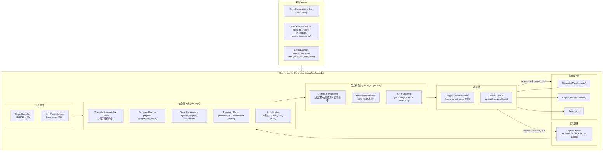

# 第4层 版式生成节点 — 开发文档 v2.0

> 版本：v2.0 | 状态：approved | 基于架构评审（节点四架构评审与优化方案.md）全面升级
>
> 关联规范：项目开发规范.md、AI自动排版系统设计方案-v2.md 第 2.5 节、layout-dsl.md
>
> 评审通过日期：2026-06-06

---

## 目录

1. [节点定位与边界（已升级）](#1-节点定位与边界已升级)
2. [Phase 0：跑通 Demo](#2-phase-0跑通-demo)
3. [Phase 1：模板元数据升级 + Template Compatibility Scorer](#3-phase-1模板元数据升级--template-compatibility-scorer)
4. [Phase 2：Hero Photo Selection System](#4-phase-2hero-photo-selection-system)
5. [Phase 3：Orientation-aware + Gutter Safe](#5-phase-3orientation-aware--gutter-safe)
6. [Phase 4：Crop Engine（含 Crop Quality Score）](#6-phase-4crop-engine含-crop-quality-score)
7. [Phase 5：Layout Evaluator + 评分拆分 + LangGraph 预备](#7-phase-5layout-evaluator--评分拆分--langgraph-预备)
8. [契约变更清单](#8-契约变更清单)
9. [测试计划](#9-测试计划)
10. [与上下游的协作协议（已对齐）](#10-与上下游的协作协议已对齐)

---

## 1. 节点定位与边界（已升级）

### 1.1 在五层流水线中的位置

```
第3层 页面规划 → [第4层 版式生成] → 第5层 全书评分
                     ↑                    |
                     └── retry_layout ────┘
```

### 1.2 v2.0 优化后架构



### 1.3 职责定义

| 维度 | 说明 |
|------|------|
| **做** | 照片预分类 → Hero Photo 选择 → 模板兼容性评分选优 → 照片-槽位质量加权分配 → 几何求解 → 裁切 + 质量评分 → 安全校验（朝向/中缝/裁切违规）→ 单页版式评分 → 不达标重试 |
| **不做** | 不执行实际渲染、不写数据库、不修改任务状态、不改变页面角色或照片分配、不做全书级评估（Bk Score 属于 Node5） |
| **上游依赖** | `state.page_plan` + `state.request.style` + `state.request.book_size` + `PhotoFeature`（含 face/subject/pet boxes、person_importance、CLIP embedding） |
| **下游消费者** | Node5 全书评分（消费 `GeneratedPageLayout` + `PageLayoutEvaluation`）、`finalize_node`、渲染服务 |

### 1.4 架构升级对比

| 子系统 | v1.0（旧） | v2.0（新） | 变更原因 |
|--------|-----------|-----------|---------|
| Template Selector | `family_to_template` 字典查表 | `compatibility_score` 8因子排序 | 旧方案退化查表，Node3 实际上决定了模板（越权） |
| Hero Photo Selector | 无 | 7因子 hero_score，4场景差异化权重 | 封图/跨页主图无选择依据 |
| Orientation Validator | 无 | 朝向兼容矩阵 + 错配检测 | 竖图进横槽被大量裁切 |
| Gutter Safe | 无 | 三级风险评分 + 自动偏移策略 | 跨页人脸被书脊切断，印刷最严重事故 |
| Crop Engine | 6模式，无质量评分 | 5模式，加权 Crop Quality Score | 裁切质量无法量化，无法驱动重试 |
| Layout Score | 混合单页/全书逻辑 | 仅 page_layout_score（5维度），Book Score 归 Node5 | 职责边界不清 |
| Layout Refiner | 无 | re-template / re-crop / re-assign | 一版定稿无优化能力 |
| 模板数量 | 6 种 | 12 种（MVP）| 6 种无法覆盖婚礼/毕业/家庭/旅行四类相册 |

### 1.5 核心问题

1. **模板选择**：从所有候选模板中按 Compatibility Score 排序选出最佳（不再做 `family_to_template` 硬编码映射）
2. **Hero 选择**：从候选照片中选出最佳封面照/跨页主图/叙事主图
3. **朝向匹配**：确保照片朝向与模板槽位朝向兼容，检测并标记错配
4. **几何求解**：百分比坐标 → 归一化坐标
5. **裁切 + 评分**：5种裁切模式，加权质量评分（人脸/主体/宠物/构图/分辨率）
6. **安全校验**：中缝安全（跨页）、裁切安全（hard constraints）、朝向校验
7. **单页评分**：page_layout_score（不越界评估全书）→ 不达标触发 Layout Refiner
8. **降级**：多次重试后仍不达标 → `tpl_single_full_bleed` 兜底

### 1.6 禁止事项

- 不修改 `state.page_plan`
- 不重新做照片选择或页面角色分配
- 不写 `state.final_layout`
- 不修改 `AlbumState` 或 `TaskState`
- 不调用 LLM / 模型推理服务 — 全部确定性规则
- 不跨层消费未声明的内部字段
- 不在关键字段缺失时静默继续
- **不做全书级评估**（连续版式多样性、章节节奏 → Node5 Book Score）

---

## 2. Phase 0：跑通 Demo

> 目标：确认占位实现可跑通全流程。
> **结论：已跑通。** Phase 0 无需改代码。

当前占位逻辑：所有页面分配 `tpl_single_full_bleed`，`placeholder=True`。

验证：

```bash
cd backend && uv sync
uv run pytest tests/graph/test_workflow_contracts.py -v
uv run pytest -v
```

交付标准：
- [ ] 全量测试通过
- [ ] `test_planning_and_layout_nodes_emit_structured_contracts` 通过
- [ ] `state.metadata["generation_summary"]` 记录了 `page_count` 和 `fallback_page_count`

---

## 3. Phase 1：模板元数据升级 + Template Compatibility Scorer

> 目标：
> 1. 定义 12 种生产级模板的完整元数据（`LayoutTemplateDefinition` 升级为 `TemplateMetadata`）
> 2. 实现 Template Compatibility Score 评分排序，替换 `family_to_template` 查表

### 3.1 模板元数据设计

**新建文件**：`algorithms/layout_templates.py`

```python
"""版式模板定义、元数据与兼容性评分。

- 模板数据来源于 layout-dsl.md v1.0（扩展至12种）
- TemplateMetadata 包含标识、匹配约束、槽位定义、适用场景四类字段
- Compatibility Score 使用8因子加权评分
"""

from __future__ import annotations

from dataclasses import dataclass, field
from enum import Enum
from typing import Literal


# === 枚举定义 ===

class CropMode(str, Enum):
    AUTO_BEST = "auto_best"
    FACE_CENTER = "face_center"
    SUBJECT_CENTER = "subject_center"
    CENTER = "center"
    FIT = "fit"


class PageType(str, Enum):
    SINGLE = "single"
    SPREAD = "spread"


class Orientation(str, Enum):
    LANDSCAPE = "landscape"
    PORTRAIT = "portrait"
    SQUARE = "square"
    ANY = "any"


class DecorationMode(str, Enum):
    NONE = "none"
    MINIMAL = "minimal"
    MODERATE = "moderate"
    RICH = "rich"


@dataclass
class SlotDefinition:
    """模板槽位定义。"""
    id: str
    geometry_fraction: tuple[float, float, float, float]  # (x%, y%, w%, h%)
    crop: CropMode = CropMode.AUTO_BEST
    bleed: bool = True
    priority: int = 0          # 填充优先级，hero_slot 的 priority > 0
    optional: bool = False
    constraints: dict = field(default_factory=dict)


@dataclass
class TextBlockDef:
    """模板文本块定义。"""
    id: str
    type: Literal["title", "subtitle", "body", "page_number", "caption"]
    position: str
    style: dict = field(default_factory=dict)


@dataclass
class TemplateMetadata:
    """生产级模板元数据。

    字段分为四类：标识、匹配约束、槽位定义、适用场景。
    """
    # === 标识字段 ===
    template_id: str
    layout_family: str
    variant_name: str
    version: str = "1.0.0"
    page_type: str = "single"

    # === 匹配约束 ===
    supported_photo_count: list[int] = field(default_factory=list)
    min_photo_count: int = 1
    max_photo_count: int = 1
    hero_slot_count: int = 0
    supported_orientation: list[str] = field(default_factory=lambda: ["any"])
    preferred_orientation: str = "any"
    min_photo_quality: float = 0.0
    require_face: bool = False
    require_subject: bool = False
    min_resolution_dpi: int = 150

    # === 槽位结构 ===
    slots: list[SlotDefinition] = field(default_factory=list)
    text_blocks: list[TextBlockDef] = field(default_factory=list)

    # === 适用场景 ===
    suitable_page_roles: list[str] = field(default_factory=list)
    suitable_album_types: list[str] = field(default_factory=lambda: ["universal"])
    decoration_mode: str = "none"
    gutter_safe: bool = False

    # === 元信息 ===
    description: str = ""
    tags: list[str] = field(default_factory=list)
    deprecated: bool = False
```

### 3.2 12 种 MVP 模板注册表

```python
# 注：layout-dsl.md 中原有的 6 种全部保留，新增 6 种（标注 ★）

TEMPLATE_REGISTRY: dict[str, TemplateMetadata] = {
    # ── 原有 6 种 ──
    "tpl_single_full_bleed": TemplateMetadata(
        template_id="tpl_single_full_bleed",
        layout_family="single", variant_name="full_bleed",
        page_type="single",
        supported_photo_count=[1], min_photo_count=1, max_photo_count=1,
        hero_slot_count=1, supported_orientation=["any"],
        slots=[SlotDefinition(id="photo_0", geometry_fraction=(3, 3, 94, 94), priority=1)],
        text_blocks=[TextBlockDef(id="pagenum", type="page_number", position="bottom_center")],
        suitable_page_roles=["hero", "collage", "ending", "general"],
        decoration_mode="none", gutter_safe=True,
        description="通用单图满版",
    ),
    "tpl_double_side_by_side": TemplateMetadata(
        template_id="tpl_double_side_by_side",
        layout_family="double", variant_name="side_by_side",
        page_type="single",
        supported_photo_count=[2], min_photo_count=2, max_photo_count=2,
        hero_slot_count=0, supported_orientation=["any"],
        slots=[
            SlotDefinition(id="photo_l", geometry_fraction=(3, 5, 45.5, 90), priority=0),
            SlotDefinition(id="photo_r", geometry_fraction=(51.5, 5, 45.5, 90), priority=0),
        ],
        suitable_page_roles=["collage", "ending", "general"],
        decoration_mode="minimal", gutter_safe=True,
        description="双图左右对开",
    ),
    "tpl_triple_narrative": TemplateMetadata(
        template_id="tpl_triple_narrative",
        layout_family="triple", variant_name="narrative",
        page_type="single",
        supported_photo_count=[3], min_photo_count=3, max_photo_count=3,
        hero_slot_count=1, supported_orientation=["any"],
        slots=[
            SlotDefinition(id="hero", geometry_fraction=(3, 5, 58, 90), priority=1),
            SlotDefinition(id="sub_1", geometry_fraction=(63, 5, 34, 43), priority=0),
            SlotDefinition(id="sub_2", geometry_fraction=(63, 52, 34, 43), priority=0),
        ],
        suitable_page_roles=["hero", "collage"],
        decoration_mode="minimal", gutter_safe=True,
        description="三图叙事，一大两小",
    ),
    "tpl_grid_nine": TemplateMetadata(
        template_id="tpl_grid_nine",
        layout_family="grid", variant_name="3x3",
        page_type="single",
        supported_photo_count=[4, 5, 6, 7, 8, 9], min_photo_count=4, max_photo_count=9,
        hero_slot_count=0, supported_orientation=["any"],
        slots=[
            SlotDefinition(id=f"g_{r}_{c}", geometry_fraction=(3+30.3*c, 4+29.3*r, 28.3, 27.3), priority=0)
            for r in range(3) for c in range(3)
        ],
        suitable_page_roles=["collage"],
        decoration_mode="minimal", gutter_safe=True,
        description="九宫格（支持4~9张）",
    ),
    "tpl_chapter_cover": TemplateMetadata(
        template_id="tpl_chapter_cover",
        layout_family="chapter", variant_name="cover",
        page_type="single",
        supported_photo_count=[1], min_photo_count=1, max_photo_count=1,
        hero_slot_count=1, supported_orientation=["any"],
        require_subject=True,
        slots=[SlotDefinition(id="cover", geometry_fraction=(3, 3, 94, 70), priority=1)],
        text_blocks=[TextBlockDef(id="title", type="title", position="center")],
        suitable_page_roles=["chapter_opening"], suitable_album_types=["universal"],
        decoration_mode="rich", gutter_safe=True,
        description="章节扉页",
    ),
    "tpl_spread_full_bleed": TemplateMetadata(
        template_id="tpl_spread_full_bleed",
        layout_family="spread", variant_name="full_bleed",
        page_type="spread",
        supported_photo_count=[1], min_photo_count=1, max_photo_count=1,
        hero_slot_count=1, supported_orientation=["landscape"],
        slots=[SlotDefinition(id="spread", geometry_fraction=(1, 3, 98, 94), priority=1)],
        suitable_page_roles=["hero", "chapter_opening"],
        decoration_mode="none", gutter_safe=False,  # 需 Gutter Safe Validator 校验
        description="跨页满版",
    ),

    # ── ★ 新增 6 种 ──
    "tpl_hero_left": TemplateMetadata(
        template_id="tpl_hero_left",
        layout_family="hero", variant_name="left",
        page_type="single",
        supported_photo_count=[1], min_photo_count=1, max_photo_count=1,
        hero_slot_count=1, supported_orientation=["portrait", "square"],
        slots=[SlotDefinition(id="hero", geometry_fraction=(3, 5, 58, 90), priority=1)],
        text_blocks=[TextBlockDef(id="title", type="title", position="bottom_right")],
        suitable_page_roles=["hero", "chapter_opening"],
        decoration_mode="moderate", gutter_safe=True,
        description="主图左，留白右（可放文字）",
    ),
    "tpl_hero_right": TemplateMetadata(
        template_id="tpl_hero_right",
        layout_family="hero", variant_name="right",
        page_type="single",
        supported_photo_count=[1], min_photo_count=1, max_photo_count=1,
        hero_slot_count=1, supported_orientation=["portrait", "square"],
        slots=[SlotDefinition(id="hero", geometry_fraction=(39, 5, 58, 90), priority=1)],
        text_blocks=[TextBlockDef(id="title", type="title", position="bottom_left")],
        suitable_page_roles=["hero", "chapter_opening"],
        decoration_mode="moderate", gutter_safe=True,
        description="主图右，留白左（可放文字）",
    ),
    "tpl_hero_center": TemplateMetadata(
        template_id="tpl_hero_center",
        layout_family="hero", variant_name="center",
        page_type="single",
        supported_photo_count=[1], min_photo_count=1, max_photo_count=1,
        hero_slot_count=1, supported_orientation=["landscape", "square"],
        slots=[SlotDefinition(id="hero", geometry_fraction=(5, 12, 90, 76), priority=1)],
        text_blocks=[TextBlockDef(id="title", type="title", position="bottom_center")],
        suitable_page_roles=["hero", "chapter_opening"],
        decoration_mode="minimal", gutter_safe=True,
        description="主图居中，上下留白",
    ),
    "tpl_double_compare": TemplateMetadata(
        template_id="tpl_double_compare",
        layout_family="double", variant_name="compare",
        page_type="single",
        supported_photo_count=[2], min_photo_count=2, max_photo_count=2,
        hero_slot_count=1, supported_orientation=["any"],
        slots=[
            SlotDefinition(id="hero", geometry_fraction=(3, 5, 58, 90), priority=1),
            SlotDefinition(id="sub", geometry_fraction=(63, 35, 34, 60), priority=0),
        ],
        suitable_page_roles=["collage", "general"],
        decoration_mode="minimal", gutter_safe=True,
        description="对比式双图，一大一小",
    ),
    "tpl_single_portrait": TemplateMetadata(
        template_id="tpl_single_portrait",
        layout_family="single", variant_name="portrait",
        page_type="single",
        supported_photo_count=[1], min_photo_count=1, max_photo_count=1,
        hero_slot_count=1, supported_orientation=["portrait"],
        slots=[SlotDefinition(id="photo", geometry_fraction=(10, 5, 80, 90), priority=1)],
        suitable_page_roles=["hero", "general"],
        decoration_mode="none", gutter_safe=True,
        description="竖图满版（侧留白）",
    ),
    "tpl_single_landscape": TemplateMetadata(
        template_id="tpl_single_landscape",
        layout_family="single", variant_name="landscape",
        page_type="single",
        supported_photo_count=[1], min_photo_count=1, max_photo_count=1,
        hero_slot_count=1, supported_orientation=["landscape"],
        slots=[SlotDefinition(id="photo", geometry_fraction=(3, 15, 94, 70), priority=1)],
        suitable_page_roles=["hero", "general"],
        decoration_mode="none", gutter_safe=True,
        description="横图满版（上下留白）",
    ),
}
```

### 3.3 Template Compatibility Score 公式

对于给定候选照片 `P = {p_1, ..., p_n}` 和模板 `T`：

```
compatibility_score(T, P, context) = Σ(w_i × s_i) / Σ(w_i)
```

其中 `context = {page_role, album_type, prev_template_ids, style}`。

| 因子 | 符号 | 权重 | 说明 |
|------|------|------|------|
| 图片数量匹配度 | S_count | 0.20 | 候选照片数是否在模板支持范围内 |
| 横竖图匹配度 | S_orientation | **0.25** | **最高权重**——错配是印刷最常见质量问题 |
| Hero Photo 适配度 | S_hero | 0.20 | 是否存在高质量 Hero Photo 填充主槽位 |
| 页面角色适配度 | S_role | 0.15 | 模板是否适合当前页面角色 |
| 人脸安全适配度 | S_face | 0.10 | 模板裁切模式是否对人脸友好 |
| 多样性约束 | S_diversity | 0.05 | 避免连续同族模板 |
| 分辨率适配度 | S_resolution | 0.03 | 照片分辨率是否满足印刷要求 |
| 相册类型适配 | S_album_type | 0.02 | 弱加成，不影响核心选择 |

### 3.4 各因子计算

```python
# algorithms/layout_templates.py

def _score_photo_count_match(t: TemplateMetadata, photos: list) -> float:
    n = len(photos)
    if n < t.min_photo_count:
        return 0.0
    if t.max_photo_count > 0 and n > t.max_photo_count:
        return 0.0
    if n in t.supported_photo_count:
        return 1.0
    return 0.5


def _score_orientation_match(t: TemplateMetadata, photos: list) -> float:
    """朝向兼容矩阵评分。"""
    if "any" in t.supported_orientation:
        return 1.0
    matches = 0
    for p in photos:
        o = _classify_orientation(p)
        if o in t.supported_orientation:
            matches += 1
        elif t.preferred_orientation == "any":
            matches += 0.3
    return matches / max(len(photos), 1)


def _score_hero_fit(t: TemplateMetadata, photos: list) -> float:
    """Hero Photo 适配度——模板有 hero_slot 时检查是否有合格 Hero Photo。"""
    if t.hero_slot_count == 0:
        return 1.0
    # hero_score 来自 Phase 2 的 Hero Photo Selector
    hero_scores = [getattr(p, 'hero_score', 0.0) for p in photos]
    return max(hero_scores) if hero_scores else 0.0


def _score_page_role_match(t: TemplateMetadata, context: dict) -> float:
    role = context.get("page_role", "general")
    if role in t.suitable_page_roles:
        return 1.0
    if "general" in t.suitable_page_roles:
        return 0.5
    return 0.2


def _score_face_safety(t: TemplateMetadata, photos: list) -> float:
    if not t.require_face:
        return 1.0
    faces = sum(1 for p in photos if getattr(p, 'face_boxes', []))
    if faces == len(photos):
        return 1.0
    if faces > 0:
        return 0.5
    return 0.1


def _score_diversity(t: TemplateMetadata, context: dict) -> float:
    """避免连续3页同一 layout_family。"""
    prev = context.get("prev_template_ids", [])
    if not prev:
        return 1.0
    if len(prev) >= 2 and prev[-1] == t.layout_family and prev[-2] == t.layout_family:
        return 0.0
    if prev[-1] == t.layout_family:
        return 0.3
    return 1.0


def _score_resolution_match(t: TemplateMetadata, photos: list) -> float:
    """简化估算——大部分照片已满足150DPI。"""
    if not photos:
        return 1.0
    ok = sum(1 for p in photos if _estimate_dpi(p) >= t.min_resolution_dpi)
    return ok / len(photos)


def _score_album_type_match(t: TemplateMetadata, context: dict) -> float:
    album_type = context.get("album_type", "universal")
    return 0.2 if album_type in t.suitable_album_types else 0.0
```

### 3.5 主选择函数

```python
# 以下函数替代旧的 select_template()
def compute_template_compatibility(
    template: TemplateMetadata,
    photos: list,
    context: dict,  # {page_role, album_type, prev_template_ids, style}
) -> float:
    """计算模板兼容性评分 (0~1)。"""
    if len(photos) < template.min_photo_count:
        return 0.0
    if template.max_photo_count > 0 and len(photos) > template.max_photo_count:
        return 0.0

    weights = {"count": 0.20, "orientation": 0.25, "hero": 0.20,
               "role": 0.15, "face": 0.10, "diversity": 0.05,
               "resolution": 0.03, "album": 0.02}

    scores = {
        "count": _score_photo_count_match(template, photos),
        "orientation": _score_orientation_match(template, photos),
        "hero": _score_hero_fit(template, photos),
        "role": _score_page_role_match(template, context),
        "face": _score_face_safety(template, photos),
        "diversity": _score_diversity(template, context),
        "resolution": _score_resolution_match(template, photos),
        "album": _score_album_type_match(template, context),
    }
    total = sum(weights[k] * scores[k] for k in weights) / sum(weights.values())
    return round(total, 4)


def select_best_template(
    templates: list[TemplateMetadata],
    photos: list,
    context: dict,
    min_threshold: float = 0.3,
) -> tuple[TemplateMetadata, float]:
    """从候选模板中 argmax 选出最佳模板。

    默认从 TEMPLATE_REGISTRY 全量候选，按 layout_family 预过滤由调用方决定。
    如果最高分 < min_threshold，回退到 tpl_single_full_bleed。
    """
    scored = [(t, compute_template_compatibility(t, photos, context)) for t in templates]
    scored.sort(key=lambda x: -x[1])
    if scored[0][1] >= min_threshold:
        return scored[0]
    fallback = TEMPLATE_REGISTRY["tpl_single_full_bleed"]
    return fallback, compute_template_compatibility(fallback, photos, context)
```

### 3.6 Phase 1 交付标准

- [ ] 12 种模板的 `TemplateMetadata` 数据定义完整，注册到 `TEMPLATE_REGISTRY`
- [ ] `compute_template_compatibility` 8 因子加权评分实现
- [ ] `select_best_template` 替代旧 `select_template`
- [ ] 旧 `family_to_template` 查表逻辑已删除
- [ ] 单元测试：正常映射（U1'）、横竖图错配降分（U2'）、无 Hero 降分（U3'）、兜底阈值（U4'）
- [ ] 旧集成测试 `test_planning_and_layout_nodes_emit_structured_contracts` 仍然通过

---

## 4. Phase 2：Hero Photo Selection System

> 目标：从候选照片中选出最佳封面照/跨页主图/叙事主图，供 Template Selector 的 `S_hero` 和 Photo-Slot Assigner 消费。

### 4.1 系统定位

| 调用方 | 用途 |
|--------|------|
| Template Selector | 判断 `S_hero`——是否有高质量 Hero Photo 可填充 hero_slot |
| Photo-Slot Assigner | 为 hero_slot 槽位分配最佳照片 |
| Node3（共享） | 为 `chapter_opening`/`hero`/`spread` 页面预选候选 |

### 4.2 Hero Score 公式

```
hero_score(p) =
  0.25 × quality_score(p)
+ 0.20 × face_score(p) × face_count_weight(p)
+ 0.20 × person_importance(p)
+ 0.15 × clip_semantic_score(p)
+ 0.10 × safe_crop_margin(p)
+ 0.05 × subject_bonus(p)
+ 0.05 × orientation_bonus(p, target_orientation)
```

**因子详解**：

| 因子 | 公式/来源 | 说明 |
|------|----------|------|
| quality_score | `0.4×sharpness + 0.3×exposure + 0.3×clip_aesthetic` | 来自 Node1 |
| face_score | `face_completeness × face_clarity` | 人脸完整度 |
| face_count_weight | `min(face_count, 3) / 3` | 1~3 张脸最优，0 张或 >3 降权 |
| person_importance | `1.0(hero), 0.8(rank1), 0.6(rank2-3), 0.3(rank>3), 0.1(无)` | 来自 Node2 频率统计 |
| clip_semantic | `cosine_similarity(p.embedding, chapter_theme_embedding)` | 与章节主题的 CLIP 相似度 |
| safe_crop_margin | `1.0 - max(face_near_edge_penalty, subject_near_edge_penalty)` | 主体/人脸越近边缘越低 |
| subject_bonus | `0.05 if has_clear_subject and 0.1 < area_ratio < 0.6` | 有清晰适中主体 |
| orientation_bonus | `0.05 if p.orientation == target_orientation` | 跟目标朝向匹配 |

### 4.3 场景差异化权重

```python
# algorithms/layout_hero_selector.py（新增）

"""Hero Photo Selector：基于多模态信号的 Hero Photo 评分与选择。"""

from __future__ import annotations
from dataclasses import dataclass

SCENE_WEIGHTS = {
    "chapter_cover":  {"face": 0.25, "person": 0.25, "quality": 0.20, "semantic": 0.15, "crop_safe": 0.10, "subject": 0.05},
    "spread":         {"face": 0.15, "person": 0.15, "quality": 0.20, "semantic": 0.10, "crop_safe": 0.25, "orientation": 0.15},
    "hero_slot":      {"subject": 0.10, "face": 0.15, "person": 0.15, "quality": 0.30, "semantic": 0.15, "crop_safe": 0.10, "orientation": 0.05},
    "narrative_hero": {"semantic": 0.20, "quality": 0.20, "face": 0.15, "person": 0.15, "subject": 0.15, "crop_safe": 0.10, "orientation": 0.05},
}

def compute_hero_score(
    candidate,  # HeroPhotoCandidate (dataclass, 参见架构评审 4.2)
    scenario: str = "hero_slot",
    target_orientation: str | None = None,
    scene_weights: dict | None = None,
) -> float:
    """计算单张照片的 hero_score (0~1)。"""
    w = scene_weights or SCENE_WEIGHTS.get(scenario, SCENE_WEIGHTS["hero_slot"])
    score = 0.0
    # 质量分
    qual = 0.4 * candidate.sharpness_score + 0.3 * candidate.exposure_score + 0.3 * candidate.clip_aesthetic_score
    score += w.get("quality", 0.25) * qual
    # 人脸分
    fcw = min(candidate.face_count, 3) / 3 if candidate.face_count > 0 else 0.2
    score += w.get("face", 0.20) * candidate.face_score * fcw
    # 人物重要性
    score += w.get("person", 0.20) * candidate.person_importance
    # CLIP 语义
    score += w.get("semantic", 0.15) * candidate.clip_semantic_score
    # 裁切安全
    score += w.get("crop_safe", 0.10) * candidate.safe_crop_margin
    # 主体加成
    sbonus = 1.0 if (candidate.has_clear_subject and 0.1 < candidate.subject_area_ratio < 0.6) else 0.0
    score += w.get("subject", 0.05) * sbonus
    # 朝向加成
    obonus = 1.0 if (target_orientation and candidate.orientation_label == target_orientation) else 0.0
    score += w.get("orientation", 0.05) * obonus
    return round(min(1.0, score), 4)


def select_hero_photos(
    candidates: list,
    count: int,
    scenario: str = "hero_slot",
    target_orientation: str | None = None,
) -> list:
    """从候选照片中选出最佳 Hero Photo(s)。"""
    scored = [(c, compute_hero_score(c, scenario, target_orientation)) for c in candidates]
    scored.sort(key=lambda x: -x[1])
    return [c for c, _ in scored[:count] if scored[0][1] > 0.3]
```

### 4.4 不同场景需求

| 场景 | 目标朝向 | 人脸偏好 | 特殊要求 |
|------|---------|---------|---------|
| 章节封面 | any | 主角优先 | subject_area_ratio > 0.15 |
| 跨页主图 | landscape | 不强制 | safe_crop_margin > 0.6, 人脸不在中缝 |
| 大图展示 | landscape preferred | 可选 | 高质量分 > 0.7 |
| 三图叙事主图 | any | 有加分 | 必须有主体 |

### 4.5 Phase 2 交付标准

- [ ] `compute_hero_score` 实现，7 因子加权，4 场景权重方案
- [ ] `select_hero_photos` 实现，top-K 选择 + 最低阈值 0.3
- [ ] `hero_score` 结果写入 `PhotoFeature`（或内存缓存），供 Template Selector 和 Slot Assigner 消费
- [ ] 单元测试：单人脸 Hero（U5'）、无人脸降分（U6'）、CLIP 高相似度加成（U7'）、4 种场景权重验证（U8'）

---

## 5. Phase 3：Orientation-aware + Gutter Safe

> 目标：
> 1. 照片朝向与模板槽位朝向兼容性校验（已集成到 Compatibility Score 的 S_orientation）
> 2. 事后错配检测 + 硬约束警告
> 3. **跨页中缝安全（Gutter Safe）**完整实现——这是 v1.0 的 P0 缺失项

### 5.1 Orientation Validator

```python
# algorithms/layout_orientation.py（新增）

"""朝向校验器：模板-照片朝向兼容性与事后错配检测。"""

def classify_photo_orientation(photo) -> str:
    """返回 'landscape' | 'portrait' | 'square'。"""
    if not photo.width or not photo.height:
        return "square"
    ratio = photo.width / photo.height
    if ratio > 1.3: return "landscape"
    if ratio < 0.77: return "portrait"
    return "square"


def classify_template_orientation(template: TemplateMetadata) -> str:
    """返回 'landscape_layout' | 'portrait_layout' | 'mixed_layout'。"""
    ratios = [s.geometry_fraction[2]/s.geometry_fraction[3] for s in template.slots]
    portrait = sum(1 for r in ratios if r < 0.67)
    landscape = sum(1 for r in ratios if r > 1.5)
    if portrait > landscape and portrait > (len(ratios)-portrait-landscape):
        return "portrait_layout"
    if landscape > portrait and landscape > (len(ratios)-portrait-landscape):
        return "landscape_layout"
    return "mixed_layout"


def detect_orientation_mismatch(photo, slot: SlotDefinition) -> list[str]:
    """检测横竖图错配，返回 issue 列表。"""
    issues = []
    p_ratio = photo.width / photo.height if photo.width and photo.height else 1.0
    s_ratio = slot.geometry_fraction[2] / slot.geometry_fraction[3]
    if p_ratio < 0.7 and s_ratio > 1.5:
        issues.append("portrait_in_landscape_slot")
    if p_ratio > 1.5 and s_ratio < 0.7:
        issues.append("landscape_in_portrait_slot")
    crop_loss = 1.0 - min(p_ratio/s_ratio, s_ratio/p_ratio) if s_ratio > 0 else 1.0
    if crop_loss > 0.3:
        issues.append(f"excessive_crop_loss_{crop_loss:.0%}")
    return issues
```

### 5.2 Gutter Safe System

这是 **v1.0 P0 缺失项**——跨页模板中书脊会"吃掉" 5-10mm 可见区域，人脸/主体落入书脊是印刷行业最严重质量事故。

```python
# algorithms/layout_gutter.py（新增）

"""Gutter Safe System：印刷书脊安全校验与自动调整。"""

from dataclasses import dataclass
from pixelpress_backend.models.domain import RelativeFrame


@dataclass
class GutterZone:
    """书脊安全区参数。"""
    center_x: float = 0.5          # 书脊中心（归一化，默认正中）
    safe_zone_width: float = 0.08  # 核心安全区宽（归一化 ≈15mm on A4）
    warning_zone_width: float = 0.12  # 警告区宽（≈22mm）
    # A4_square(210×210mm): safe≈16mm, warning≈25mm
    # A5_square(148×148mm): safe≈12mm, warning≈18mm


def eval_gutter_risk(
    crop_window: RelativeFrame,
    photo_feature,
    gutter: GutterZone | None,
) -> tuple[float, list[str]]:
    """评估人脸/主体/宠物落入书脊的风险。

    Returns:
        (risk_score: 0.0安全~1.0严重, issues)
    """
    if gutter is None:
        return 0.0, []
    issues = []
    d_left = gutter.center_x - gutter.safe_zone_width / 2
    d_right = gutter.center_x + gutter.safe_zone_width / 2
    w_left = gutter.center_x - gutter.warning_zone_width / 2
    w_right = gutter.center_x + gutter.warning_zone_width / 2
    risk = 0.0

    # 人脸风险
    for face in getattr(photo_feature, 'face_boxes', []):
        fc_x = face.x + face.w / 2
        if d_left <= fc_x <= d_right:
            risk = max(risk, 1.0)
            issues.append("face_center_in_danger_zone")
        elif w_left <= fc_x <= w_right:
            risk = max(risk, 0.6)
            issues.append("face_center_in_warning_zone")

    # 主体风险
    for sub in getattr(photo_feature, 'subject_boxes', []):
        sc_x = sub.x + sub.w / 2
        if d_left <= sc_x <= d_right:
            risk = max(risk, 0.8)
            issues.append("subject_center_in_danger_zone")
        elif w_left <= sc_x <= w_right:
            risk = max(risk, 0.5)
            issues.append("subject_center_in_warning_zone")

    # 宠物风险
    for pet in getattr(photo_feature, 'pet_boxes', []):
        pc_x, _ = pet.head_center
        if d_left <= pc_x <= d_right:
            risk = max(risk, 0.7)
            issues.append("pet_head_in_danger_zone")

    return risk, issues


def auto_adjust_for_gutter(
    crop_window: RelativeFrame,
    photo_feature,
    gutter: GutterZone,
) -> tuple[RelativeFrame, float, list[str]]:
    """自动调整裁切窗以避免书脊风险。

    策略顺序：左移 → 缩小裁切 → unfixable
    """
    risk, issues = eval_gutter_risk(crop_window, photo_feature, gutter)
    if risk < 0.5:
        return crop_window, risk, []
    adjustments = []

    # 策略1：左移
    shifted = RelativeFrame(
        x=min(crop_window.x + gutter.safe_zone_width / 2, 0.5),
        y=crop_window.y, w=crop_window.w, h=crop_window.h
    )
    new_risk, _ = eval_gutter_risk(shifted, photo_feature, gutter)
    if new_risk < risk:
        adjustments.append("shift_left")
        return shifted, new_risk, adjustments

    # 策略2：缩小裁切
    shrunk = RelativeFrame(
        x=crop_window.x + 0.02, y=crop_window.y,
        w=crop_window.w - 0.04, h=crop_window.h
    )
    new_risk, _ = eval_gutter_risk(shrunk, photo_feature, gutter)
    if new_risk < risk:
        adjustments.append("shrink_crop")
        return shrunk, new_risk, adjustments

    adjustments.append("unfixable")
    return crop_window, risk, adjustments


def validate_text_gutter_safety(text_block, gutter: GutterZone) -> bool:
    """文字块中心不得落在书脊安全区。"""
    tx_center = text_block.frame.x + text_block.frame.w / 2
    d_left = gutter.center_x - gutter.safe_zone_width / 2
    d_right = gutter.center_x + gutter.safe_zone_width / 2
    return not (d_left <= tx_center <= d_right)
```

### 5.3 Phase 3 交付标准

- [ ] `classify_photo_orientation` / `classify_template_orientation` 实现
- [ ] `detect_orientation_mismatch` 实现，集成到 SafetyValidators
- [ ] `eval_gutter_risk` 实现：人脸/主体/宠物三级风险
- [ ] `auto_adjust_for_gutter` 实现：左移 → 缩裁切 → unfixable
- [ ] `validate_text_gutter_safety` 实现
- [ ] 单元测试：人脸在安全区（U9'）、人脸在警告区（U10'）、自动调整（U11'）、调整失败（U12'）

---

## 6. Phase 4：Crop Engine（含 Crop Quality Score）

> 目标：5 种裁切模式 + 完整 Crop Quality Score（人脸/主体/宠物/构图/分辨率）。

### 6.1 裁切模式（精简为 5 种）

```python
# algorithms/layout_crop.py（重写）

"""Crop Engine：裁切窗口求解 + 质量评分。"""

CropMode: AUTO_BEST | FACE_CENTER | SUBJECT_CENTER | CENTER | FIT

# FIT 替代原来的 NONE——不裁切，letterbox/pillarbox 缩放适配
```

原有 6 模式中，`MANUAL` 移除（由前端 HITL 处理），`NONE` → `FIT`，`CENTER_FACE` → `FACE_CENTER`。

### 6.2 Crop Quality Score

```python
def compute_crop_quality(
    crop_window: RelativeFrame,
    photo_feature,
    slot: SlotDefinition,
    gutter_zone: GutterZone | None = None,
) -> tuple[float, list[str]]:
    """评估裁切质量 (0~1, 违规/警告列表)。

    6个维度加权：
    - 人脸安全度 0.40（硬约束）
    - 主体完整度 0.25（硬约束）
    - 宠物安全度 0.15（家庭/宠物相册重要）
    - 构图质量   0.10（三分法）
    - 分辨率充足 0.10（≥150 DPI）
    - 中缝安全   bonus（跨页时额外因子）

    打分规则：
    - 有 violations → 总分封顶 0.4
    - ≥2 violations → 总分封顶 0.2
    """
    violations, warnings = [], []
    # 人脸安全度
    face_s = _eval_face_safety(crop_window, photo_feature)
    if face_s < 0.3: violations.append("face_severely_cut")
    elif face_s < 0.7: warnings.append("face_partially_cut")
    # 主体完整度
    sub_s = _eval_subject_completeness(crop_window, photo_feature)
    if sub_s < 0.3: violations.append("subject_cut")
    # 宠物安全度
    pet_s = _eval_pet_safety(crop_window, photo_feature)
    if pet_s < 0.3: warnings.append("pet_head_cut")
    # 构图质量
    comp_s = _eval_composition(crop_window, photo_feature)
    # 分辨率
    res_s = _eval_resolution_sufficiency(crop_window, photo_feature, slot)
    if res_s < 0.5: violations.append("insufficient_resolution")
    # 中缝安全
    if gutter_zone:
        gs, g_issues = eval_gutter_risk(crop_window, photo_feature, gutter_zone)
        if gs >= 0.5: violations.append("face_or_subject_in_gutter")

    total = 0.40*face_s + 0.25*sub_s + 0.15*pet_s + 0.10*comp_s + 0.10*res_s
    if violations: total = min(total, 0.4)
    if len(violations) >= 2: total = min(total, 0.2)
    return round(total, 4), violations + warnings


def _eval_face_safety(crop, photo) -> float:
    """人脸安全度：人脸中心在裁切框内 1→ 被切 →0。"""
    if not photo.face_boxes: return 1.0
    ok = 0
    for f in photo.face_boxes:
        cx, cy = f.x+f.w/2, f.y+f.h/2
        in_crop = (crop.x<=cx<=crop.x+crop.w and crop.y<=cy<=crop.y+crop.h)
        near_edge = (abs(cx-crop.x)<0.05 or abs(cx-(crop.x+crop.w))<0.05)
        ok += 1.0 if (in_crop and not near_edge) else (0.7 if (in_crop and near_edge) else 0.0)
    return ok / max(len(photo.face_boxes), 1)


def _eval_subject_completeness(crop, photo) -> float:
    if not photo.subject_boxes: return 1.0
    ok = sum(1 for s in photo.subject_boxes
             if crop.x<=s.x+s.w/2<=crop.x+crop.w and crop.y<=s.y+s.h/2<=crop.y+crop.h)
    return ok / max(len(photo.subject_boxes), 1)


def _eval_pet_safety(crop, photo) -> float:
    boxes = getattr(photo, 'pet_boxes', [])
    if not boxes: return 1.0
    ok = sum(1 for p in boxes
             if crop.x<=p.head_center[0]<=crop.x+crop.w and crop.y<=p.head_center[1]<=crop.y+crop.h)
    return ok / max(len(boxes), 1)


def _eval_composition(crop, photo) -> float:
    """三分法构图评分。"""
    score = 0.5
    if photo.subject_boxes:
        m = photo.subject_boxes[0]
        scx, scy = m.x+m.w/2, m.y+m.h/2
        thirds = [(1/3,1/3),(2/3,1/3),(1/3,2/3),(2/3,2/3)]
        d = min(((scx-tx)**2+(scy-ty)**2)**0.5 for tx,ty in thirds)
        if d < 0.1: score += 0.3
        elif d < 0.2: score += 0.1
    return min(1.0, score)


def _eval_resolution_sufficiency(crop, photo, slot) -> float:
    if not photo.width or not photo.height: return 0.5
    mp = photo.width * photo.height * crop.w * crop.h / 1_000_000
    if mp >= 4: return 1.0
    if mp >= 2: return 0.7
    if mp >= 1: return 0.4
    return 0.1
```

### 6.3 Phase 4 交付标准

- [ ] 5 种裁切模式完整实现（`AUTO_BEST` / `FACE_CENTER` / `SUBJECT_CENTER` / `CENTER` / `FIT`）
- [ ] `compute_crop_quality` 6维度加权 + violation 封顶规则
- [ ] `_eval_face_safety` 考虑边缘位置、多人场景
- [ ] `_eval_pet_safety` 宠物头部保护
- [ ] 单元测试：正常人脸（U13'）、人脸被切（U14'）、多人脸混合（U15'）、宠物被切（U16'）

---

## 7. Phase 5：Layout Evaluator + 评分拆分 + LangGraph 预备

> 目标：
> 1. 实现纯单页 `page_layout_score`（不越界评估全书）
> 2. 区分 Page Layout Score（Node4）与 Book Score（Node5）职责
> 3. 输出 `PageLayoutEvaluation` 结构（供 Layout Refiner 消费）
> 4. 主节点具备 Generator → Evaluator → Refiner 循环骨架

### 7.1 Page Layout Score 公式

Node4 只做单页评分。全书级评估（连续版式多样性、章节节奏、全局一致性）归 Node5。

```
page_layout_score(page) =
  0.30 × template_compatibility_score   -- Template Selector 输出
+ 0.25 × avg_crop_quality               -- Crop Engine 输出
+ 0.15 × slot_fill_rate                 -- 槽位填充率
+ 0.15 × visual_balance                 -- 视觉平衡
+ 0.10 × print_safety                   -- bleed/safe margin 合规
+ 0.05 × text_block_safety              -- 文字块安全（含中缝）
```

### 7.2 输出结构扩充

```python
# models/workflow_contracts.py 中新增（或 algorithms/layout_evaluator.py）
@dataclass
class PageLayoutEvaluation:
    page_id: str
    generated_layout: GeneratedPageLayout
    page_layout_score: float
    breakdown: dict[str, float]       # 各维度得分
    issues: list[str]                 # 候选 Issue 列表
    repair_suggestions: list[dict]    # [{type: "recrop", slot_id: "hero"}]
    placeholder: bool                 # 是否兜底
```

说明：`GeneratedPageLayout.layout_score` 保留（兼容现有契约），但改为引用 `PageLayoutEvaluation.page_layout_score`。

### 7.3 Node4 与 Node5 职责拆分

```
Node4 → Page Layout Score（单页）
  ├─ 模板-照片兼容度
  ├─ 槽位填充率
  ├─ 裁切平均质量
  ├─ 单页视觉平衡
  └─ 单页印刷安全

Node5 → Book Score（全书）
  ├─ 章节节奏（页数分配合理性）
  ├─ 跨页连续性（模板多样性约束）
  ├─ 全书留白一致性
  ├─ 主角曝光度
  ├─ 全书裁切/中缝安全汇总
  └─ 印刷交付合规
```

### 7.4 主节点重构

```python
# graph/layout_generation_node.py（最终版）

from __future__ import annotations

from pixelpress_backend.algorithms.layout_templates import (
    TEMPLATE_REGISTRY, select_best_template, compute_template_compatibility,
)
from pixelpress_backend.algorithms.layout_hero_selector import select_hero_photos
from pixelpress_backend.algorithms.layout_geometry import (
    PageGeometry, BOOK_SIZE_DIMENSIONS, resolve_slot_geometry,
    DEFAULT_BLEED_MM, DEFAULT_SAFE_MARGIN_MM,
)
from pixelpress_backend.algorithms.layout_crop import compute_crop_window, compute_crop_quality
from pixelpress_backend.algorithms.layout_gutter import (
    GutterZone, eval_gutter_risk, auto_adjust_for_gutter, validate_text_gutter_safety,
)
from pixelpress_backend.algorithms.layout_orientation import (
    classify_photo_orientation, detect_orientation_mismatch,
)
from pixelpress_backend.algorithms.layout_text import generate_text_blocks
from pixelpress_backend.algorithms.layout_evaluator import evaluate_page_layout

from pixelpress_backend.models.workflow_contracts import (
    GeneratedPageLayout, LayoutGenerationInput, LayoutGenerationOutput,
    PagePlan, PageSlot, PageLayoutEvaluation,
)
from pixelpress_backend.models.workflow_state import LayoutWorkflowState


MAX_RETRIES = 3
ACCEPT_THRESHOLD = 0.7


def layout_generation_node(state: LayoutWorkflowState) -> LayoutWorkflowState:
    node_input = LayoutGenerationInput(
        album_id=state.request.album_id,
        book_size=state.request.book_size,
        style=state.request.style,
        page_plan=PagePlan.model_validate(state.page_plan),
        photo_features=_build_photo_features(state),
    )
    page_dims = BOOK_SIZE_DIMENSIONS.get(node_input.book_size, BOOK_SIZE_DIMENSIONS["A4_square"])
    page_geometry = PageGeometry(*page_dims, DEFAULT_BLEED_MM, DEFAULT_SAFE_MARGIN_MM)
    gutter_zone = GutterZone()

    context = {
        "album_type": state.request.album_type if hasattr(state.request, 'album_type') else "universal",
        "page_role": None,  # per-page override
        "prev_template_ids": [],
        "style": state.request.style,
    }

    page_layouts: list[GeneratedPageLayout] = []
    page_evaluations: list[PageLayoutEvaluation] = []
    fallback_count = 0

    # Phase 2 前置：全局 Hero 选择
    all_hero = select_hero_photos(
        node_input.photo_features, count=3, scenario="hero_slot"
    )
    # 将 hero_score 注入 photo_features（内存）
    hero_map = {h.photo_id: h.hero_score for h in all_hero}
    for pf in node_input.photo_features:
        pf.hero_score = hero_map.get(pf.photo_id, 0.0)

    for page in node_input.page_plan.planned_pages:
        try:
            layout, evaluation = _generate_page_with_retry(
                page, page_geometry, gutter_zone, node_input, context
            )
            page_layouts.append(layout)
            page_evaluations.append(evaluation)
            if layout.placeholder:
                fallback_count += 1
            context["prev_template_ids"].append(layout.template_id.split("_")[1] if "_" in layout.template_id else layout.template_id)
        except Exception:
            page_layouts.append(_fallback_layout(page))
            page_evaluations.append(PageLayoutEvaluation(
                page_id=page.page_id, generated_layout=_fallback_layout(page),
                page_layout_score=0.0, breakdown={}, issues=["exception_fallback"],
                repair_suggestions=[], placeholder=True,
            ))
            fallback_count += 1

    node_output = LayoutGenerationOutput(
        album_id=node_input.album_id,
        page_layouts=page_layouts,
        generation_summary={
            "page_count": len(page_layouts),
            "fallback_page_count": fallback_count,
        },
    )
    state.page_layouts = node_output.page_layouts
    state.metadata["generation_summary"] = node_output.generation_summary.model_dump(mode="python")
    state.metadata["page_evaluations"] = [e if hasattr(e, 'model_dump') else e for e in page_evaluations]
    return state


def _generate_page_with_retry(page, page_geometry, gutter_zone, node_input, context) -> tuple[GeneratedPageLayout, PageLayoutEvaluation]:
    """单页生成 + 最多 MAX_RETRIES=3 次重试。"""
    ctx = dict(context)
    ctx["page_role"] = page.page_role
    photos = [pf for pf in node_input.photo_features if pf.photo_id in page.candidate_photo_ids]

    excluded_templates: set[str] = set()

    for attempt in range(MAX_RETRIES + 1):
        # Filter templates
        candidates = [t for tid, t in TEMPLATE_REGISTRY.items() if tid not in excluded_templates]
        if step_specific_excluded := ctx.get("_force_retemplate_exclude"):
            candidates = [t for t in candidates if t.template_id not in step_specific_excluded]

        best_template, _ = select_best_template(candidates, photos, ctx)

        # === Geometry ===
        page_slots = []
        for slot_def in best_template.slots:
            frame = resolve_slot_geometry(slot_def, page_geometry)
            page_slots.append(PageSlot(slot_id=slot_def.id, frame=frame))

        # === Photo Assignment (quality-weighted) ===
        assigned_photos = _assign_photos_weighted(photos, best_template)
        for slot in page_slots:
            slot.photo_id = assigned_photos.get(slot.slot_id)

        # === Crop ===
        pf_map = {pf.photo_id: pf for pf in photos}
        for slot in page_slots:
            if slot.photo_id and slot.photo_id in pf_map:
                pf = pf_map[slot.photo_id]
                slot_def = next(s for s in best_template.slots if s.id == slot.slot_id)
                slot.crop = compute_crop_window(pf, slot.frame, slot_def.crop)

        # === Text ===
        text_blocks = generate_text_blocks(best_template, page.page_role, page.text_need)

        # === Build draft layout ===
        generated = GeneratedPageLayout(
            page_id=page.page_id,
            template_id=best_template.template_id,
            slots=page_slots,
            text_blocks=text_blocks,
            render_hints={
                "background": best_template.decoration.get("background", "#FFFFFF"),
                "bleed_mm": page_geometry.bleed_mm,
                "safe_margin_mm": page_geometry.safe_margin_mm,
            },
        )

        # === Safety Validation ===
        all_issues = []
        # Orientation
        for slot in page_slots:
            if slot.photo_id and slot.photo_id in pf_map:
                all_issues.extend(detect_orientation_mismatch(pf_map[slot.photo_id], next(s for s in best_template.slots if s.id == slot.slot_id)))
        # Gutter Safe (仅 spread)
        if best_template.page_type == "spread":
            for slot in page_slots:
                if slot.photo_id and slot.photo_id in pf_map:
                    risk, g_issues = eval_gutter_risk(slot.crop, pf_map[slot.photo_id], gutter_zone)
                    if risk >= 0.5:
                        adjusted, adj_risk, adj = auto_adjust_for_gutter(slot.crop, pf_map[slot.photo_id], gutter_zone)
                        if "unfixable" not in adj:
                            slot.crop = adjusted
                        all_issues.extend(g_issues)
        # Text gutter safety
        for tb in text_blocks:
            if not validate_text_gutter_safety(tb, gutter_zone):
                all_issues.append("text_block_in_gutter_zone")

        # === Evaluate ===
        evaluation = evaluate_page_layout(generated, page, pf_map, best_template, all_issues)
        generated.layout_score = evaluation.page_layout_score

        # === Decision ===
        if evaluation.page_layout_score >= ACCEPT_THRESHOLD and not [i for i in all_issues if "danger_zone" in i]:
            evaluation.placeholder = False
            return generated, evaluation

        # === Refine ===
        if attempt < MAX_RETRIES:
            # Generate repair suggestions
            for issue in all_issues:
                if "portrait_in_landscape" in issue or "landscape_in_portrait" in issue:
                    excluded_templates.add(generated.template_id)
                if "face_cut" in issue or "subject_cut" in issue:
                    ctx["_force_recrop"] = True
                if "gutter" in issue:
                    ctx["_force_gutter_adjust"] = True

    # === Fallback ===
    return _fallback_layout(page), PageLayoutEvaluation(
        page_id=page.page_id, generated_layout=_fallback_layout(page),
        page_layout_score=0.0, breakdown={},
        issues=["max_retries_exceeded"] + all_issues,
        repair_suggestions=[], placeholder=True,
    )


def _assign_photos_weighted(photos: list, template: TemplateMetadata) -> dict[str, str | None]:
    """质量加权照片-槽位分配。hero_slot 优先获取最高质量照片。"""
    assignments: dict[str, str | None] = {}
    remaining = sorted(photos, key=lambda p: -(getattr(p, 'hero_score', 0.0) * 0.7 + getattr(p, 'quality_score', 0.0) * 0.3))
    required = [s for s in template.slots if not s.optional]
    optional = [s for s in template.slots if s.optional]
    for slot in sorted(required + optional, key=lambda s: -s.priority):
        if remaining:
            assignments[slot.id] = remaining.pop(0).photo_id
        else:
            assignments[slot.id] = None
    return assignments


def _fallback_layout(page) -> GeneratedPageLayout:
    return GeneratedPageLayout(
        page_id=page.page_id,
        template_id="tpl_single_full_bleed",
        layout_score=0.0,
        slots=[], text_blocks=[],
        render_hints={"background": "#FFFFFF", "bleed_mm": 3},
        placeholder=True,
    )


def _build_photo_features(state: LayoutWorkflowState) -> list:
    from pixelpress_backend.models.workflow_contracts import PhotoFeature
    features = []
    if not state.cleaned_photo_set:
        return features
    for photo in state.cleaned_photo_set.valid_photos:
        features.append(PhotoFeature(photo_id=photo.photo_id))
    return features
```

### 7.5 LangGraph 预备

当前节点已内置 Generator → Evaluator → Refiner 循环骨架。未来升级为 LangGraph Agent 时：

```
layout_generator  → layout_evaluator  → [decision]
      ↑                   │
      └── layout_refiner ←┘  (retry)
```

直接复用 `_generate_page_with_retry` 的逻辑，三个子节点分别是：
- **generator**: 现有 `_generate_single_page_layout` 逻辑
- **evaluator**: 现有 `evaluate_page_layout` + SafetyValidators
- **refiner**: 现有重试分支（re-template / re-crop / re-assign）

`LayoutAgentState`（详见架构评审 9.2 节）在 LangGraph StateGraph 中定义，当前无需落地——保持文件结构和函数接口就绪即可。

### 7.6 Phase 5 交付标准

- [ ] `evaluate_page_layout` 实现，5 维度加权，输出 `PageLayoutEvaluation`
- [ ] `_assign_photos_weighted` 替代旧的 `assign_photos_to_slots`
- [ ] 主节点 `_generate_page_with_retry` 实现 Generator→Safety→Evaluator→Refiner 循环
- [ ] MAX_RETRIES=3，ACCEPT_THRESHOLD=0.7
- [ ] `page_layout_score` 不包含全书级逻辑（多样性归 Node5）
- [ ] 单元测试：评分 > 0.7（U17'）、评分 < 0.4 + trigger retry（U18'）、max_retry 降级（U19'）

---

## 8. 契约变更清单

### 8.1 各 Phase 文件变更

| Phase | 文件 | 变更类型 | 变更内容 | 影响范围 |
|-------|------|---------|---------|---------|
| 1 | `algorithms/layout_templates.py` | **重写** | 6→12 模板，`TemplateMetadata` 升级，`compute_template_compatibility` + `select_best_template` | 替代原有模板注册表 |
| 2 | `algorithms/layout_hero_selector.py` | **新增** | Hero Photo Selector：7 因子 hero_score + 4 场景 | Node3/TemplateSelector/SlotAssigner |
| 3 | `algorithms/layout_orientation.py` | **新增** | 朝向分类 + 错配检测 | Safety Layer |
| 3 | `algorithms/layout_gutter.py` | **新增** | Gutter Safe：风险评分 + 自动调整 + 文字安全 | 仅影响 spread 模板 |
| 4 | `algorithms/layout_crop.py` | **重写** | 5 模式 + Crop Quality Score（6 维） | 替代原有裁切逻辑 |
| 5 | `algorithms/layout_evaluator.py` | **新增** | `evaluate_page_layout` + `PageLayoutEvaluation` 类型 | Layout Refiner + Node5 |
| 5 | `algorithms/layout_text.py` | 不变 | 保持原样 | — |
| 2-5 | `algorithms/layout_geometry.py` | 不变 | 保持原样 | — |
| 5 | `graph/layout_generation_node.py` | **重写** | Generator→Safety→Evaluator→Refiner 循环 | 主节点 |
| 5 | `models/workflow_contracts.py` | **小改** | 新增 `PageLayoutEvaluation` 类型（可选，先放 evaluator 模块） | Node5 消费 |

### 8.2 对缓存和版本的影响

- 模板 DSL 版本通过 `generation_meta.template_version` 记录，模板变更时缓存自动失效
- 裁切算法版本通过 `generation_meta.crop_version` 记录
- Node4 本身不触发 `BookLayout.version` 递增（由 `finalize_node` 决定）

---

## 9. 测试计划

### 9.1 算法单元测试

| 编号 | 测试目标 | Phase | 关键输入 | 预期 |
|------|---------|-------|---------|------|
| U1' | `select_best_template` 正常选到最佳 | 1 | 1张风景横图, page_role=hero | 选 `tpl_single_landscape` |
| U2' | 横竖图错配降分 | 1 | 3张竖图, 模板=横版 | compatibility < 0.4 |
| U3' | 无Hero Photo时降分 | 1 | 低质照片, hero_slot_count=1 | S_hero ≈ 0.0 |
| U4' | 兜底阈值 | 1 | 所有模板 compatibility < 0.3 | 回退 `tpl_single_full_bleed` |
| U5' | Hero Score 单人脸 | 2 | 清晰单人脸 + person_importance=1.0 | hero_score > 0.8 |
| U6' | Hero Score 无人脸降分 | 2 | 风景照, 无人脸 | hero_score < 0.4 |
| U7' | Hero Score CLIP加成 | 2 | 与主题高度相似的照片 | clip_semantic 项 > 0.12 |
| U8' | 4场景权重差异 | 2 | 同一照片, spread vs chapter_cover | 评分差异显著 |
| U9' | 人脸在书脊安全区 | 3 | 人脸中心 x=0.5, 跨页模板 | eval_gutter_risk >= 1.0, face_center_in_danger_zone |
| U10' | 人脸在书脊警告区 | 3 | 人脸中心 x=0.46 | eval_gutter_risk ≈ 0.6 |
| U11' | 自动调整成功 | 3 | 人脸在安全区, 照片右边有空间 | auto_adjust 返回 shift_left, risk降低 |
| U12' | 自动调整失败 | 3 | 人脸在安全区, 照片无空间 | auto_adjust 返回 unfixable |
| U13' | Crop Quality 正常人脸 | 4 | 人脸在裁切框内 | face_safety ≈ 1.0 |
| U14' | Crop Quality 人脸被切 | 4 | 人脸中心在裁切框外 | face_safety ≈ 0.0, violations=[face_severely_cut] |
| U15' | 多人脸混合 | 4 | 2/3人脸在框内 | face_safety ≈ 0.67 |
| U16' | 宠物头部被切 | 4 | 宠物头部在裁切框外 | pet_safety < 0.3, warnings=[pet_head_cut] |
| U17' | page_layout_score 高分 | 5 | 最佳模板+全部槽位填充+无违规 | score > 0.7 |
| U18' | page_layout_score 低分触发retry | 5 | 模板不匹配+裁切违规 | score < 0.4, 触发 retry |
| U19' | max_retry降级 | 5 | 3次retry后仍不达标 | 返回 placeholder=True |

### 9.2 节点集成测试

| 编号 | 用例 | 预期 |
|------|------|------|
| I1 | 正常流程 - 多页多角色 | 每页有正确的 `template_id`，`placeholder=False`，`page_layout_score > 0.5` |
| I2 | 照片特征缺失时的兜底 | `crop=None`，不抛异常，`page_layout_score` 降分 |
| I3 | 空页计划（0页） | 返回空 `page_layouts`，不抛异常 |
| I4 | 跨页候选 + Gutter Safe | 跨页页面触发 `eval_gutter_risk`，如有风险自动调整 |
| I5 | 降级统计 | `fallback_page_count > 0` + `page_evaluations` 有 `placeholder=True` |
| I6 | chapter_opening 文本块 | `text_blocks` 包含 `type="chapter_title"` |
| I7 | 重试循环 | 低分页触发 retry，retry 后评分改善或降级 |
| I8 | 朝向错配检测 | 竖图进横槽产生 `portrait_in_landscape_slot` issue |

### 9.3 规范必测覆盖

| 必测类型 | 覆盖用例 |
|---------|---------|
| 成功主流程 | I1 |
| 降级结果不可下单 | I2, I5 |
| 非法状态迁移 | I3（空输入不崩溃） |
| 版本冲突 | 本层不涉及 |
| 局部重排范围 | 本层不涉及（重排由 Node3/编排层处理） |

---

## 10. 与上下游的协作协议（已对齐）

### 10.1 与 Node3（页面规划）的协议

| 事项 | v1.0 约定 | v2.0 变更 |
|------|----------|----------|
| `layout_family` | Node3 指定，Node4 查表 | **废弃**：Node3 不再指定具体 family，Node4 的 Compatibility Scorer 自行选择 |
| `candidate_photo_ids` | Node3 决定顺序，Node4 按序分配 | Node3 提供列表 + 权重，Node4 的 `_assign_photos_weighted` 自行决策 |
| `text_need` | `chapter_title` / `none` | 扩充为 `text_spec` 结构（未来） |
| `is_spread` | 直接指定 | 保留，但由 Compatibility Scorer 的 S_orientation 权衡是否选择 spread 模板 |
| **新增** | — | Node3 需传入 `person_importance` 和 `chapter_theme_embedding`（供 Hero Selector 使用） |

### 10.2 与 Node5（全书评分）的协议

| 事项 | 约定 |
|------|------|
| `GeneratedPageLayout.slots` | Node5 消费此字段做全书中缝安全汇总 |
| `GeneratedPageLayout.layout_score` | 现在等于 `PageLayoutEvaluation.page_layout_score` |
| `PageLayoutEvaluation.issues` | Node5 汇总各页 issues，输出 `Book Score` |
| `PageLayoutEvaluation.repair_suggestions` | Node5 判断是否需要回退到 Node4 或 Node3 |
| `placeholder` | `True` 时 Node5 标记该页为降级，`allow_export=false` |

**关键边界**：Node4 的 `page_layout_score` **不包含**连续版式多样性、章节节奏、全局留白一致性——这些全部属于 Node5 Book Score。

### 10.3 与 Node1（照片清洗）的协议

| 事项 | 约定 |
|------|------|
| `PhotoFeature` 扩展 | 需要 `face_boxes`, `subject_boxes`, `pet_boxes`(可选), `person_importance`, `CLIP embedding`, `sharpness_score`, `exposure_score`, `clip_aesthetic_score` |
| Hero 选择依赖 | `person_importance` 来自 Node2 频率统计，`CLIP` 来自特征提取 Worker |

### 10.4 与 finalize_node 的协议

| 事项 | 约定 |
|------|------|
| `state.page_layouts` | 透传给 `BookLayout.pages` |
| `state.metadata["generation_summary"]` | 写入 `BookLayout.generation_meta` |
| `state.metadata["page_evaluations"]` | 写入 `BookLayout.generation_meta.evaluations` |

---

## 附录 A：文件结构总览

```
backend/src/pixelpress_backend/
├── algorithms/
│   ├── __init__.py
│   ├── layout_templates.py          ← Phase 1 重写：TemplateMetadata + TEMPLATE_REGISTRY(12种) + Compatibility Scorer
│   ├── layout_hero_selector.py      ← Phase 2 新增：Hero Photo Selector
│   ├── layout_geometry.py           ← 不变
│   ├── layout_orientation.py        ← Phase 3 新增：朝向分类 + 错配检测
│   ├── layout_gutter.py             ← Phase 3 新增：Gutter Safe System
│   ├── layout_crop.py               ← Phase 4 重写：5模式 + Crop Quality Score
│   ├── layout_text.py               ← 不变
│   └── layout_evaluator.py          ← Phase 5 新增：PageLayoutEvaluator
├── graph/
│   └── layout_generation_node.py    ← Phase 5 重写：Generator→Safety→Evaluator→Refiner
└── models/
    └── workflow_contracts.py         ← 小改：新增 PageLayoutEvaluation 类型

backend/tests/
├── algorithms/
│   ├── test_layout_templates.py     ← Phase 1 重写
│   ├── test_layout_hero_selector.py ← Phase 2 新增
│   ├── test_layout_geometry.py      ← 不变
│   ├── test_layout_orientation.py   ← Phase 3 新增
│   ├── test_layout_gutter.py        ← Phase 3 新增
│   ├── test_layout_crop.py          ← Phase 4 重写
│   ├── test_layout_text.py          ← 不变
│   └── test_layout_evaluator.py     ← Phase 5 新增
└── graph/
    └── test_workflow_contracts.py    ← 修改：扩充集成测试 I1~I8
```

## 附录 B：开发顺序 Checklist

### Phase 0（无需改代码）
- [ ] `uv sync && uv run pytest -v` 全量通过
- [ ] API 端到端调用成功

### Phase 1：模板元数据升级 + Compatibility Scorer
- [ ] 新增 6 种模板的 DSL 定义（hero_left, hero_right, hero_center, double_compare, single_portrait, single_landscape）
- [ ] 重写 `algorithms/layout_templates.py`：`TemplateMetadata` 数据类 + 12 种 `TEMPLATE_REGISTRY`
- [ ] 实现 `compute_template_compatibility` 8 因子加权
- [ ] 实现 `select_best_template`
- [ ] 重写 `tests/algorithms/test_layout_templates.py`：U1'~U4'
- [ ] `uv run pytest tests/algorithms/test_layout_templates.py -v`

### Phase 2：Hero Photo Selector
- [ ] 新建 `algorithms/layout_hero_selector.py`：`compute_hero_score` + `select_hero_photos`
- [ ] 新建 `tests/algorithms/test_layout_hero_selector.py`：U5'~U8'
- [ ] `uv run pytest -v` 全量通过

### Phase 3：Orientation + Gutter Safe
- [ ] 新建 `algorithms/layout_orientation.py`：朝向分类 + 错配检测
- [ ] 新建 `algorithms/layout_gutter.py`：`GutterZone` + `eval_gutter_risk` + `auto_adjust_for_gutter`
- [ ] 新建 `tests/algorithms/test_layout_orientation.py`、`test_layout_gutter.py`：U9'~U12'
- [ ] `uv run pytest -v` 全量通过

### Phase 4：Crop Engine 重写
- [ ] 重写 `algorithms/layout_crop.py`：5 模式 + `compute_crop_quality`（6 维）
- [ ] 重写 `tests/algorithms/test_layout_crop.py`：U13'~U16'
- [ ] `uv run pytest -v` 全量通过

### Phase 5：Evaluator + 主节点重构
- [ ] 新建 `algorithms/layout_evaluator.py`：`evaluate_page_layout` + `PageLayoutEvaluation`
- [ ] 重写 `graph/layout_generation_node.py`：Generator→Safety→Evaluator→Refiner 循环
- [ ] 新建 `tests/algorithms/test_layout_evaluator.py`：U17'~U19'
- [ ] 修改 `tests/graph/test_workflow_contracts.py`：扩充集成测试 I1~I8
- [ ] `uv run pytest -v` 全量通过
- [ ] API 端到端验证

## 附录 C：后续增强规划

### C.1 模板变体扩充（P1 — 生产级 v1 25 种）
- grid_4 (2×2)、grid_6 (2×3)、double_top_bottom、collage_mixed(5-7张)、spread_hero_asymmetric、ending_farewell 等

### C.2 裁切美学增强（P1）
- 基于 U2Net 显著性热力图做 SALIENCY_CENTER 裁切
- 三分法检测 + 地平线检测

### C.3 版式多样性控制（P2 — Node5 联动）
- Node5 反馈"连续3页同一 layout_family" → Node4 的 S_diversity 自动降分或强制排除

### C.4 LangGraph Agent 升级（P2）
- 当 Layout Refiner 稳定后，内部循环升级为 LangGraph StateGraph Agent
- State Schema 参考架构评审 9.2 节

### C.5 不支持 LLM 的场景

以下场景**不**用 LLM：模板选择、槽位几何、裁切窗口、文本位置——全部由确定性规则处理。

---

> **更新记录**
> - 2026-06-06 v1.0：初始版本，Phase 0~5 基础开发计划
> - 2026-06-06 v2.0：架构评审驱动的重大升级
>   - 模板从 6→12 种，Template Selector 从查表升级为 Compatibility Score 排序
>   - 新增 Hero Photo Selector（Phase 2）、Orientation Validator + Gutter Safe（Phase 3）
>   - Crop Engine 5 模式 + Crop Quality Score（Phase 4）
>   - Layout Evaluator + Generator→Evaluator→Refiner 循环 + 评分拆分（Phase 5）
>   - 修复 P0×5 所有阻塞项