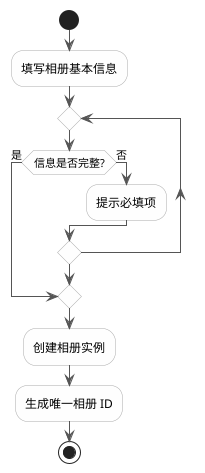
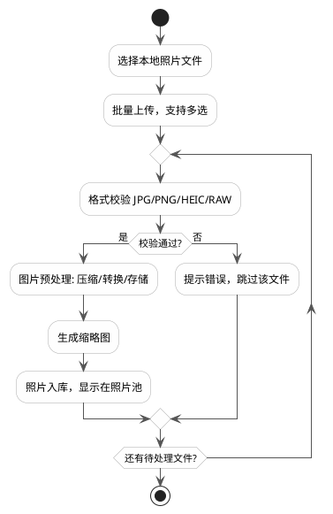
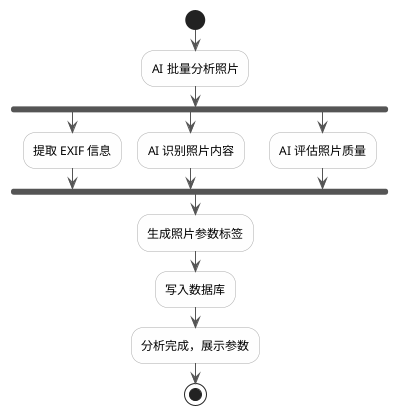
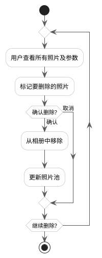
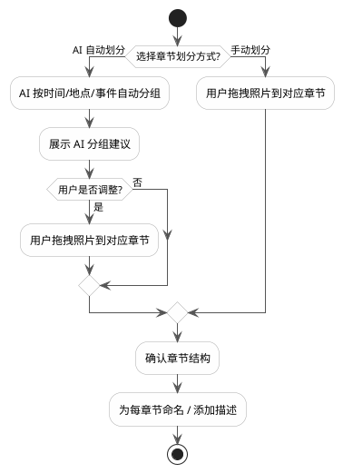
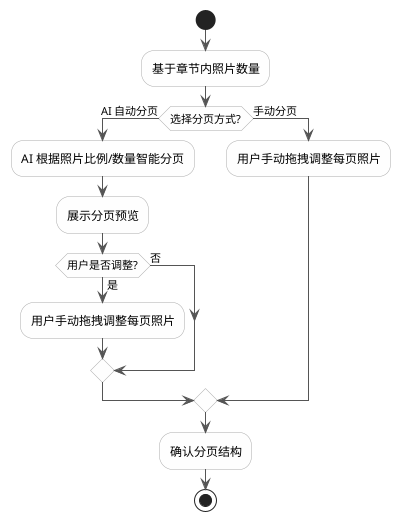
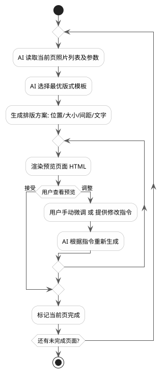
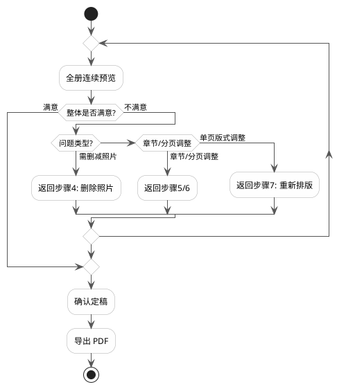

# AI 智能相册排版系统 - 需求文档

**版本**：v0.1
**日期**：2026-06-15
**状态**：草稿

---

## 一、项目背景

用户手机中积累了大量历史照片，需要从中挑选部分照片，通过 AI 辅助排版系统，自动生成美观的相册版式，最终导出 PDF 文件供冲印或印刷使用。

---

## 二、目标用户

- 有记录生活需求的普通用户（家庭相册、旅行纪念、成长记录等）
- 对排版无专业要求，希望借助 AI 快速生成高质量成品

---

## 三、核心流程

### 3.1 总体流程

```plantuml
@startuml
skinparam defaultFontName Microsoft YaHei
skinparam ArrowColor #555555
skinparam ActivityBackgroundColor #FEFEFE
skinparam ActivityBorderColor #AAAAAA
skinparam DiamondBackgroundColor #FFFDE7
skinparam DiamondBorderColor #F9A825

start
:1. 新建相册;
:2. 上传照片;
:3. 为照片建立参数;
repeat
  :4. 删除不满意照片;
  :5. 建立照片分章节;
  :6. 建立照片分页;
  :7. 每页进行 AI 排版;
  diamond if (8. 确认排版结果?) then (满意)
    break
  else (不满意，继续调整)
  endif
repeat while ( )
:9. 导出 PDF;
stop
@enduml
```

---

### 3.2 详细子流程

#### 3.2.1 新建相册



**相册基本信息包括：**
- 相册名称（必填）
- 主题风格（模板选择：简约 / 复古 / 清新 / 商务）
- 尺寸规格（A4 / A5 / 正方形 / 自定义）
- 封面设计（可跳过，后续补充）

---

#### 3.2.2 上传照片



---

#### 3.2.3 为照片建立参数（AI 分析）



**照片参数包括：**

| 参数类型 | 字段 | 说明 |
|---------|------|------|
| 基础信息 | 拍摄时间、分辨率、文件大小 | 从 EXIF 提取 |
| 内容识别 | 场景标签、人物数量、主体描述 | AI 识别 |
| 质量评分 | 清晰度、曝光、构图得分（0-10） | AI 评估 |
| 用户自定义 | 说明文字、自定义标签 | 用户填写 |
| 排版建议 | 推荐占版比例（全页/半页/小图） | AI 建议 |

---

#### 3.2.4 删除照片



---

#### 3.2.5 建立章节



---

#### 3.2.6 建立分页



---

#### 3.2.7 每页排版（AI 排版引擎）



---

#### 3.2.8 整体确认与迭代



---

## 四、功能模块清单

| 模块 | 功能 | 优先级 |
|------|------|--------|
| 相册管理 | 新建、重命名、删除相册 | P0 |
| 照片上传 | 批量上传、格式转换、预处理 | P0 |
| AI 照片分析 | EXIF 提取、内容识别、质量评分 | P0 |
| 照片池管理 | 预览、筛选、删除、标签编辑 | P0 |
| 章节管理 | AI 自动分章、手动调整、命名 | P1 |
| 分页管理 | AI 自动分页、手动调整 | P1 |
| AI 排版引擎 | 版式生成、HTML 渲染、排版调整 | P0 |
| 预览系统 | 单页预览、全册预览 | P0 |
| 导出模块 | HTML 转 PDF、印刷规格适配 | P0 |
| 历史版本 | 排版历史记录、版本回退 | P2 |

---

## 五、非功能性需求

### 5.1 性能
- 单张照片 AI 分析时间 ≤ 5 秒
- 单页排版生成时间 ≤ 10 秒
- 支持单次上传 200 张以内照片

### 5.2 文件支持
- 输入格式：JPG、PNG、HEIC、RAW（CR2/NEF/ARW）
- 输出格式：PDF（300 DPI，CMYK 色彩空间，适合印刷）

### 5.3 版式规格
- 页面尺寸：A4（210×297mm）、A5、正方形（200×200mm）
- 出血线：3mm
- 安全边距：10mm

---

## 六、技术选型建议

| 层次 | 技术 | 说明 |
|------|------|------|
| 前端 | Vue 3 / React | 照片池、拖拽排版交互 |
| 后端 | Python (FastAPI) | 业务逻辑、AI 调用 |
| AI 分析 | DeepSeek V4 Pro (deepseek-chat) | 图片理解、排版建议 |
| 排版渲染 | HTML + CSS → Puppeteer | 高保真 PDF 输出 |
| 存储 | 本地文件系统 / MinIO | 照片及渲染文件存储 |
| 数据库 | SQLite / PostgreSQL | 相册、照片元数据 |

---

## 七、后续迭代方向

- 支持视频封面提取
- 相册模板市场（用户上传自定义模板）
- 多用户协同编辑
- 在线印刷下单对接
- 移动端 App

---

*本文档为初版草稿，待技术评审后更新。*
